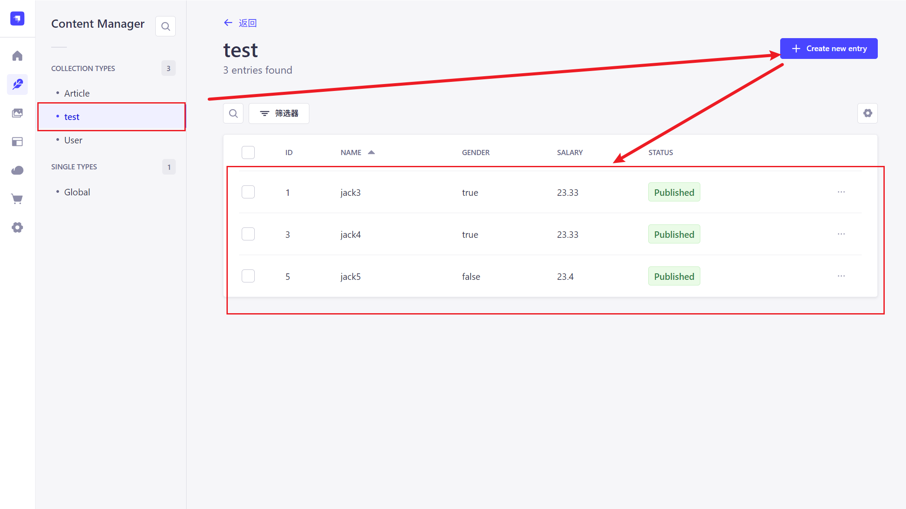
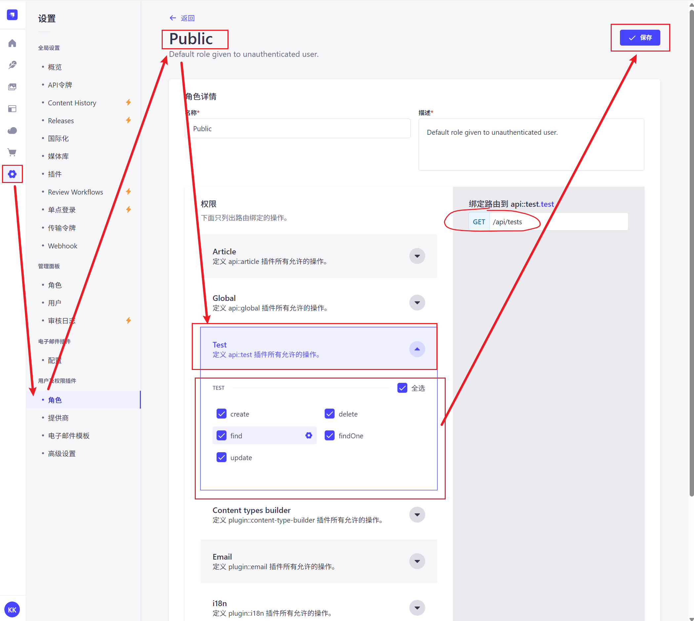

## 封装axios方案


### todo-list

- [x] 全局消息提示
- [x] axios二次封装
  - [x] 处理重复请求
  - [ ] 一键配置本地开发是否走代理
  - [ ] 组件可以获取返参response的类型
  - [ ] 下载
  - [ ] 上传
  - [ ] 组件请求时配置后端返参格式?
  - [ ] 接口缓存策略
  - [ ] 请求超时重复机制
- [x] mock数据服务: strapi
- [ ] 


### 如何封装(添加功能)

* 在项目中引用方便, vue2中可以绑定到原型上, vue3可以
* 兼容REST封装,提供常用方法get/post/put/delete
* 统一入参, 统一处理错误, 统一返回格式
* 可取消重复请求, 用户切换路径取消请求
* 文件下载及上传
* 指定是否走mock服务,例如提供了本地strapi服务,则本地开发时仅使用proxy地址即可,也不用指定特别路径
* 

### 方案1

#### 1.封装

* 基础请求(get, post, put, del等请求的封装)
* 拦截器的基本封装
  * 请求拦截器: 请求头设置; 用户标识添加
  * 响应拦截器
    * 网络错误处理
    * 授权错误处理
    * 普通错误处理
    * 代码异常处理
* 取消请求
  * 取消请求的场景有哪些?
    * 页面切换
    * 搜索输入时的防抖节流: 快速输入时,需要取消上一次的搜索请求,只发送最后一次
    * 下拉列表的频繁切换
    * 用户手动取消操作: 用户点击取消按钮,关闭弹窗或放弃某个操作
    * 请求超时自动取消
    * 重复提交防止
    * 组件卸载时
    * 登录状态改变: 用户退出登录时取消所有未完成的请求
    * 依赖条件变更: 如使用React的useEffect时，依赖项变化导致之前的请求不再有效
    * 网络状态变化: 网络从在线变为离线
    * 无限滚动加载时切换条件: 比如用户在滚动加载时突然切换了筛选条件

* 其它功能??


#### 2.使用

全局使用axios实例文件,有如下几种方案:

**方案1**

1. 创建统一的api实例文件
2. 在有需要的地方直接引入

```tsx
//src/api/index.ts

// src/api/index.ts
import HttpRequest from '../axios/http';

// 创建实例
const httpInstance = new HttpRequest({
  baseURL: import.meta.env.VUE_APP_BASE_URL || "/api",
  timeout: 1000 * 6
});

// 导出HTTP方法
export const get = httpInstance.get.bind(httpInstance);
export const post = httpInstance.post.bind(httpInstance);
export const put = httpInstance.put.bind(httpInstance);
export const del = httpInstance.delete.bind(httpInstance);
export const patch = httpInstance.patch.bind(httpInstance);

// 导出实例自身(用于取消请求等操作)
export const http = httpInstance;

// 导出默认实例
export default httpInstance;
```


```tsx
//在组件中使用

import {get, post} from '@/api'

//使用
get('/test').then(rse => {
  console.log('res>', res)
})
```


**方案2 - 在Vue中作为插件使用**

1. 创建插件文件
2. 在main.ts中注册
3. 在组件中使用

```tsx
//src/plugins/http.ts
import HttpRequest from '../axios/http';
import type { App } from 'vue';

export const httpInstance = new HttpRequest({
  baseURL: import.meta.env.VUE_APP_BASE_URL || "/api"
});

export default {
  install(app: App) {
    app.config.globalProperties.$http = httpInstance;
    app.provide('http', httpInstance);
  }
};
```


```tsx
//src/main.ts

import { createApp } from 'vue';
import App from './App.vue';
import httpPlugin from './plugins/http';

const app = createApp(App);
app.use(httpPlugin);
app.mount('#app');
```


```ts
//组件


// 选项式API
export default {
  methods: {
    fetchData() {
      this.$http.get('/api/data').then(res => {
        // 处理响应
      });
    }
  }
}

// 组合式API
import { inject } from 'vue';

export default {
  setup() {
    const http = inject('http');
    
    const fetchData = () => {
      http.get('/api/data').then(res => {
        // 处理响应
      });
    };
    
    return { fetchData };
  }
}

```


**其它-在react中使用Context**

1. 创建HttpContext
2. 在应用入口包裹
3. 在组件中使用

```tsx
// src/context/HttpContext.tsx
import React, { createContext, useContext } from 'react';
import HttpRequest from '../axios/http';

const httpInstance = new HttpRequest({
  baseURL: import.meta.env.VITE_API_BASE_URL || "/api"
});

const HttpContext = createContext(httpInstance);

export const HttpProvider = ({ children }) => {
  return (
    <HttpContext.Provider value={httpInstance}>
      {children}
    </HttpContext.Provider>
  );
};

export const useHttp = () => useContext(HttpContext);
```


```tsx
// src/index.tsx
import React from 'react';
import ReactDOM from 'react-dom';
import App from './App';
import { HttpProvider } from './context/HttpContext';

ReactDOM.render(
  <HttpProvider>
    <App />
  </HttpProvider>
  document.getElementById('root')
);
```


```tsx
// 在组件中
import { useHttp } from '../context/HttpContext';

const MyComponent = () => {
  const http = useHttp();
  
  const fetchData = async () => {
    try {
      const response = await http.get('/api/data');
      // 处理响应
    } catch (error) {
      // 处理错误
    }
  };
  
  return (
    <button onClick={fetchData}>获取数据</button>
  );
};
```


## strapi的使用

### 1. 创建strapi服务

在项目根目录下执行如下命令,会创建对应名称的项目

```sh
npx create-strapi@latest server-strapi
```


因为我们在命令行提供的选项中选择了ts, 所以需要复制admin文件夹下的`app.example.tsx`文件, 重命名为`app.tsx`, 并将语言改为中文简体.  选择js文件时,同理.

```tsx

import type { StrapiApp } from '@strapi/strapi/admin';

export default {
  config: {
    locales: [
      'zh-cn',
    ],
  },
  bootstrap(app: StrapiApp) {
    console.log(app);
  },
};
```


### 2. 启动服务

```sh
npm run dev
```

启动成功后,命令行会提示本地地址: 

```html
http://localhost:1337/admin
```

完成用户信息的注册

```md
Email: kkk@kk.com
password: 123Kkk@kk.com
```

进入网站页面, 点击左下角的头像-experience, 选择界面语言为中文.

以上,我们完成了项目的初始化. 邮箱及密码是随意设置的,但是要保存好.

### 3. 创建接口

需要配置两个地方:

1. 创建接口的集合
2. 将此集合的权限配置为public


##### 1.创建接口集合




##### 2.将此集合的权限配置为public




配置完成以后, 就可以在浏览器地址栏中访问地址, 查看是否能获取到结果.
