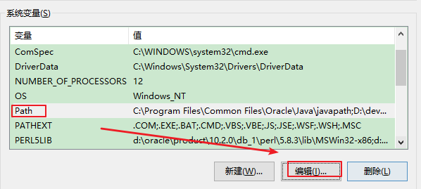
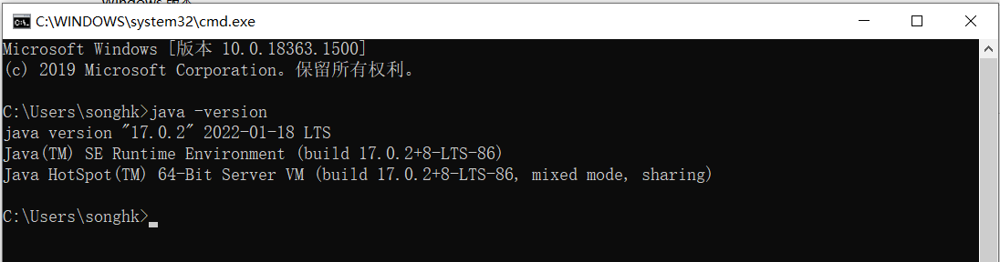

## 资料

* https://github.com/AobingJava/JavaFamily
* 尚硅谷java零基础教程
* https://www.codefather.cn/course/1803988290715377665


### 常用的DOS命令

- `操作1：进入和回退`

| 操作                | 说明                                |
| ------------------- | ----------------------------------- |
| 盘符名称:           | 盘符切换。E:回车，表示切换到E盘。   |
| dir                 | 列出当前目录下的文件以及文件夹      |
| cd 目录             | 进入指定单级目录。                  |
| cd 目录1\目录2\\... | 进入指定多级目录。cd atguigu\JavaSE |
| cd ..               | 回退到上一级目录。                  |
| cd \ 或 cd /        | 回退到盘符目录。                    |

- `操作2：增、删`

| 操作          | 说明                                               |
| ------------- | -------------------------------------------------- |
| md 文件目录名 | 创建指定的文件目录。                               |
| rd 文件目录名 | 删除指定的文件目录（如文件目录内有数据，删除失败） |

- `操作3：其它`

| 操作              | 说明                 |
| ----------------- | -------------------- |
| cls               | 清屏。               |
| exit              | 退出命令提示符窗口。 |
| ←  →              | 移动光标             |
| ↑  ↓              | 调阅历史操作命令     |
| Delete和Backspace | 删除字符             |


## 01章-java入门概述

### 1.java的3个体系

- **Java SE(Java Standard Edition)标准版**
  - 支持面向`桌面级应用`（如Windows下的应用程序）的Java平台，即定位个人计算机的应用开发。
  - 包括用户界面接口AWT及Swing，网络功能与国际化、图像处理能力以及输入输出支持等。
  - 此版本以前称为J2SE
- **Java EE(Java Enterprise Edition)企业版**
  - 为开发企业环境下的应用程序提供的一套解决方案，即定位`在服务器端的Web应用开发`。
  - JavaEE是JavaSE的扩展，增加了用于服务器开发的类库。如：Servlet能够延伸服务器的功能，通过请求-响应的模式来处理客户端的请求；JSP是一种可以将Java程序代码内嵌在网页内的技术。
  - 版本以前称为J2EE
- **Java ME(Java Micro Edition)小型版**
  - 支持Java程序运行在`移动终端（手机、机顶盒）上的平台`，即定位在消费性电子产品的应用开发
  - JavaME是JavaSE的内伸，精简了JavaSE 的核心类库，同时也提供自己的扩展类。增加了适合微小装置的类库：javax.microedition.io.*等。
  - 此版本以前称为J2ME


### 2.发展历史

- 1995年5月23日，Java语言诞生
- ....
- 2014 年 3 月 18 日，Oracle 公司发表 Java SE 8。
- 2017 年 9 月 21 日，Oracle 公司发表 Java SE 9
- 2018 年 3 月 21 日，Oracle 公司发表 Java SE 10
- 2018 年 9 月 25 日，Java SE 11 发布
- 2019 年 3 月 20 日，Java SE 12 发布


### 3.java开发工具

尽量保证系统内存在1G以上，其他工具如下所示：

- Linux 系统或者Windows 95/98/2000/XP，WIN 7/8/10/11系统
- Java JDK 8以上版本（这是必须的）
- Notepad编辑器或者其他编辑器（虽然使用记事本也可以进行代码编写，但一个舒适的工具可以提高编程的效率，小编这里推荐使用vscode）。
- IDE：Eclipse或者IntelliJ IDEA（对于初学者而言，这两款IDE都很不错，但却不是必要的（初学者使用到的功能比较少，不需要用到这么多功能））


### 4.java开发环境搭建(掌握)

#### 01 什么是JDK、JRE

- **JDK**  (`J`ava `D`evelopment `K`it)：是Java程序开发工具包，包含`JRE` 和开发人员使用的工具。
- **JRE ** (`J`ava `R`untime `E`nvironment) ：是Java程序的运行时环境，包含`JVM` 和运行时所需要的`核心类库`。

如下是Java 8.0 Platform：


小结：

JDK = JRE + 开发工具集（例如Javac编译工具等）

JRE = JVM + Java SE标准类库


#### 02 JDK版本选择

根据当前市场主流来选择:

* java8
* java11
* java17


#### 03 JDK的下载

* 下载网址（Oracle公司官网）：www.oracle.com
* 下载步骤：如图所示，在官网底部选择Developers开发者


（1）在Developers页面中间的技术分类部分，选择`Java`，单击进入，如图所示：


（2）这里展示的是最新Java版本，例如Java17。单击`Download Java`，然后选择具体的版本下载。


（3）选择Download Java按钮后


（4）如果想安装Java8 可以选择如下位置：


（5）选择Accept License Agreement，


（6）注册或登录后下载：


（7）如果需要安装其它版本，可以选择Java archive：


接着进行选择下载即可：


### 

#### 04 JDK安装

- 安装说明
  - 傻瓜式安装，下一步即可。
  - **建议：安装路径不要有中文或者空格等特殊符号。**
  - **本套课程会同时安装JDK8 和 JDK17，并以JDK17为默认版本进行讲解。**

* 安装步骤：

（1）双击`jdk-17_windows-x64_bin.exe`文件，并单击下一步，如图所示：


（2）修改安装路径，单击更改，如图所示：


（3）将安装路径修改为`D:\develop_tools\jdk\jdk-17.0.2\`，并单击下一步，如图所示：


（4）稍后几秒，安装完成，如图所示：


### 5.配置path环境变量

#### 01.理解path环境变量

**什么是path环境变量？**

答：window操作系统执行命令时，所要搜寻的路径。

**为什么配置path？**

答：希望在命令行使用javac.exe等工具时，任意目录下都可以找到这个工具所在的目录。

**以JDK为例演示**

我们在`C:\Users\songhk`目录下使用javac命令，结果如下：


我们在JDK的安装目录的bin目录下使用javac命令，结果如下：


我们不可能每次使用java.exe，javac.exe等工具的时候都进入到JDK的安装目录下，太麻烦了。这时就需要配置path环境变量。

#### 02.JDK8配置方案1：只配置path

* 步骤：

（1）打开桌面上的计算机，进入后在左侧找到`此电脑`，单击鼠标`右键`，选择`属性`，如图所示：


（2）选择`高级系统设置`，如图所示：


（3）在`高级`选项卡，单击`环境变量`，如图所示：


（4）在`系统变量`中，选中`Path` 环境变量，`双击`或者`点击编辑` ,如图所示：



（5）点击`新建`，填入`D:\develop_tools\jdk\jdk1.8.0_271\bin`  ，并将此值`上移`到变量列表的首位。如图所示：

- 编辑模式1：


- 编辑模式2：（注意，结尾需要有英文模式下的;）


（6）环境变量配置完成，**重新开启**DOS命令行，在任意目录下输入`javac` 或`java`命令或`java -version`，运行成功。


#### 03. JDK8配置方案2：配置JAVA_HOME+path（推荐）

* 步骤：

（1）打开桌面上的计算机，进入后在左侧找到`计算机`，单击鼠标`右键`，选择`属性`，如图所示：


（2）选择`高级系统设置`，如图所示：


（3）在`高级`选项卡，单击`环境变量`，如图所示：


（4）在`系统变量`中，单击`新建` ，创建新的环境变量，如图所示：


（5）变量名输入`JAVA_HOME`，变量值输入 `D:\develop_tools\jdk\jdk1.8.0_271` ，单击`确定`，如图所示：


（6）选中`Path` 环境变量，`双击`或者`点击编辑` ，如图所示：


（7）在变量值的最前面，键入`%JAVA_HOME%\bin`。如图所示：


> 注意：强烈建议将%JAVA_HOME%\bin声明在path环境变量中所有变量的最前面！

（8）环境变量配置完成，**重启**DOS命令行，在任意目录下输入`javac` 或`java`命令或`java -version`，运行成功。


> 我想说：
>
> 有的书籍、论坛、视频上还提到配置classpath，用于指名class文件识别的路径。其实是没必要的，反而建议大家如果配置了classpath环境变量，要删除。对于初学者，反而不友好。

**小结如下：**


#### 04. JDK17配置方案：自动配置

不管大家有没有提前安装JDK8或其它版本JDK，在我们安装完JDK17之后，理应按JDK8的方式配置path环境变量。但是，我们发现在安装完JDK17以后，配置环境变量之前，执行CMD指令：



竟然成功了！而且是17.0.2版本。因为JDK17在安装之后，自动进行了环境变量的配置。如下：


这里建议，将JDK17安装的路径，设置为JAVA_HOME，并将`%JAVA_HOME%\bin`上移到首位。


> 思考：如果你仍然希望在JDK8下开发Java程序？如何做呢？


### 6.Hello World编写

#### 01. 开发步骤

Java程序开发三步骤：**编写**、**编译**、**运行**。

- 将 Java 代码**编写**到扩展名为 .java 的源文件中
- 通过 javac.exe 命令对该 java 文件进行**编译**，生成一个或多个字节码文件
- 通过 java.exe 命令对生成的 class 文件进行**运行**


#### 02. 编写

（1）在`D:\JavaSE\chapter01` 目录下新建文本文件，完整的文件名修改为`HelloWorld.java`，其中文件名为`HelloWorld`，后缀名必须为`.java`。


（2）用记事本或editplus等文本编辑器打开（虽然记事本也可以，但是没有关键字颜色标识，不利于初学者学习）

（3）在文件中输入如下代码，并且保存：

```java
class HelloChina {
  	public static void main(String[] args) {
    	System.out.println("HelloWorld!!");
  	}
}
```

- **友情提示1：每个字母和符号必须与示例代码一模一样，包括大小写在内。**

- 友情提示2：


或


第一个`HelloWord` 源程序就编写完成了，但是这个文件是程序员编写的，JVM是看不懂的，也就不能运行，因此我们必须将编写好的**`Java源文件`** 编译成JVM可以看懂的**`字节码文件`** ，也就是**`.class`文件**。


#### 03. 编译

在DOS命令行中，进入`D:\JavaSE\chapter01`目录，使用`javac` 命令进行编译。

使用文件资源管理器打开`D:\JavaSE\chapter01`目录，然后在地址栏输入cmd。


命令：

```java
javac Java源文件名.后缀名java
```

举例：

```
javac HelloWorld.java
```


编译成功后，命令行没有任何提示。打开`D:\JavaSE\chapter01`目录，发现产生了一个新的文件 `HelloChina.class`，该文件就是编译后的文件，是Java的可运行文件，称为**字节码文件**，有了字节码文件，就可以运行程序了。 


#### 04. 运行

在DOS命令行中，在字节码文件目录下，使用`java` 命令进行运行。

命令：

```java
java 主类名字
```

主类是指包含main方法的类，main方法是Java程序的入口：

```java
public static void main(String[] args){
    
}
```

举例：

```
java HelloChina
```

> 错误演示：
>
> java HelloChina.class


### 7.总结

#### 步骤

```md
1.编写 xxx.java文件
2.编译 javac xxx.java  生成xxx.class字节码文件
3.运行 java xxx 运行程序
```

#### java程序的结构与格式

```java
class HelloChina {
  public static void main(String[] args) {
    System.out.println("hello, world!!你好世界");
  }
}
```

```java
类 {
  方法 {
    语句;
  }
}
```


#### 源文件名与类名

（1）源文件名是否必须与类名一致？public呢？

```java
如果这个类不是public，那么源文件名可以和类名不一致。但是不便于代码维护。

如果这个类是public，那么要求源文件名必须与类名一致。否则编译报错。

我们建议大家，不管是否是public，都与源文件名保持一致，而且一个源文件尽量只写一个类，目的是为了好维护。
```

（2）一个源文件中是否可以有多个类？public呢？

```java
一个源文件中可以有多个类，编译后会生成多个.class字节码文件。

但是一个源文件只能有一个public的类。
```


#### 注意事项

* Java语言是一门严格区分大小写的语言
* 标点符号使用问题
  * 不能用中文符号，英文半角的标点符号（正确）
  * 括号问题，成对出现
* 


#### java程序的解构与格式

结构：

```java
类{
    方法{
        语句;
    }
}
```

格式：

（1）每一级缩进一个Tab键

（2）{}的左半部分在行尾，右半部分单独一行，与和它成对的"{"的行首对齐

#### Java程序的入口

Java程序的入口是main方法

```java
public static void main(String[] args){
    
}
```

#### 两种常见的输出语句

- **换行输出语句**：输出内容，完毕后进行换行，格式如下：

  ```java
  System.out.println(输出内容);
  ```

- **直接输出语句**：输出内容，完毕后不做任何处理，格式如下

  ```java
  System.out.print(输出内容);
  ```

> 注意事项：
>
> ​	换行输出语句，括号内可以什么都不写，只做换行处理
>
> ​	直接输出语句，括号内什么都不写的话，编译报错


### 8.注释

#### **Java中的注释类型：**

- 单行注释

  ```
  //注释文字
  ```

- 多行注释

  ```
  /* 
  注释文字1 
  注释文字2
  注释文字3
  */
  ```

- 文档注释 (Java特有)

  ```
  /**
    @author  指定java程序的作者
    @version  指定源文件的版本
  */ 
  ```


#### 使用

* 对于单行和多行注释，被注释的文字，不会不会出现在字节码文件中，进而不会被JVM（java虚拟机）解释执行。
* 多行注释里面不允许有多行注释嵌套。
* 文档注释(Java特有)


- 文档注释内容可以被JDK提供的工具 javadoc 所解析，生成一套以网页文件形式体现的该程序的说明文档。

  - 操作方式。比如：

    ```
    javadoc -d mydoc -author -version HelloWorld.java
    ```


案例：

```java
//单行注释
/*
多行注释
*/
/**
文档注释演示。这是我的第一个Java程序！^_^
@author songhk
@version 1.0
*/
public class HelloWorld{
    
	/**
	Java程序的入口
	@param args main方法的命令参数
	*/
    public static void main(String[] args){
        System.out.println("hello");
    }
}
```


