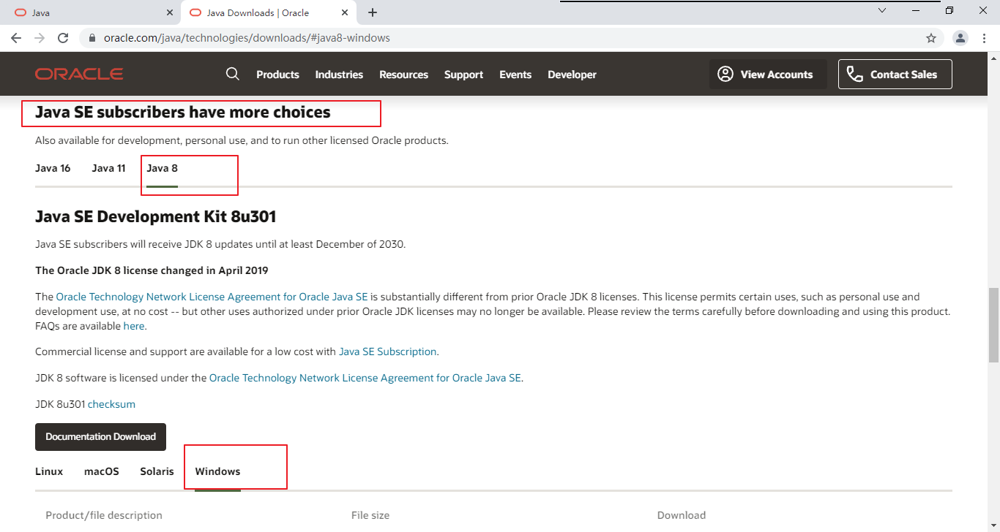
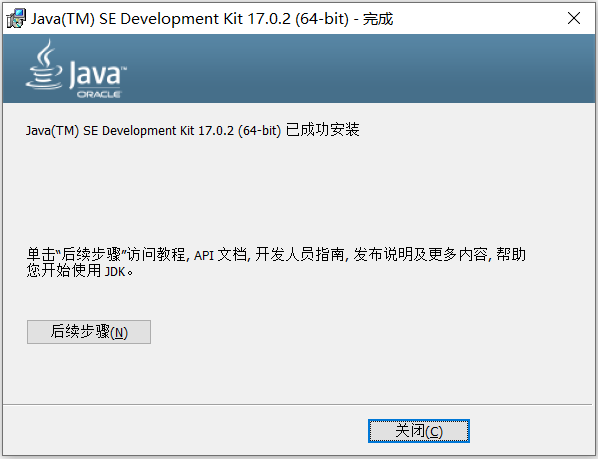
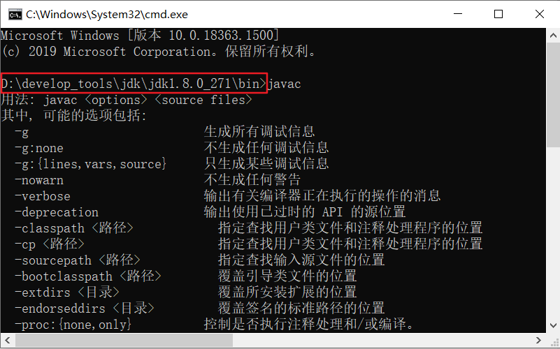
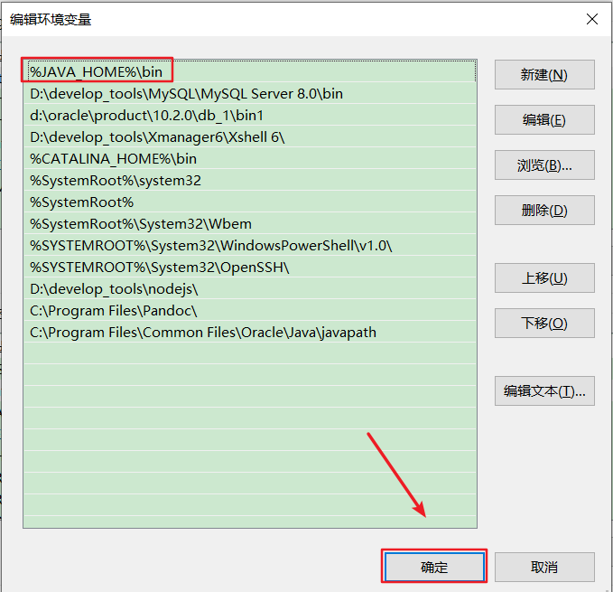
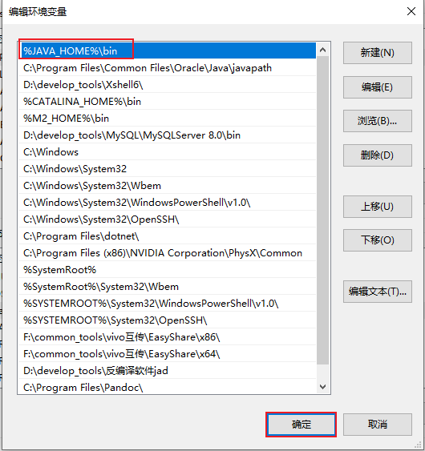
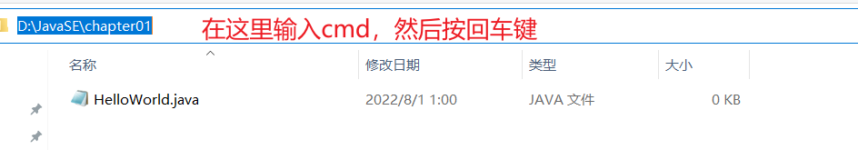

## 资料

* https://github.com/AobingJava/JavaFamily
* 尚硅谷java零基础教程
* https://www.codefather.cn/course/1803988290715377665


### 常用的DOS命令

- `操作1：进入和回退`

| 操作              | 说明                         |
| --------------- | -------------------------- |
| 盘符名称:           | 盘符切换。E:回车，表示切换到E盘。         |
| dir             | 列出当前目录下的文件以及文件夹            |
| cd 目录           | 进入指定单级目录。                  |
| cd 目录1\目录2\\... | 进入指定多级目录。cd atguigu\JavaSE |
| cd ..           | 回退到上一级目录。                  |
| cd \ 或 cd /     | 回退到盘符目录。                   |

- `操作2：增、删`

| 操作       | 说明                        |
| -------- | ------------------------- |
| md 文件目录名 | 创建指定的文件目录。                |
| rd 文件目录名 | 删除指定的文件目录（如文件目录内有数据，删除失败） |

- `操作3：其它`

| 操作              | 说明                 |
| ----------------- | -------------------- |
| cls               | 清屏。               |
| exit              | 退出命令提示符窗口。 |
| ←  →              | 移动光标             |
| ↑  ↓              | 调阅历史操作命令     |
| Delete和Backspace | 删除字符             |


## 01章-java入门概述

### 1.java的3个体系

- **Java SE(Java Standard Edition)标准版**
  - 支持面向`桌面级应用`（如Windows下的应用程序）的Java平台，即定位个人计算机的应用开发。
  - 包括用户界面接口AWT及Swing，网络功能与国际化、图像处理能力以及输入输出支持等。
  - 此版本以前称为J2SE
- **Java EE(Java Enterprise Edition)企业版**
  - 为开发企业环境下的应用程序提供的一套解决方案，即定位`在服务器端的Web应用开发`。
  - JavaEE是JavaSE的扩展，增加了用于服务器开发的类库。如：Servlet能够延伸服务器的功能，通过请求-响应的模式来处理客户端的请求；JSP是一种可以将Java程序代码内嵌在网页内的技术。
  - 版本以前称为J2EE
- **Java ME(Java Micro Edition)小型版**
  - 支持Java程序运行在`移动终端（手机、机顶盒）上的平台`，即定位在消费性电子产品的应用开发
  - JavaME是JavaSE的内伸，精简了JavaSE 的核心类库，同时也提供自己的扩展类。增加了适合微小装置的类库：javax.microedition.io.*等。
  - 此版本以前称为J2ME


### 2.发展历史

- 1995年5月23日，Java语言诞生
- ....
- 2014 年 3 月 18 日，Oracle 公司发表 Java SE 8。
- 2017 年 9 月 21 日，Oracle 公司发表 Java SE 9
- 2018 年 3 月 21 日，Oracle 公司发表 Java SE 10
- 2018 年 9 月 25 日，Java SE 11 发布
- 2019 年 3 月 20 日，Java SE 12 发布


### 3.java开发工具

尽量保证系统内存在1G以上，其他工具如下所示：

- Linux 系统或者Windows 95/98/2000/XP，WIN 7/8/10/11系统
- Java JDK 8以上版本（这是必须的）
- Notepad编辑器或者其他编辑器（虽然使用记事本也可以进行代码编写，但一个舒适的工具可以提高编程的效率，小编这里推荐使用vscode）。
- IDE：Eclipse或者IntelliJ IDEA（对于初学者而言，这两款IDE都很不错，但却不是必要的（初学者使用到的功能比较少，不需要用到这么多功能））


### 4.java开发环境搭建(掌握)

#### 01 什么是JDK、JRE


- **JDK**  (`J`ava `D`evelopment `K`it)：是Java程序开发工具包，包含`JRE` 和开发人员使用的工具。
- **JRE ** (`J`ava `R`untime `E`nvironment) ：是Java程序的运行时环境，包含`JVM` 和运行时所需要的`核心类库`。

如下是Java 8.0 Platform：


小结：

JDK = JRE + 开发工具集（例如Javac编译工具等）

JRE = JVM + Java SE标准类库


#### 02 JDK版本选择


根据当前市场主流来选择:

* java8
* java11
* java17


#### 03 JDK的下载


* 下载网址（Oracle公司官网）：www.oracle.com
* 下载步骤：如图所示，在官网底部选择Developers开发者


（1）在Developers页面中间的技术分类部分，选择`Java`，单击进入，如图所示：


（2）这里展示的是最新Java版本，例如Java17。单击`Download Java`，然后选择具体的版本下载。


（3）选择Download Java按钮后


（4）如果想安装Java8 可以选择如下位置：



（5）选择Accept License Agreement，


（6）注册或登录后下载：


（7）如果需要安装其它版本，可以选择Java archive：


接着进行选择下载即可：


#### 04 JDK安装

- 安装说明
  - 傻瓜式安装，下一步即可。
  - **建议：安装路径不要有中文或者空格等特殊符号。**
  - **本套课程会同时安装JDK8 和 JDK17，并以JDK17为默认版本进行讲解。**

* 安装步骤：

（1）双击`jdk-17_windows-x64_bin.exe`文件，并单击下一步，如图所示：


（2）修改安装路径，单击更改，如图所示：


（3）将安装路径修改为`D:\develop_tools\jdk\jdk-17.0.2\`，并单击下一步，如图所示：


（4）稍后几秒，安装完成，如图所示：




### 5.配置path环境变量

#### 01.理解path环境变量

**什么是path环境变量？**

答：window操作系统执行命令时，所要搜寻的路径。

**为什么配置path？**

答：希望在命令行使用javac.exe等工具时，任意目录下都可以找到这个工具所在的目录。

**以JDK为例演示**

我们在`C:\Users\songhk`目录下使用javac命令，结果如下：


我们在JDK的安装目录的bin目录下使用javac命令，结果如下：



我们不可能每次使用java.exe，javac.exe等工具的时候都进入到JDK的安装目录下，太麻烦了。这时就需要配置path环境变量。

#### 02.JDK8配置方案1：只配置path

* 步骤：

（1）打开桌面上的计算机，进入后在左侧找到`此电脑`，单击鼠标`右键`，选择`属性`，如图所示：


（2）选择`高级系统设置`，如图所示：


（3）在`高级`选项卡，单击`环境变量`，如图所示：


（4）在`系统变量`中，选中`Path` 环境变量，`双击`或者`点击编辑` ,如图所示：


（5）点击`新建`，填入`D:\develop_tools\jdk\jdk1.8.0_271\bin`  ，并将此值`上移`到变量列表的首位。如图所示：

- 编辑模式1：


- 编辑模式2：（注意，结尾需要有英文模式下的;）


（6）环境变量配置完成，**重新开启**DOS命令行，在任意目录下输入`javac` 或`java`命令或`java -version`，运行成功。


#### 03. JDK8配置方案2：配置JAVA_HOME+path（推荐）

* 步骤：

（1）打开桌面上的计算机，进入后在左侧找到`计算机`，单击鼠标`右键`，选择`属性`，如图所示：


（2）选择`高级系统设置`，如图所示：


（3）在`高级`选项卡，单击`环境变量`，如图所示：


（4）在`系统变量`中，单击`新建` ，创建新的环境变量，如图所示：


（5）变量名输入`JAVA_HOME`，变量值输入 `D:\develop_tools\jdk\jdk1.8.0_271` ，单击`确定`，如图所示：


（6）选中`Path` 环境变量，`双击`或者`点击编辑` ，如图所示：


（7）在变量值的最前面，键入`%JAVA_HOME%\bin`。如图所示：



> 注意：强烈建议将%JAVA_HOME%\bin声明在path环境变量中所有变量的最前面！

（8）环境变量配置完成，**重启**DOS命令行，在任意目录下输入`javac` 或`java`命令或`java -version`，运行成功。


> 我想说：
>
> 有的书籍、论坛、视频上还提到配置classpath，用于指名class文件识别的路径。其实是没必要的，反而建议大家如果配置了classpath环境变量，要删除。对于初学者，反而不友好。

**小结如下：**


#### 04. JDK17配置方案：自动配置

不管大家有没有提前安装JDK8或其它版本JDK，在我们安装完JDK17之后，理应按JDK8的方式配置path环境变量。但是，我们发现在安装完JDK17以后，配置环境变量之前，执行CMD指令：


竟然成功了！而且是17.0.2版本。因为JDK17在安装之后，自动进行了环境变量的配置。如下：


这里建议，将JDK17安装的路径，设置为JAVA_HOME，并将`%JAVA_HOME%\bin`上移到首位。




> 思考：如果你仍然希望在JDK8下开发Java程序？如何做呢？


### 6.Hello World编写

#### 01. 开发步骤

Java程序开发三步骤：**编写**、**编译**、**运行**。

- 将 Java 代码**编写**到扩展名为 .java 的源文件中
- 通过 javac.exe 命令对该 java 文件进行**编译**，生成一个或多个字节码文件
- 通过 java.exe 命令对生成的 class 文件进行**运行**


#### 02. 编写

（1）在`D:\JavaSE\chapter01` 目录下新建文本文件，完整的文件名修改为`HelloWorld.java`，其中文件名为`HelloWorld`，后缀名必须为`.java`。


（2）用记事本或editplus等文本编辑器打开（虽然记事本也可以，但是没有关键字颜色标识，不利于初学者学习）

（3）在文件中输入如下代码，并且保存：

```java
class HelloChina {
  	public static void main(String[] args) {
    	System.out.println("HelloWorld!!");
  	}
}
```

- **友情提示1：每个字母和符号必须与示例代码一模一样，包括大小写在内。**

- 友情提示2：


或


第一个`HelloWord` 源程序就编写完成了，但是这个文件是程序员编写的，JVM是看不懂的，也就不能运行，因此我们必须将编写好的**`Java源文件`** 编译成JVM可以看懂的**`字节码文件`** ，也就是**`.class`文件**。


#### 03. 编译

在DOS命令行中，进入`D:\JavaSE\chapter01`目录，使用`javac` 命令进行编译。

使用文件资源管理器打开`D:\JavaSE\chapter01`目录，然后在地址栏输入cmd。



命令：

```java
javac Java源文件名.后缀名java
```

举例：

```
javac HelloWorld.java
```


编译成功后，命令行没有任何提示。打开`D:\JavaSE\chapter01`目录，发现产生了一个新的文件 `HelloChina.class`，该文件就是编译后的文件，是Java的可运行文件，称为**字节码文件**，有了字节码文件，就可以运行程序了。 


#### 04. 运行

在DOS命令行中，在字节码文件目录下，使用`java` 命令进行运行。

命令：

```java
java 主类名字
```

主类是指包含main方法的类，main方法是Java程序的入口：

```java
public static void main(String[] args){
    
}
```

举例：

```
java HelloChina
```

> 错误演示：
>
> java HelloChina.class


### 7.总结

#### 步骤

```md
1.编写 xxx.java文件
2.编译 javac xxx.java  生成xxx.class字节码文件
3.运行 java xxx 运行程序
```

#### java程序的结构与格式

```java
class HelloChina {
  public static void main(String[] args) {
    System.out.println("hello, world!!你好世界");
  }
}
```

```java
类 {
  方法 {
    语句;
  }
}
```


#### 源文件名与类名

（1）源文件名是否必须与类名一致？public呢？

```java
如果这个类不是public，那么源文件名可以和类名不一致。但是不便于代码维护。

如果这个类是public，那么要求源文件名必须与类名一致。否则编译报错。

我们建议大家，不管是否是public，都与源文件名保持一致，而且一个源文件尽量只写一个类，目的是为了好维护。
```

（2）一个源文件中是否可以有多个类？public呢？

```java
一个源文件中可以有多个类，编译后会生成多个.class字节码文件。

但是一个源文件只能有一个public的类。
```


#### 注意事项

* Java语言是一门严格区分大小写的语言
* 标点符号使用问题
  * 不能用中文符号，英文半角的标点符号（正确）
  * 括号问题，成对出现
* 


#### java程序的解构与格式

结构：

```java
类{
    方法{
        语句;
    }
}
```

格式：

（1）每一级缩进一个Tab键

（2）{}的左半部分在行尾，右半部分单独一行，与和它成对的"{"的行首对齐

#### Java程序的入口

Java程序的入口是main方法

```java
public static void main(String[] args){
    
}
```

#### 两种常见的输出语句

- **换行输出语句**：输出内容，完毕后进行换行，格式如下：

  ```java
  System.out.println(输出内容);
  ```

- **直接输出语句**：输出内容，完毕后不做任何处理，格式如下

  ```java
  System.out.print(输出内容);
  ```

> 注意事项：
>
> ​	换行输出语句，括号内可以什么都不写，只做换行处理
>
> ​	直接输出语句，括号内什么都不写的话，编译报错


### 8.注释

#### **Java中的注释类型：**

- 单行注释

  ```
  //注释文字
  ```

- 多行注释

  ```
  /* 
  注释文字1 
  注释文字2
  注释文字3
  */
  ```

- 文档注释 (Java特有)

  ```
  /**
    @author  指定java程序的作者
    @version  指定源文件的版本
  */ 
  ```


#### 使用-单行注释/多行注释

* 对于单行和多行注释，被注释的文字，不会不会出现在字节码文件中，进而不会被JVM（java虚拟机）解释执行。
* 多行注释里面不允许有多行注释嵌套。


#### 使用-文档注释

- 文档注释内容可以被JDK提供的工具 javadoc 所解析，生成一套以网页文件形式体现的该程序的说明文档。

  - 操作方式。比如：
 ```bash
javadoc -d mydoc -author -version HelloWorld.java
```


案例：

```java
//单行注释
/*
多行注释
*/
/**
文档注释演示。这是我的第一个Java程序！^_^
@author songhk
@version 1.0
*/
public class HelloWorld{
    
	/**
	Java程序的入口
	@param args main方法的命令参数
	*/
    public static void main(String[] args){
        System.out.println("hello");
    }
}
```


### 9.JavaAPI文档

- API （Application Programming Interface，应用程序编程接口）是 Java 提供的基本编程接口。
- Java语言提供了大量的基础类，因此 Oracle 也为这些基础类提供了相应的说明文档，用于告诉开发者如何使用这些类，以及这些类里包含的方法。大多数Java书籍中的类的介绍都要参照它来完成，它是编程者经常查阅的资料。
- Java API文档，即为JDK使用说明书、帮助文档。

- 下载API文档：
	- 在线看：[https://docs.oracle.com/en/java/javase/17/docs/api/index.html](https://docs.oracle.com/en/java/javase/17/docs/api/index.html)
	- 离线下载：[https://www.oracle.com/java/technologies/javase-jdk17-doc-downloads.html](https://www.oracle.com/java/technologies/javase-jdk17-doc-downloads.html)


### 10.Java核心机制：JVM

#### 优点
* 跨平台性. 
	* 原理: 装一个Java虚拟机 (`J`VM ，Java `V`irtual `M`achine) 即可。由JVM来负责Java程序在该系统中的运行。
* 面向对象
* 健壮性
* 安全性高
* 简单性
* 高性能

#### 缺点
* 语法过于复杂,严谨
* 适用于大型网站,架构比较重
* 并非适用于所有领域.


#### JVM功能说明
**JVM**（`J`ava `V`irtual `M`achine ，Java虚拟机）：是一个虚拟的计算机，是Java程序的运行环境。JVM具有指令集并使用不同的存储区域，负责执行指令，管理数据、内存、寄存器。

![[image-20220310165805739.png]]

##### 功能1：实现Java程序的跨平台性

我们编写的Java代码，都运行在**JVM** 之上。正是因为有了JVM，才使得Java程序具备了跨平台性。


使用JVM前后对比：


##### 14.2.2 功能2：自动内存管理(内存分配、内存回收)
- Java程序在运行过程中，涉及到运算的`数据的分配`、`存储`等都由JVM来完成
- Java消除了程序员回收无用内存空间的职责。提供了一种系统级线程跟踪存储空间的分配情况，在内存空间达到相应阈值时，检查并释放可被释放的存储器空间。
- GC的自动回收，提高了内存空间的利用效率，也提高了编程人员的效率，很大程度上`减少了`因为没有释放空间而导致的`内存泄漏`。

> 面试题：
> Java程序还会出现内存溢出和内存泄漏问题吗？ Yes!


### 11.实践案例
打印心形


#### 书籍推荐
* java核心技术
* Effective java
* java编程思想


## 02章-Java语言概述

### 变量与运算符-关键字
- 定义：**被Java语言赋予了特殊含义，用做专门用途的字符串（或单词）**        
- 特点：全部关键字都是`小写字母`。
- 关键字比较多，不需要死记硬背，学到哪里记到哪里即可。
- 官方地址： [https://docs.oracle.com/javase/tutorial/java/nutsandbolts/_keywords.html](https://docs.oracle.com/javase/tutorial/java/nutsandbolts/_keywords.html)


说明：
1. 关键字一共`50个`，其中`const`和`goto`是`保留字`(reserved word)。
2. `true`，`false`，`null`不在其中，它们看起来像关键字，其实是**字面量**，表示特殊的布尔值和空值。

![[image-20220310234557454.png]]

![[image-20220310234607198.png]]


### 变量与关键字-标识符

Java中变量、方法、类等要素命名时使用的字符序列，称为标识符。

技巧：凡是自己可以起名字的地方都叫标识符。比如: 类名,方法名,变量名,报包名,常量名

**标识符的命名规则**（必须遵守的`硬性规定`）：
* 由26个英文字母大小写，0-9 ，`_`或`$`组成, 大小写敏感
* 数字不可以开头
* 不可以使用关键字和保留字，但能包含关键字和保留字。
* Java中严格区分大小写，长度无限制。
* 标识符不能包含空格。

**标识符的命名规范**（建议遵守的`软性要求`）:
包名：多单词组成时所有字母都小写：xxxyyyzzz。
  例如：java.lang、com.atguigu.bean
  
>**类名、接口名**：多单词组成时，所有单词的首字母大写：XxxYyyZzz
  例如：HelloWorld，String，System等
  
> **变量名、方法名**：多单词组成时，第一个单词首字母小写，第二个单词开始每个单词首字母大写：xxxYyyZzz
  例如：age,name,bookName,main,binarySearch,getName
  
>**常量名**：所有字母都大写。多单词时每个单词用下划线连接：XXX_YYY_ZZZ
  例如：MAX_VALUE,PI,DEFAULT_CAPACITY

注意：在起名字时，为了提高阅读性，要尽量有意义，“见名知意”。

> 更多细节详见《代码整洁之道_关于标识符.txt》《阿里巴巴Java开发手册-1.7.1-黄山版》


### 变量与关键字-变量
#### 变量的概念
- 内存中的一个存储区域，该区域的数据可以在同一类型范围内不断变化
- 变量的构成包含三个要素：`数据类型`、`变量名`、`存储的值`
- Java中变量声明的格式：`数据类型 变量名 = 变量值`

#### 变量的作用
在内存中保存数据。
    
#### 使用变量注意：
* Java中每个变量必须先声明，后使用。  
- 使用变量名来访问这块区域的数据。
- 变量的作用域：其定义所在的一对`{ }`内。
- 变量只有在其`作用域`内才有效。出了作用域，变量不可以再被调用。
- 同一个作用域内，不能定义重名的变量。


#### 变量的数据类型
Java中变量的数据类型分为两大类：
- **基本数据类型**：包括 `整数类型`、`浮点数类型`、`字符类型`、`布尔类型`。
- **引用数据类型**：包括`数组`、 `类`、`接口`、`枚举`、`注解`、`记录`。
![[Java的数据类型.png]]


#### 变量的使用
##### 1.声明变量
格式:
```java
格式: 数据类型 变量名;
```

```java
//存储一个整数类型的年龄
int age; 

//存储一个小数类型的体重
double weight;

//存储一个单字符类型的性别 
char gender;

//存储一个布尔类型的婚姻状态
boolean marry;

//存储一个字符串类型的姓名
String name;

//声明多个同类型的变量
int a,b,c; //表示a,b,c三个变量都是int类型。
```

##### 2.变量的赋值
给变量赋值，就是把“值”存到该变量代表的内存空间中。同时，给变量赋的值类型必须与变量声明的类型一致或兼容。
```java
变量名 = 值;
```

**注意事项:**
* 变量可以反复赋值
* 可以将变量的声明和赋值一并执行


### 基本数据类型

* 整数类型
* 浮点类型
* 布尔类型
* 字符类型

#### 1.整数类型
**涵盖**: byte short int long

**各整数类型的字段及范围**
![[image-20220311001553945.png]]

- 定义long类型的变量，赋值时需要以"`l`"或"`L`"作为后缀。
- Java程序中变量通常声明为int型，除非不足以表示较大的数，才使用long。
- Java的整型`常量默认为 int 型`。


**补充**

> 注意, 整数范围表示方法应该采用的是补码表示方法. 但我在这里是有个问题的,负数的最大范围为什呢是`2^(n-1)`,而不是像正数范围一样的`2^(n-1) - 1`呢?

![[Pasted image 20250326213310.png]]

#### 2.浮点类型 float double
- 与整数类型类似，Java 浮点类型也有固定的表数范围和字段长度，不受具体操作系统的影响。
- -浮点型常量有两种表示形式：
    - 十进制数形式。如：5.12 512.0f .512 (必须有小数点）
    - 科学计数法形式。如：5.12e2 512E2 100E-2
- float：`单精度`，尾数可以精确到7位有效数字。很多情况下，精度很难满足需求。
- double：`双精度`，精度是float的两倍。通常采用此类型。
- 定义float类型的变量，赋值时需要以"`f`"或"`F`"作为后缀。
- Java 的浮点型`常量默认为double型`。

![[image-20220311001749699.png]]


**注意**
- 并不是所有的小数都能可以精确的用二进制浮点数表示。二进制浮点数不能精确的表示0.1、0.01、0.001这样10的负次幂。
- 浮点类型float、double的数据不适合在`不容许舍入误差`的金融计算领域。如果需要`精确`数字计算或保留指定位数的精度，需要使用`BigDecimal类`。
- 测试用例：
```java
//测试1：（解释见章末企业真题：为什么0.1 + 0.2不等于0.3）
System.out.println(0.1 + 0.2);//0.30000000000000004

//测试2：
float ff1 = 123123123f;
float ff2 = ff1 + 1;
System.out.println(ff1);
System.out.println(ff2);
System.out.println(ff1 == ff2);
```


#### 3.字符类型 char
- char 型数据用来表示通常意义上“`字符`”（占2字节）
- Java中的所有字符都使用Unicode编码，故一个字符可以存储一个字母，一个汉字，或其他书面语的一个字符。
- 字符型变量的三种表现形式：
    - **形式1**：使用单引号(' ')括起来的`单个字符`。
        例如：char c1 = 'a'; char c2 = '中'; char c3 = '9';
    - **形式2**：直接使用 `Unicode值`来表示字符型常量：‘`\uXXXX`’。其中，XXXX代表一个十六进制整数。
        例如：\u0023 表示 '#'。
    - **形式3**：Java中还允许使用`转义字符‘\’`来将其后的字符转变为特殊字符型常量。
        例如：char c3 = '\n'; // '\n'表示换行符

|转义字符|说明|Unicode表示方式|
|---|---|---|
|`\n`|换行符|\u000a|
|`\t`|制表符|\u0009|
|`\"`|双引号|\u0022|
|`\'`|单引号|\u0027|
|`\\`|反斜线|\u005c|
|`\b`|退格符|\u0008|
|`\r`|回车符|\u000d|

- char类型是可以进行运算的。因为它都对应有Unicode码，可以看做是一个数值。

```java

//char类型计算实例1-字符与Unicode码转换

char c = 'A';
int unicode = c;
System.out.println(unicode); //输出65

int num = 97;
char ch = (char)num; //强制转换位char类型
System.out.println(ch); //输出'a'

```


```java
//char类型计算实例2-字符的算术运算
char ch1 = 'B';
char ch2 = (char) (ch1 + 1); // 字符 + 整数 = 新 Unicode 值
System.out.println(ch2); // 输出 'C'

char ch3 = 'Z' - 3; // 直接参与减法运算
System.out.println(ch3); // 输出 'W'
```

```java
//3-大小写字母转换

char lowercase = 'm';
char uppercase = (char) (lowercase - 32); // 小写转大写（差 32）
System.out.println(uppercase); // 输出 'M'

char original = 'G';
char lower = (char) (original + 32); // 大写转小写
System.out.println(lower); // 输出 'g'
```


```java

//4 字符与循环结合

for (char c = 'a'; c <= 'z'; c++) {
    System.out.print(c + " "); // 输出 a b c ... z
}

```

```java
//5 字符比较运算
char a = '5';
char b = '9';
System.out.println(b > a); // 输出 true（比较 Unicode 值 '9'(57) > '5'(53)）
```

```java
//6 凯撒密码

String text = "HELLO";
int shift = 3; //偏移量

for (char ch: text.toCharArray()) {
	char encrypted = (char)(ch + shift);
	System.out.println(encrypted); //输出KHOOR(H->K, E->H, L->O)
}
```


#### 4.布尔类型
- boolean 类型用来判断逻辑条件，一般用于流程控制语句中：
    - if条件控制语句；
    - while循环控制语句；
    - for循环控制语句；
    - do-while循环控制语句；
- **boolean类型数据只有两个值：true、false，无其它。**
    - 不可以使用0或非 0 的整数替代false和true，这点和C语言不同。
    - 拓展：Java虚拟机中没有任何供boolean值专用的字节码指令，Java语言表达所操作的boolean值，在编译之后都使用java虚拟机中的int数据类型来代替：true用1表示，false用0表示。——《java虚拟机规范 8版》


### 基本数据类型变量间运算规则

在Java程序中，不同的基本数据类型（只有7种，不包含boolean类型）变量的值经常需要进行相互转换。

转换的方式有两种：`自动类型提升`和`强制类型转换`。

#### 1.自动类型提升
规则：将取值范围小（或容量小）的类型自动提升为取值范围大（或容量大）的类型 。

![[image-20220311002543688.png]]

（1）当把存储范围小的值（常量值、变量的值、表达式计算的结果值）赋值给了存储范围大的变量时
```java
int i = 'A';//char自动升级为int，其实就是把字符的编码值赋值给i变量了
double d = 10;//int自动升级为double
long num = 1234567; //右边的整数常量值如果在int范围呢，编译和运行都可以通过，这里涉及到数据类型转换

//byte bigB = 130;//错误，右边的整数常量值超过byte范围
long bigNum = 12345678912L;//右边的整数常量值如果超过int范围，必须加L，显式表示long类型。否则编译不通过
```

（2）当存储范围小的数据类型与存储范围大的数据类型变量一起混合运算时，会按照其中最大的类型运算。
```java
int i = 1;
byte b = 1;
double d = 1.0;

double sum = i + b + d;//混合运算，升级为double
```

（3）当<span style="color: blue">byte,short,char</span>数据类型的变量进行<span style="color:blue">算术运算</span>时，按照int类型处理。
```java
byte b1 = 1;
byte b2 = 2;
byte b3 = b1 + b2;//编译报错，b1 + b2自动升级为int

char c1 = '0';
char c2 = 'A';
int i = c1 + c2;//至少需要使用int类型来接收
System.out.println(c1 + c2);//113 
```

练习:
```md

设 x 为float型变量，y为double型变量，a为int型变量，b为long型变量，c为char型变量，则表达式
x + y * a / x + b / y + c的值类型为：

A. int   B. long  C. double  D. char
```


#### 2.强制类型转换
将`3.14` 赋值到`int` 类型变量会发生什么？产生编译失败，肯定无法赋值。
```java
int i = 3.14; // 编译报错
```

想要赋值成功，只有通过`强制类型转换`，将`double` 类型强制转换成`int` 类型才能赋值。


**规则:**
**将取值范围大（或容量大）的类型强制转换成取值范围小（或容量小）的类型。**

> 自动类型提升是Java自动执行的，而强制类型转换是自动类型提升的逆运算，需要我们自己手动执行。

转换格式:
```md
数据类型1 变量名 = (数据类型1)被强转数据值;  //()中的数据类型必须<=变量值的数据类型
```

（1）当把存储范围大的值（常量值、变量的值、表达式计算的结果值）强制转换为存储范围小的变量时，可能会`损失精度`或`溢出`。
```java
int i = (int)3.14;//损失精度

double d = 1.2;
int num = (int)d;//损失精度

int i = 200;
byte b = (byte)i;//溢出

```


（2）当某个值想要提升数据类型时，也可以使用强制类型转换。这种情况的强制类型转换是`没有风险`的，通常省略。
```java
int i = 1;
int j = 2;
double bigger = (double)(i/j);
```

（3）声明long类型变量时，可以出现省略后缀的情况。float则不同。
```java

long l1 = 123L;
long l2 = 123;//如何理解呢？ 此时可以看做是int类型的123自动类型提升为long类型

//long l3 = 123123123123; //报错，因为123123123123超出了int的范围。
long l4 = 123123123123L;


//float f1 = 12.3; //报错，因为12.3默认看做是double，不能自动转换为float类型
float f2 = 12.3F;
float f3 = (float)12.3;
```


**练习** **：判断是否能通过编译

```java
1）short  s = 5;
   s = s-2;                     //判断：no
2） byte b = 3;
    b = b + 4;                  //判断：no
    b = (byte)(b+4);            //判断：yes
3）char c = ‘a’;
   int  i = 5;
   float d = .314F;
   double result = c+i+d;       //判断：yes
4） byte b = 5;
    short s = 3;
    short t = s + b;            //判断：no
```


### 基本数据类型与String的运算
#### 1.字符串类型 String
- String不是基本数据类型，属于引用数据类型
- 使用一对`""`来表示一个字符串，内部可以包含0个、1个或多个字符。
- 声明方式与基本数据类型类似。例如：String str = “尚硅谷”;

#### 2.运算规则
1. 任意八种基本数据类型的数据与String类型只能进行连接“+”运算，且结果一定也是String类型
2. String类型不能通过强制类型()转换，转为其他的类型

```java
//1
System.out.println("" + 1 + 2);//12

int num = 10;
boolean b1 = true;
String s1 = "abc";

String s2 = s1 + num + b1;
System.out.println(s2);//abc10true

//String s3 = num + b1 + s1;//编译不通过，因为int类型不能与boolean运算
String s4 = num + (b1 + s1);//编译通过


//2
String str = "123";
int num = (int)str;//错误的

int num = Integer.parseInt(str);//正确的，后面才能讲到，借助包装类的方法才能转
```


#### 3.案例练习


### 变量与运算符-常见进制的理解

#### 1.进制分类
- **十进制（decimal）**
  - 数字组成：0-9
  - 进位规则：满十进一

- **二进制（binary）**
  - 数字组成：0-1
  - 进位规则：满二进一，以`0b`或`0B`开头

- **八进制（octal）：很少使用**
  - 数字组成：0-7
  - 进位规则：满八进一，以数字`0`开头表示; // JS中以`0O`或者`0o`开头

- **十六进制**
  - 数字组成：0-9，a-f
  - 进位规则：满十六进一，以`0x`或`0X`开头表示。此处的 a-f 不区分大小写


#### 2.二进制转10进制
**二进制如何表示整数？**

- 计算机数据的存储使用二进制`补码`形式存储，并且`最高位是符号位`。
  - 正数：`最高位是0`
  - 负数：`最高位是1`

- 规 定
  - 正数的补码与反码、原码一样，称为`三码合一`
  - 负数的补码与反码、原码不一样：
    - 负数的`原码`：把十进制转为二进制，然后最高位设置为1
    - 负数的`反码`：在原码的基础上，最高位不变，其余位取反（0变1,1变0）
    - 负数的`补码`：反码+1

**二进制转十进制：权相加法**

针对于byte数据举例来说：
![[image-20220523114701881.png]]

例如：byte类型（1个字节，8位）

25 ==> 原码  0001 1001 ==> 反码  0001 1001 -->补码  0001 1001

-25 ==>原码  1001 1001 ==> 反码1110 0110 ==>补码 1110 0111


```bash
整数：
正数：25   00000000 00000000 000000000 00011001（原码）
正数：25   00000000 00000000 000000000 00011001（反码）
正数：25   00000000 00000000 000000000 00011001（补码）

负数：-25  10000000 00000000 000000000 00011001（原码）
负数：-25  11111111 11111111 111111111 11100110（反码）
负数：-25  11111111 11111111 111111111 11100111（补码）
```


一个字节可以存储的整数范围是多少?
```bash
//1个字节：8位

0000 0001  ~  0111 111 ==> 1~127

1000 0001 ~ 1111 1111 ==> -127 ~ -1

0000 0000 ==>0

1000 0000 ==> -128（特殊规定）=-127-1
```


#### 3.十进制转二进制
十进制转二进制：`除2取余的逆`
![[image-20220312000042595.png]]


#### 4.二进制与八进制,十六进制的转换

**二进制转八进制**
> 从二进制数**最右侧（低位）​**开始，向左每3位分一组。若最左侧（高位）不足3位，则在左侧补0至3位。
![[image-20220312000233863.png]]

**二进制转16进制**
> 从二进制数**最右侧（低位）​**开始，向左每4位分一组。若最左侧（高位）不足4位，则在左侧补0至4位

![[image-20220312000251113.png]]


**八进制, 16进制转2进制**
> 从**逐位转换**：将八进制数的每一位 ​**独立转换** 为 ​**3位二进制数**，不足3位时在左侧补0。去掉 ​高位多余的0​（除非数值本身就是0


**16进制转2进制**
> **逐位转换**：将十六进制数的每一位 ​**独立转换** 为 ​**4位二进制数**，不足4位时在左侧补0。去掉 ​高位多余的0​（除非数值本身就是0

![[image-20220312000341297.png]]


**练习**
```bash
1.将以下十进制数转换为十六进制和二进制
123  256  87  62


2.将以下十六进制数转换为十进制和二进制
0x123   0x25F  0x38  0x62
```


### 运算符(operator)
运算符是一种特殊的符号，用以表示数据的运算、赋值和比较等。

#### 运算符分类
- 按照`功能`分为：算术运算符、赋值运算符、比较(或关系)运算符、逻辑运算符、位运算符、条件运算符、Lambda运算符

|           分类            |                        运算符                        |
| :-----------------------: | :--------------------------------------------------: |
|     算术运算符（7个）     |                +、-、*、/、%、++、--                 |
|    赋值运算符（12个）     | =、+=、-=、*=、/=、%=、>>=、<<=、>>>=、&=、\|=、^=等 |
| 比较(或关系)运算符（6个） |                 >、>=、<、<=、==、!=                 |
|     逻辑运算符（6个）     |                &、\|、^、!、&&、\|\|                 |
|      位运算符（7个）      |               &、\|、^、~、<<、>>、>>>               |
|     条件运算符（1个）     |               (条件表达式)?结果1:结果2               |
|    Lambda运算符（1个）    |                  ->（第18章时讲解）                  |

* 按照`操作数个数`分为：一元运算符（单目运算符）、二元运算符（双目运算符）、三元运算符 （三目运算符）

|           分类            |                  运算符                  |
| :-----------------------: | :--------------------------------------: |
| 一元运算符（单目运算符）  |    正号（+）、负号（-）、++、--、!、~    |
| 二元运算符（双目运算符）  | 除了一元和三元运算符剩下的都是二元运算符 |
| 三元运算符 （三目运算符） |         (条件表达式)?结果1:结果2         |

**案例1**: 加减乘除模
```java
public class ArithmeticTest1 {
	public static void main(String[] args) {
		int a = 3;
		int b = 4;

		System.out.println(a + b);
		System.out.println(a - b);// -1
		System.out.println(a * b);// 12
		System.out.println(a / b);// 计算机结果是0，为什么不是0.75呢？
		System.out.println(a % b);// 3

		// 结果与被模数符号相同
		System.out.println(5%2);//1
		System.out.println(5%-2);//1
		System.out.println(-5%2);//-1
		System.out.println(-5%-2);//-1		
		//商*除数 + 余数 = 被除数
		//5%-2  ==>商是-2，余数时1    (-2)*(-2)+1 = 5
		//-5%2  ==>商是-2，余数是-1   (-2)*2+(-1) = -4-1=-5
	}
}
```


**案例2:** “+”号的两种用法
- 第一种：对于`+`两边都是数值的话，`+`就是加法的意思
- 第二种：对于`+`两边至少有一边是字符串的话，`+`就是拼接的意思

```java
public class ArithmeticTest2 {
	public static void main(String[] args) {
		// 字符串类型的变量基本使用
		// 数据类型 变量名称 = 数据值;
		String str1 = "Hello";
		System.out.println(str1); // Hello
		
		System.out.println("Hello" + "World"); // HelloWorld
		
		String str2 = "Java";
		// String + int --> String
		System.out.println(str2 + 520); // Java520
		// String + int + int
		// String		+ int
		// String
		System.out.println(str2 + 5 + 20); // Java520
	}
}
```


**案例3: 自加自减运算**

理解：`++`  运算，表示`自增1`。同理，`--` 运算，表示`自减1`，用法与++ 一致。

1、单独使用

* 变量在单独运算的时候，变量`前++`和变量`后++`，是没有区别的。
* 变量`前++`   ：例如 `++a` 。
* 变量`后++`   ：例如 `a++` 。
```java
public class ArithmeticTest3 {
	public static void main(String[] args) {
		// 定义一个int类型的变量a
		int a = 3;
		//++a;
		a++;
        // 无论是变量前++还是变量后++，结果都是4
		System.out.println(a);
	}
}
```

2、复合使用
* 和`其他变量放在一起使用`或者和`输出语句放在一起使用`，`前++`和`后++`就产生了不同。
- 变量`前++` ：变量先自增1，然后再运算。
- 变量`后++` ：变量先运算，然后再自增1。

```java
public class ArithmeticTest4 {
	public static void main(String[] args) {
		// 其他变量放在一起使用
		int x = 3;
		//int y = ++x; // y的值是4，x的值是4，
		int y = x++; // y的值是3，x的值是4
		
		System.out.println(x);
		System.out.println(y);
		System.out.println("==========");
        
		// 和输出语句一起
		int z = 5;
		//System.out.println(++z);// 输出结果是6，z的值也是6
		System.out.println(z++);// 输出结果是5，z的值是6
		System.out.println(z);
        
	} 
}
```

#### 实例
为抵抗洪水，战士连续作战89小时，编程计算共多少天零多少小时？
```java
public class ArithmeticExer2 {
    public static void main(String[] args){
        int hours = 89;
        // 当两个操作数 ​**都是整数（如 `int`）​** 时，除法运算符 `/` 会自动执行 ​**整数除法**，结果会被截断（直接舍弃小数部分，​**不四舍五入**）。
        int day = hours / 24;
        int hour = hours % 24;
        System.out.println("为抵抗洪水，战士连续作战89小时：");
        System.out.println(hours + "是" + day + "天" + hour +"小时");
    }
}
```


练习2
```java
System.out.println("5+5=" + 5 + 5); //打印结果是？ 5+5=55 ?
```


练习3
```java
byte bb1 = 127;
bb1++;
//bb1++; 结果还是相同
System.out.println("bb1 = " + bb1); //bb1 = -128
```

练习4
```java
int i = 1;
int j = i++ + ++i * i++; 
// 4 + 3 * 3  ?
// 1 + 3 * 3  ? 那个结果对?
System.out.println("j = " + j); //
```


练习5
```java
int i = 2;
int j = i++;
System.out.println(j);

int m = 2;
m = m++; //(1)先取b的值“2”放操作数栈 (2)m再自增,m=3 (3)再把操作数栈中的"2"赋值给m,m=2
System.out.println(m);
```


#### 1.赋值运算符

##### 基本语法
- 符号：= 
  - 当“=”两侧数据类型不一致时，可以使用自动类型转换或使用强制类型转换原则进行处理。
  - 支持`连续赋值`。
- 扩展赋值运算符： +=、 -=、*=、 /=、%=

| 赋值运算符 | 符号解释                                     |
| ----- | ---------------------------------------- |
| `+=`  | 将符号`左边的值`和`右边的值`进行`相加`操作，最后将结果`赋值给左边的变量` |
| `-=`  | 将符号`左边的值`和`右边的值`进行`相减`操作，最后将结果`赋值给左边的变量` |
| `*=`  | 将符号`左边的值`和`右边的值`进行`相乘`操作，最后将结果`赋值给左边的变量` |
| `/=`  | 将符号`左边的值`和`右边的值`进行`相除`操作，最后将结果`赋值给左边的变量` |
| `%=`  | 将符号`左边的值`和`右边的值`进行`取余`操作，最后将结果`赋值给左边的变量` |

```java
public class SetValueTest1 {
	public static void main(String[] args) {
		int i1 = 10;
		long l1 = i1; //自动类型转换

		byte bb1 = (byte)i1; //强制类型转换

		int i2 = i1;

		//连续赋值的测试
		//以前的写法
		int a1 = 10;
		int b1 = 10;
		
		//连续赋值的写法
		int a2,b2;
		a2 = b2 = 10;
		
		int a3 = 10,b3 = 20;

		//举例说明+=  -=  *=  /=   %=  
		int m1 = 10;
		m1 += 5; //类似于 m1 = m1 + 5的操作，但不等同于。
		System.out.println(m1);//15
		
		//练习1：开发中，如何实现一个变量+2的操作呢？
		// += 的操作不会改变变量本身的数据类型。其他拓展的运算符也如此。
		//写法1：推荐
		short s1 = 10;
		s1 += 2; //编译通过，因为在得到int类型的结果后，JVM自动完成一步强制类型转换，将int类型强转成short
		System.out.println(s1);//12
		//写法2：
		short s2 = 10;
		//s2 = s2 + 2;//编译报错，因为将int类型的结果赋值给short类型的变量s时，可能损失精度
		s2 = (short)(s2 + 2);
		System.out.println(s2);


		//练习2：开发中，如何实现一个变量+1的操作呢？
		//写法1：推荐
		int num1 = 10;
		num1++;
		System.out.println(num1);

		//写法2：
		int num2 = 10;
		num2 += 1;
		System.out.println(num2);

		//写法3：
		int num3 = 10;
		num3 = num3 + 1;
		System.out.println(num3);

	}
}
```


##### 练习
练习1
```java
short s = 3; 
s = s+2;  //① 编译报错
s += 2;   //② 正常执行

//①和②有什么区别？ 

In Java, when you perform arithmetic operations on a `short` value, the result is promoted to an `int`. This is because the `short` type is not large enough to hold the result of the operation.

也就是`s+2`结果是整数, int a = s + 2;不会报错;
s += 2; 进行了隐式的类型映射

为了解决short类型+数字,自动转换int类型的问题, 两种方案:
1. 赋值运算符 s+=2
2. 类型转换 short(s + 2)
```


练习2
```java
//在java中, 浮点类型(这里是double)和整数类型相乘, 整数类型会提升位浮点类型, 但在进行结果赋值时, 因为i是整数类型, 所以会对浮点类型进行截断,只保留整数.


int i = 1;
i *= 0.1;
System.out.println(i); //0
i++;
System.out.println(i); //1
```

练习3
```java
int m = 2;
int n = 3;
n *= m++; 	//n = n * m++;
System.out.println("m=" + m);//3
System.out.println("n=" + n);//6
```

练习4
```java
int n = 10;
n += (n++) + (++n);  //n = n + (n++) + (++n)
System.out.println(n);//32
```

练习5 你有几种办法实现变量值减1？变量值减2呢？
```java

/**
 * @author 尚硅谷-宋红康
 * @create 16:55
 */
public class MinusTest {
    public static void main(String[] args) {
        //练习①：变量值减1
        short s = 10;
        //方式1：
        //s = (short)(s - 1);
        //方式2：推荐
        s--; //或者 --s
        //方式3：
        s -= 1;

        //练习②：变量值减2
        short s1 = 10;
        //方式1：
        //s1 = (short)(s1 - 2);
        //方式2：推荐
        s1 -= 2;
    }
}
```


#### 2.比较(关系)运算符
![[image-20220312001742263.png]]

##### 概述
- 比较运算符的结果都是boolean型，也就是要么是true，要么是false。
- `>   <   >=  <= `：只适用于基本数据类型（除boolean类型之外）
  `==   != `：适用于基本数据类型和引用数据类型
- 比较运算符“`==`”不能误写成“`=`” 


#### 3.逻辑运算符
![[image-20220312001943403.png]]

- 逻辑运算符，操作的都是boolean类型的变量或常量，而且运算得结果也是boolean类型的值。

- 运算符说明：
  - & 和 &&：表示"且"关系，当符号左右两边布尔值都是true时，结果才能为true。否则，为false。
  - | 和 || ：表示"或"关系，当符号两边布尔值有一边为true时，结果为true。当两边都为false时，结果为false
  - ! ：表示"非"关系，当变量布尔值为true时，结果为false。当变量布尔值为false时，结果为true。
  - ^ ：当符号左右两边布尔值不同时，结果为true。当两边布尔值相同时，结果为false。
    - 理解：`异或，追求的是“异”！`

- 逻辑运算符用于连接布尔型表达式，在Java中不可以写成 3 < x < 6，应该写成x > 3 & x < 6 。


- **区分“&”和“&&”：**

  - 相同点：如果符号左边是true，则二者都执行符号右边的操作

  - 不同点：& ： 如果符号左边是false,则继续执行符号右边的操作

  ​                     && ：如果符号左边是false,则不再继续执行符号右边的操作

  - 建议：开发中，推荐使用 && 

- **区分“|”和“||”：**


  - 相同点：如果符号左边是false，则二者都执行符号右边的操作

  - 不同点：| ： 如果符号左边是true，则继续执行符号右边的操作

    ​               || ：如果符号左边是true，则不再继续执行符号右边的操作

  - 建议：开发中，推荐使用 ||


##### 练习
1.区分& 和  &&
```java
int x = 1;
int y = 1;

if(x++ == 2 & ++y == 2){
	x = 7;
}
System.out.println("x=" + x + ",y=" + y);

//

int x = 1,y = 1;

if(x++ == 2 && ++y == 2){
	x =7;
}
System.out.println("x="+x+",y="+y);
```


2.区分 | 和 ||
```java
int x = 1,y = 1;

if(x++==1 | ++y==1){
	x =7;
}
System.out.println("x="+x+",y="+y); //7 2


//
int x = 1,y = 1;

if(x++==1 || ++y==1){
	x =7;
}
System.out.println("x="+x+",y="+y);//7 1

```


#### 4.位运算符(难点,非重点)
##### 基本语法
![[image-20220313174721111.png]]
![[image-20220312002506339.png]]


- 位运算符的运算过程都是基于二进制的补码运算

##### 1.左移 `<<`
运算规则：在一定范围内，数据每向左移动一位，相当于`原数据*2^1`。（正数、负数都适用）

【注意】当左移的位数n超过该数据类型的总位数时，相当于左移（n-总位数）位

```java
3<<4  类似于  3*2的4次幂 => 3*16 => 48
```
![[image-20200225113651675.png]]


##### 2.右移`>>`
运算规则：在一定范围内，数据每向右移动一位，相当于`原数据/(2^1`)。（正数、负数都适用）

【注意】如果不能整除，向下取整.
```java
69>>4  类似于  69/2的4次 = 69/16 =4
```

![[image-20200225115636844.png]]

```java
-69>>4  类似于  -69/2的4次 = -69/16 = -5
```
![[image-20200225120112188.png]]


##### 3.无符号右移 `>>>`
运算规则：往右移动后，左边空出来的位直接补0。（正数、负数都适用）
```java
69>>>4  类似于  69/2的4次 = 69/16 =4
```
![[image-20200225121104734.png]]

```java
-69>>>4   结果：268435451
```
![[image-20200225121244290.png]]


##### 4.按位与 `&`
运算规则：对应位都是1才为1，否则为0。
- 1 & 1 结果为1
- 1 & 0 结果为0
- 0 & 1 结果为0
- 0 & 0 结果为0
```java
9 & 7 = 1
```

![[image-20200225122440953.png]]

```java
-9 & 7  =  7
```
![[image-20200225122221616.png]]


##### 5.按位或 `|`
运算规则：对应位只要有1即为1，否则为0。
- 1 | 1 结果为1
- 1 | 0 结果为1
- 0 | 1 结果为1
- 0 & 0 结果为0
```java
9 | 7  //结果： 15
```
![[image-20200225122758851.png]]

```java
-9 | 7 //结果： -9
```


##### 6.按位异或 `^`
运算规则：对应位一个为1一个为0，才为1，否则为0。
- 1 ^ 1 结果为0
- 1 ^ 0 结果为1
- 0 ^ 1 结果为1
- 0 ^ 0 结果为0

```java
9 ^ 7  //结果为14
```

![[image-20200225123445305.png]]

```java
-9 ^ 7 //结果为-16
```
![[image-20200225133145727.png]]


##### 7.按位取反 `~`
运算规则：对应位为1，则结果为0；对应位为0，则结果为1。
- ~0就是1  
- ~1就是0

```java
~9  //结果：-10
```

![[image-20200225124112662.png]]

```java
~-9  //结果：8
```

![[image-20200225124156862.png]]


##### 举例
举例1:
![[snipaste_20220312_002549.jpg]]

举例2:
**体会 m = k ^ n = (m ^ n) ^ n**
![[image-20220312002736157.png]]


##### 练习
高效的方式计算2 * 8的值（经典面试题）
```java
答案: 2<<3, 8<<1
```


如何交换两个int型变量的值？String呢？
```java
/**
 * @author 尚硅谷-宋红康
 * @create 16:58
 */
public class BitExer {
    public static void main(String[] args) {
        int m = 10;
		int n = 5;

		System.out.println("m = " + m + ", n = " + n);

		//（推荐）实现方式1：优点：容易理解，适用于不同数据类型    缺点：需要额外定义变量
		//int temp = m;
		//m = n;
		//n = temp;

		//实现方式2：优点：没有额外定义变量    缺点：可能超出int的范围；只能适用于数值类型
		//m = m + n; //15 = 10 + 5
		//n = m - n;//10 = 15 - 5
		//m = m - n;//5 = 15 - 10
	
		//实现方式3：优点：没有额外定义变量    缺点：不易理解；只能适用于数值类型
		m = m ^ n; 
		n = m ^ n; //(m ^ n) ^ n
		m = m ^ n;

		System.out.println("m = " + m + ", n = " + n);
    }
}
```


#### 5.条件运算符
##### 基本语法
- 条件运算符格式：
```md
(条件表达式)? 表达式1:表达式2
```
- 说明：条件表达式是boolean类型的结果，根据boolean的值选择表达式1或表达式2
![[image-20220312002841945.png]]

* 如果运算后的结果赋给新的变量，要求表达式1和表达式2为同种或兼容的类型

案例1. 获取三个数中的最大值
```java
/**
 * @author 尚硅谷-宋红康
 * @create 12:43
 */
public class ConditionExer2 {
    public static void main(String[] args) {
        int n1 = 23;
        int n2 = 13;
        int n3 = 33;
        //写法1：
        int tempMax = (n1 > n2)? n1:n2;
        int finalMax = (tempMax > n3)? tempMax : n3;
        System.out.println("三个数中最大值为：" + finalMax);

        //写法2：不推荐，可读性差
        int finalMax1 = (((n1 > n2)? n1:n2) > n3)? ((n1 > n2)? n1:n2) : n3;
        System.out.println("三个数中最大值为：" + finalMax1);
    }
}
```


##### 与if-else的转换关系
- 凡是可以使用条件运算符的地方，都可以改写为if-else结构。反之，不成立。
- 开发中，如果既可以使用条件运算符，又可以使用if-else，推荐使用条件运算符。因为执行效率稍高。

#### 6.运算符优先级
运算符有不同的优先级，所谓优先级就是在表达式运算中的运算符顺序。
上一行中的运算符总是优先于下一行的。

| 优先级 | 运算符说明    | Java运算符                        |
| --- | -------- | ------------------------------ |
| 1   | 括号       | `()`、`[]`、`{}`                 |
| 2   | 正负号      | `+`、`-`                        |
| 3   | 单元运算符    | `++`、`--`、`~`、`！`              |
| 4   | 乘法、除法、求余 | `*`、`/`、`%`                    |
| 5   | 加法、减法    | `+`、`-`                        |
| 6   | 移位运算符    | `<<`、`>>`、`>>>`                |
| 7   | 关系运算符    | `<`、`<=`、`>=`、`>`、`instanceof` |
| 8   | 等价运算符    | `==`、`!=`                      |
| 9   | 按位与      | `&`                            |
| 10  | 按位异或     | `^`                            |
| 11  | 按位或      | `\|`                           |
| 12  | 条件与      | `&&`                           |
| 13  | 条件或      | `\|`                           |
| 14  | 三元运算符    | `? :`                          |
| 15  | 赋值运算符    | `=`、`+=`、`-=`、`*=`、`/=`、`%=`   |
| 16  | 位赋值运算符   | `&=`、`\|=`、`<<=`、`>>=`、`>>>=`  |

> 开发建议：
> 
> 1. 不要过多的依赖运算的优先级来控制表达式的执行顺序，这样可读性太差，尽量`使用()来控制`表达式的执行顺序。
>     
> 2. 不要把一个表达式写得过于复杂，如果一个表达式过于复杂，则把它`分成几步`来完成。例如： ​ (num1 + num2) * 2 > num3 && num2 > num3 ? num3 : num1 + num2;
>


### 关于字符集(了解)

#### 1.字符集
##### **编码与解码**
计算机中储存的信息都是用`二进制数`表示的，而我们在屏幕上看到的数字、英文、标点符号、汉字等字符是二进制数转换之后的结果。按照某种规则，将字符存储到计算机中，称为`编码` 。反之，将存储在计算机中的二进制数按照某种规则解析显示出来，称为`解码` 。
- **字符编码（Character Encoding）** : 就是一套自然语言的字符与二进制数之间的对应规则。
- **字符集**：也叫编码表。是一个系统支持的所有字符的集合，包括各国家文字、标点符号、图形符号、数字等。

#### 2.ASCII码
- ASCII码（American Standard Code for Information Interchange，美国信息交换标准代码）：上个世纪60年代，美国制定了一套字符编码，对`英语字符`与二进制位之间的关系，做了统一规定。这被称为ASCII码。
- ASCII码用于显示现代英语，主要包括控制字符（回车键、退格、换行键等）和可显示字符（英文大小写字符、阿拉伯数字和西文符号）。
- 基本的ASCII字符集，使用7位（bits）表示一个字符（最前面的1位统一规定为0），共`128个`字符。比如：空格“SPACE”是32（二进制00100000），大写的字母A是65（二进制01000001）。

- 缺点：不能表示所有字符。
    ![[image-20220513095907601.png]]


### 8.3 ISO-8859-1字符集

- 拉丁码表，别名Latin-1，用于显示欧洲使用的语言，包括荷兰语、德语、意大利语、葡萄牙语等
    
- ISO-8859-1使用单字节编码，兼容ASCII编码。
    

### 8.4 GBxxx字符集

- GB就是国标的意思，是为了`显示中文`而设计的一套字符集。
    
- **GB2312**：简体中文码表。一个小于127的字符的意义与原来相同，即向下兼容ASCII码。但两个大于127的字符连在一起时，就表示一个汉字，这样大约可以组合了包含`7000多个简体汉字`，此外数学符号、罗马希腊的字母、日文的假名们都编进去了，这就是常说的"全角"字符，而原来在127号以下的那些符号就叫"半角"字符了。
    
- **GBK**：最常用的中文码表。是在GB2312标准基础上的扩展规范，使用了`双字节`编码方案，共收录了`21003个`汉字，完全兼容GB2312标准，同时支持`繁体汉字`以及日韩汉字等。
    
- **GB18030**：最新的中文码表。收录汉字`70244个`，采用`多字节`编码，每个字可以由1个、2个或4个字节组成。支持中国国内少数民族的文字，同时支持繁体汉字以及日韩汉字等。
    

### 8.5 Unicode码

- Unicode编码为表达`任意语言的任意字符`而设计，也称为统一码、标准万国码。Unicode 将世界上所有的文字用`2个字节`统一进行编码，为每个字符设定唯一的二进制编码，以满足跨语言、跨平台进行文本处理的要求。
    
- Unicode 的缺点：这里有三个问题：
    
    - 第一，英文字母只用一个字节表示就够了，如果用更多的字节存储是`极大的浪费`。
        
    - 第二，如何才能`区别Unicode和ASCII`？计算机怎么知道两个字节表示一个符号，而不是分别表示两个符号呢？
        
    - 第三，如果和GBK等双字节编码方式一样，用最高位是1或0表示两个字节和一个字节，就少了很多值无法用于表示字符，`不够表示所有字符`。
        
- Unicode在很长一段时间内无法推广，直到互联网的出现，为解决Unicode如何在网络上传输的问题，于是面向传输的众多 UTF（UCS Transfer Format）标准出现。具体来说，有三种编码方案，UTF-8、UTF-16和UTF-32。
    

### 8.6 UTF-8

- Unicode是字符集，UTF-8、UTF-16、UTF-32是三种`将数字转换到程序数据`的编码方案。顾名思义，UTF-8就是每次8个位传输数据，而UTF-16就是每次16个位。其中，UTF-8 是在互联网上`使用最广`的一种 Unicode 的实现方式。
    
- 互联网工程工作小组（IETF）要求所有互联网协议都必须支持UTF-8编码。所以，我们开发Web应用，也要使用UTF-8编码。UTF-8 是一种`变长的编码方式`。它可以使用 1-4 个字节表示一个符号它使用一至四个字节为每个字符编码，编码规则：
    
    1. 128个US-ASCII字符，只需一个字节编码。
        
    2. 拉丁文等字符，需要二个字节编码。
        
    3. 大部分常用字（含中文），使用三个字节编码。
        
    4. 其他极少使用的Unicode辅助字符，使用四字节编码。
        

- 举例
    

Unicode符号范围 | UTF-8编码方式
```java

(十六进制)           | （二进制）

————————————————————|—–—–—–—–—–—–—–—–—–—–—–—–—–—–

0000 0000-0000 007F | 0xxxxxxx（兼容原来的ASCII）

0000 0080-0000 07FF | 110xxxxx 10xxxxxx

0000 0800-0000 FFFF | 1110xxxx 10xxxxxx 10xxxxxx

0001 0000-0010 FFFF | 11110xxx 10xxxxxx 10xxxxxx 10xxxxxx
```
![[image-20220525164636164.png]]


![[字符集.jpg]]


## 03章-流程控制语句

### 概述
- 流程控制语句是用来控制程序中各`语句执行顺序`的语句，可以把语句组合成能`完成一定功能`的小逻辑模块。
- 程序设计中规定的`三种`流程结构，即：
  - **顺序结构**
    - 程序从上到下逐行地执行，中间没有任何判断和跳转。
  - **分支结构**
    - 根据条件，选择性地执行某段代码。
    - 有`if…else`和`switch-case`两种分支语句。
  - **循环结构**
    - 根据循环条件，重复性的执行某段代码。
    - 有`for`、`while`、`do-while`三种循环语句。
    - 补充：JDK5.0 提供了`foreach`循环，方便的遍历集合、数组元素。（第12章集合中讲解）

### 1.顺序结构
顺序结构就是程序`从上到下逐行`地执行。表达式语句都是顺序执行的。并且上一行对某个变量的修改对下一行会产生影响。


### 2.分支结构

#### 2.1 if-else条件判断结构

**结构1**
```java
if(条件表达式) {
	语句块;
}
```
`说明：`条件表达式必须是布尔表达式（关系表达式或逻辑表达式）或 布尔变量。


**结构2**

```java
if(条件表达式) { 
  	语句块1;
}else {
  	语句块2;
}
```


**结构3**
```java
if (条件表达式1) {
  	语句块1;
} else if (条件表达式2) {
  	语句块2;
}
...
}else if (条件表达式n) {
 	语句块n;
} else {
  	语句块n+1;
}
```
`说明：`一旦条件表达式为true，则进入执行相应的语句块。执行完对应的语句块之后，就跳出当前结构。
![[image-20220514160538651.png]]

例题:
> 当条件表达式之间是“`互斥`”关系时（即彼此没有交集），条件判断语句及执行语句间顺序无所谓.
> 当条件表达式之间是“`包含`”关系时，“`小上大下 / 子上父下`”，否则范围小的条件表达式将不可能被执行。

![[image-20221027185234087.png]]
![[image-20221027185500389.png]]


**其它**
* ***if...else嵌套**
> 在 if 的语句块中，或者是在else语句块中，又包含了另外一个条件判断（可以是单分支、双分支、多分支），就构成了`嵌套结构`。

* 语句块只有一条执行语句时，一对`{}可以省略`，但建议保留    
- 当if-else结构是“多选一”时，最后的`else是可选的`，根据需要可以省略


#### 2.switch-case选择结构

##### 1.基本语法
```java
switch(表达式){
    case 常量值1:
        语句块1;
        //break;
    case 常量值2:
        语句块2;
        //break; 
    // ...
   [default:
        语句块n+1;
        break;
   ]
}
```

使用注意:
- switch(表达式)中表达式的值必须是下述几种类型之一：byte，short，char，int，枚举 (jdk 5.0)，String (jdk 7.0)；
- case子句中的值必须是常量，不能是变量名或不确定的表达式值或范围；
- 同一个switch语句，所有case子句中的常量值互不相同；
- break语句用来在执行完一个case分支后使程序跳出switch语句块；
  如果没有break，程序会顺序执行到switch结尾；
- default子句是可选的。同时，位置也是灵活的。当没有匹配的case时，执行default语句。

##### 2.案例
1.使用switch-case实现：对学生成绩大于60分的，输出“合格”。低于60分的，输出“不合格”。
```java
class SwitchCaseTest3 {
	public static void main(String[] args) {
		
		int score = 67;
		/*
		写法1：极不推荐
		switch(score){
			case 0:
				System.out.println("不及格");
				break;
			case 1:
				System.out.println("不及格");
				break;
			//...

			case 60:
				System.out.println("及格");
				break;
			//...略...
		
		}
		*/

		//写法2：
		switch(score / 10){
			case 0:
			case 1:
			case 2:
			case 3:
			case 4:
			case 5:
				System.out.println("不及格");
				break;
			case 6:
			case 7:
			case 8:
			case 9:
			case 10:
				System.out.println("及格");
				break;
			default:
				System.out.println("输入的成绩有误");
				break;
		}

		//写法3：
		switch(score / 60){
			case 0:
				System.out.println("不及格");
				break;
			case 1:
				System.out.println("及格");
				break;
			default:
				System.out.println("输入的成绩有误");
				break;
		}
	}
}
```


2.利用case的穿透性
> 在switch语句中，如果case的后面不写break，将出现穿透现象，也就是一旦匹配成功，不会在判断下一个case的值，直接向后运行，直到遇到break或者整个switch语句结束，执行终止。

编写程序：从键盘上输入2023年的“month”和“day”，要求通过程序输出输入的日期为2023年的第几天
```java

import java.util.Scanner;

class SwitchCaseTest4 {
	public static void main(String[] args) {
		
		Scanner scan = new Scanner(System.in);

		System.out.println("请输入2023年的month:");
		int month = scan.nextInt();

		System.out.println("请输入2023年的day:");
		int day = scan.nextInt();

		//这里就不针对month和day进行合法性的判断了，以后可以使用正则表达式进行校验。

		int sumDays = 0;//记录总天数
		
		//写法1 ：不推荐（存在冗余的数据）
		/*
		switch(month){
			case 1:
				sumDays = day;
				break;
			case 2:
				sumDays = 31 + day;
				break;
			case 3:
				sumDays = 31 + 28 + day;
				break;
			//....
		
			case 12:
				//sumDays = 31 + 28 + ... + 30 + day;
				break;
		}
		*/

		//写法2：推荐
		switch(month){
			case 12:
				sumDays += 30;//这个30是代表11月份的满月天数
			case 11:
				sumDays += 31;//这个31是代表10月份的满月天数
			case 10:
				sumDays += 30;//这个30是代表9月份的满月天数
			case 9:
				sumDays += 31;//这个31是代表8月份的满月天数
			case 8:
				sumDays += 31;//这个31是代表7月份的满月天数
			case 7:
				sumDays += 30;//这个30是代表6月份的满月天数
			case 6:
				sumDays += 31;//这个31是代表5月份的满月天数
			case 5:
				sumDays += 30;//这个30是代表4月份的满月天数
			case 4:
				sumDays += 31;//这个31是代表3月份的满月天数
			case 3:
				sumDays += 28;//这个28是代表2月份的满月天数
			case 2:
				sumDays += 31;//这个31是代表1月份的满月天数
			case 1:
				sumDays += day;//这个day是代表当月的第几天
		}
		
		System.out.println(month + "月" + day + "日是2023年的第" + sumDays + "天");
        //关闭资源
		scan.close();
	}
}
```

3.练习
从键盘分别输入年、月、日，判断这一天是当年的第几天
 
注：判断一年是否是闰年的标准：
   1）可以被4整除，但不可被100整除
	  或
   2）可以被400整除
   
例如：1900，2200等能被4整除，但同时能被100整除，但不能被400整除，不是闰年

```java
import java.util.Scanner;

public class SwitchCaseTest04 {

    public static void main(String[] args) {

        Scanner scanner = new Scanner(System.in);
        System.out.print("请输入year:");
        int year = scanner.nextInt();

        System.out.print("请输入month:");
        int month = scanner.nextInt();

        System.out.print("请输入day:");
        int day = scanner.nextInt();

        //判断这一天是当年的第几天==>从1月1日开始，累加到xx月xx日这一天
        //(1)[1,month-1]个月满月天数
        //(2)单独考虑2月份是否是29天（依据是看year是否是闰年）
        //(3)第month个月的day天

        //声明一个变量days，用来存储总天数
        int sumDays = 0;

        //累加[1,month-1]个月满月天数
        switch (month) {
            case 12:
                //累加的1-11月
                sumDays += 30;//这个30是代表11月份的满月天数
                //这里没有break，继续往下走
            case 11:
                //累加的1-10月
                sumDays += 31;//这个31是代表10月的满月天数
                //这里没有break，继续往下走
            case 10:
                sumDays += 30;//9月
            case 9:
                sumDays += 31;//8月
            case 8:
                sumDays += 31;//7月
            case 7:
                sumDays += 30;//6月
            case 6:
                sumDays += 31;//5月
            case 5:
                sumDays += 30;//4月
            case 4:
                sumDays += 31;//3月
            case 3:
                sumDays += 28;//2月
                //在这里考虑是否可能是29天
                if (year % 4 == 0 && year % 100 != 0 || year % 400 == 0) {
                    sumDays++;//多加1天
                }
            case 2:
                sumDays += 31;//1月
            case 1:
                sumDays += day;//第month月的day天
        }

        //输出结果
        System.out.println(year + "年" + month + "月" + day + "日是这一年的第" + sumDays + "天");

        scanner.close();
    }
}
```


#### 3.if-else语句与switch-case语句比较
- 结论：凡是使用switch-case的结构都可以转换为if-else结构。反之，不成立。
- 开发经验：如果既可以使用switch-case，又可以使用if-else，建议使用switch-case。因为效率稍高。

- 细节对比：
  - if-else语句优势
    - if语句的条件是一个布尔类型值，if条件表达式为true则进入分支，可以用于范围的判断，也可以用于等值的判断，`使用范围更广`。
    - switch语句的条件是一个常量值（byte,short,int,char,枚举,String），只能判断某个变量或表达式的结果是否等于某个常量值，`使用场景较狭窄`。
  - switch语句优势
    - 当条件是判断某个变量或表达式是否等于某个固定的常量值时，使用if和switch都可以，习惯上使用switch更多。因为`效率稍高`。当条件是区间范围的判断时，只能使用if语句。
    - 使用switch可以利用`穿透性`，同时执行多个分支，而if...else没有穿透性。


### 3.循环语句
#### 3.1 for循环

##### 1.语法

##### 2.举例

##### 3.练习


## 03章-IDEA安装与适用


## 04章-面向对象编程


## 05章-Java语言高级应用


## 


