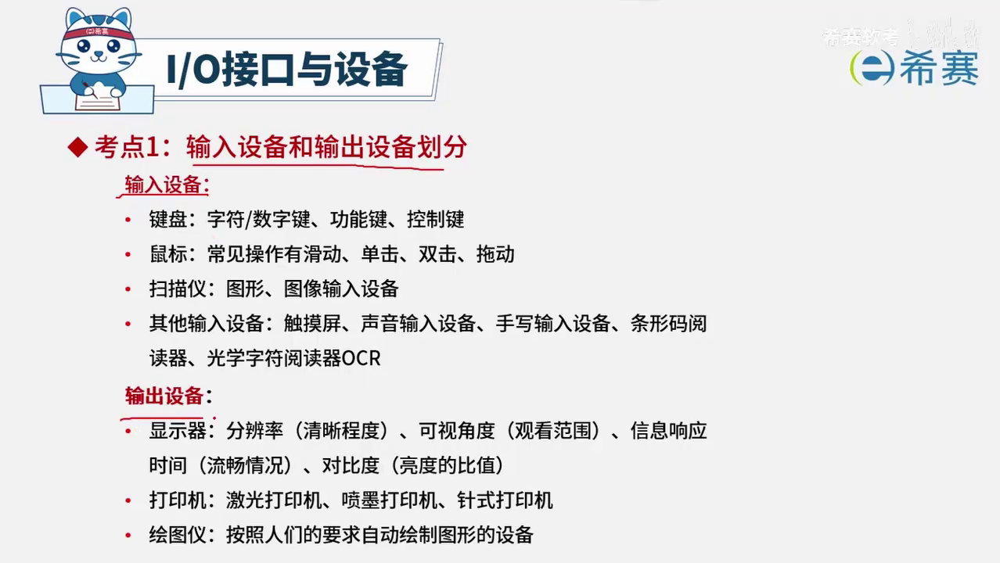

## 程序员考前突破
> 整理知识点, 形成大纲,以便快速回顾和复习.
> 要简略易于理解, 要回头看时还能理解.


### Part1 计算机科学基础

### 1.考点
> 掌握数制及转换, 数据的表示, 算术运算和逻辑运算, 数学应用
> 掌握常用数据结构和算法

### 难点
1)数据的3种编码——原码、反码、补码，以及它们之间的变换方法。
2)浮点数的表示法及其规格化。
3)常用数据结构，其中二叉树及其遍历、链表尤为重要。
4)图的存储（矩阵、邻接表）与遍历、算法效率的计算（时间、空间复杂度）​、6种常见的排序算法、哈希表（散列表）及其解决冲突的方法。

#### ![[11_01.jpg]]


## 数制及转换

### 数制是什么
> 数值是用(一组固定的)符号和(统一的)规则来表示数值的方法.

### r进制
> 在采用**进位计数**的数字系统中, 如果只用r个基本符号来表示数值, 则称其为r进制, r称为该数值的基数.

### 常用进位计数表格
![[13_01.jpg]]

以十进制的2021.25为例的表示形式:


$$
\begin{align}
\text {十进制表示为 } (2021.25)_{10} \text{ 或 } 2021.25D \\
\text {二进制表示为 } (11111100101.01)_{2} \text{ 或 } 11111100101.01B \\
\text {八进制表示为 } (3745.2)_{8} \text{ 或 } 3745.2O \\
\text {十六进制表示为 } (7E5.4)_{16} \text{ 或 } 7E5.4H
\end{align}
$$


### 进制转换

原理: ?
任何一种进位的数制, 所表示的数制都可以写作==**按权展开的多项式**==, 不同数据的相互转换也是依据此实现的.

例如:
$$
(2021.25)_{10} = 2×10^{3} + 0*10^{2} + 2*10^{1} +| 1*10^{0} + 2*10^{-1} + 5*10^{-2}
$$

#### 十进制转二进制:

**整数部分除2取余, 余数倒序排列
小数部分乘2取整, 整数正序排列**

计算过程略, 本章位置为: 1.1.3.1 数制及其转换

那十进制转8进制, 16进制分别是除8 和 除16.

#### **二进制转十进制呢?**
> 方法: 将二进制数的每一位数乘以它的权后相加。

$$
(11111100101.01)_{2}=1×2^{10}+1×2^{9}+1×2^{8}+1×2^{7}+1×2^{6}+1×2^{5}+0×2^{4}+0×2^{3}+1×2^{2}+0×2^{1}+1×2^{0}+0×2^{-1}+1×2^{-2}=(2021.25)_{10}
$$

#### **二进制转8进制**
> 取三合一法，即以二进制的小数点为分界点，向左（或向右）每三位取成一位。

![[14_01.jpg]]

$$
(11111100101.01)_{2} = (3745.2)_{8}
$$

转换过程如下:(位数不足则补位)
![[14_02.jpg]]


## 数据的表示

### 原码, 反码, 补码
> 二进制数值数据包括二进制表示的定点小数、整数和浮点数。这里讲的编码方法，主要是如何方便统一地表示正数、零和负数，并且尽可能有利于简化对它们实现算术运算用到的规.
> **机器数**:  通常把表示一个数值数据的机内编码称为机器数;
> **真值**:  把表示一个数值的数据所代表的实际值称为机器数的真值。

### 1.原码
#### 定义
> 定义: 原码是一种比较直观的机器数表示方法，最高位是符号位，0代表正号，1代表负号，数值部分用该数的绝对值表示。

原码的定义:


$$
[X]_{\text{原}} = 
\begin{cases}
X, & 0 \leq X < 1 \\
1 - X, & -1 < X \leq 0
\end{cases}
$$

分段函数:
* 当X值的范围是`0<= X < 1`时, X的原值就是X
* 当X值的范围是`-1<X<=0`时, X的原值就是`1-X`

#### 表示范围
原码的表示范围受限于位数（如 8 位、16 位、32 位等）.

注意: 通过查询deepSeek得出, 如果需使用原码来表示更大范围的数, 可以通过**固定位数**表示更大范围的数值.


**对于一个 n 位的原码：**
- **最高位是符号位**：0 表示正数，1 表示负数。

- **剩余 n−1 位是数值位**：表示数值的绝对值。

所以, 原码的表示范围是:
$$
- (2^{n-1} - 1) \leq X \leq 2^{n-1} - 1 ]
$$

#### 性质
1. 在原码表示中, 机器数的最高位是符号位, 0表示正号, 1表示负号
2. 在原码表示中, 零有两种表示形式

$$
\begin{align}
[+0.0] &= 00000
\\
[-0.0] &= 10000
\\
注意: 5位只是例子
\end{align}
$$

#### 优缺点
##### 优点
* 数的真值与原码表示之间对应关系简单, 相互转换容易
* 用原码实现乘除运算的规则简单

##### 缺点
* 表示范围是对称的, 但是存在两个问题:  
	1. **零的表示不唯一**：有 +0 和 −0 两种表示; 
	2. **表示范围有限**
* 不利于计算机中应用最多的加减运算, 故计算机中一般不用原码.

> 在乘除运算方便的原因: 在乘除运算中, 符号和数值可以分开处理, 与人类手工计算方式相同.
> 在加减运算不方便的原因:  如果一个加一个减,需要比较绝对值大小,然后大的减去小的,再赋予结果正确的符号. 增加了硬件设备设计的复杂性,降低了运算效率.
> 还有, 零的不唯一表示. 会导致在加减计算中额外处理零的情况, 增加复杂性.


### 反码

#### 定义
> 当真值为正数时，反码与原码相同；
> 当真值为负数时，反码的符号位用1表示，数值位是原码的各位取反（1变0，0变1）的结果


$$
\begin{align}

[X]_{反} = 
\begin{cases}

X  & 0 \leq X<1 \\
(2-2^{-n}) + X & -1<X\leq0

\end{cases}
\end{align}
$$


#### 算术运算和逻辑运算


## 计算机组成与体系结构(分值7-11)


### 进制的转换


### 含符号位数值标识


### 浮点数


### 逻辑代数及其运算


### 校验码


### 中央处理器


### 


### 指令系统(分值0-2)


#### 考点1 - 指令的执行方式

指令执行: 取指-->分析-->执行->

计算机性能: '百万条指令/秒'来表示(MIPS, million instruction per second)计算机的运算速度, 并且计算机的字长越长, 处理能力越强.


**练习题**


#### 考点2 - 指令地址结构

##### 指令的格式

一条指令就是机器语言的一个语句, 它是一组有意义的二进制代码, 指令的基本格式如下:

| 操作码字段 | 地址码字段 |
| ---------- | ---------- |

##### 指令类型

操作码部分指出了计算机要执行什么性质的操作, 如加法,减法,取数,存数等. 

地址码字段需要包含**各操作数的地址及操作结果的存放地址**等, 从其地址结构的角度可以分为:

* 三地址指令
* 二地址指令
* 一地址指令
* 零地址指令

| OP   | A1   | A2   | A3   |
| ---- | ---- | ---- | ---- |


| OP   | A1   | A2   |
| ---- | ---- | ---- |


| OP   | A1   |
| ---- | ---- |


| OP   |
| ---- |


#### 考点3 - 寻址方式

##### 立即寻址

操作数直接在指令中, 速度快, 灵活性差

##### 直接寻址方式

指令中存放的是操作数的地址

##### 间接寻址方式

指令中存放了一个地址, 这个地址对应的内容是操作数的地址

##### 寄存器寻址方式

寄存器存放操作数(前面几种是放在主存储器中的)

##### 寄存器间接寻址方式

寄存器内存放的是操作数的地址(这个地址指向的是主存储器中的)


**例题:**

1.在寄存器简介寻址方式下, 操作数存放在()中.

A.栈空间

B.指令寄存器

**C.主存单元**

D.通用寄存器

> 寄存器寻址就是操作数存放在指定的寄存器中, 寄存器间接寻址是将操作数地址放在寄存器中,操作数放在主存单元中.


### 存储系统(分值0-2)

#### 考点1-层次化存储结构


* 内存一般用于临时存储计算机运行时所需的程序,数据及运行结果
* 外存用于长期保存信息
* 寄存器位于CPU中,用于临时存放少量的数据,运算结果和正在执行的指令


#### 考点2-Cache

* 基于成本和性能方面的考虑, Cache(高速缓存)是为了解决相对较慢的主存与快速的CPU之间工作速度不匹配问题而引入的存储器
* Cache容量较小, 速度比主存快5-10倍, 存储的主存内容的副本
* 主存地址与Cache地址之间的转换工作由硬件自动完成
* 在计算机的存储系统中, Cache是访问速度最快的存储(若有寄存器, 则寄存器最快)
* 使用Cache改善系统性能的依据是**程序的局部性原理**

时间局部性: 某条指令一旦执行, 可能将会再次被执行; 某数据被访问, 可能将会再次被访问

空间局部性: 某程序一旦访问了某个存储单元, 其附近的存储单元也可能将会被访问.


#### 考点3-主存

#### 1.ROM和RAM

ROM(只读存储器): ROM中的内容在厂家生产时写入, 其内容只能读出不能改变,断电后其中的内容不会丢失.

RAM(随机存储器): 既可以写入也可以读出, 断电后信息无法保存,只能用于暂存数据. RAM又可以分为SRAM和DRAM两种.

SRAM: 不断电的情况下信息一直保持而不丢失.

DRAM: 信息会随时间逐渐消失, 需要定时对齐进行刷新来维持信息不丢失. **主存主要构成就是它.**


思考题:

回收站和剪贴板分别占用内存还是外存的存储空间?


#### 2.存储容量单位

**字(Word)**: 计算机进行数据处理时, 一次存取,加工和传送的数据长度称为字. 字的位数可以是16位, 32位, 64位等.

**地址**: 整个内存被分成若干个存储单元, 每个单元用地址(唯一的编号)来标识

**位(b/bit)**: 存放一位二进制数

**字节(B/Byte)**: 8个二进制位为一个字节

1B = 8b

1KB = 1024B

1MB  = 1024KB

1GB  = 1024MB

1TB  = 1024GB

1PB  = 1024TB

1EB  = 1024PB

1ZB  = 1024EB

1YB  = 1024ZB


### 总线系统

#### 考点1-性能指标

**总线的带宽(总线数据传输速率**: 单位时间内总线上传送的数据量, 即每秒钟传送MB的最大稳态数据传输率. 

总线的带宽  = 总线的工作频率 * 总线的位宽 / 8


**总线的位宽: **  能同时传送的二进制数据的位数, 或数据总线的位数, 即32位, 64位等总线宽度的概念. 总线的位宽越宽, 每秒钟数据传输率越大, 总线的带宽越宽.


**总线的工作频率:** 以MHZ为单位, 工作频率越高, 总线工作速度越快, 总线带宽越宽. 


#### 考点2-三总线系统


**地址总线**

* 存储器的数据位宽与数据总线的宽度需要一一匹配，以实现高效数据传输

* 字长: 对应的位宽.


**地址总线宽度32位 => 4GB物理空间.**

```md
2^32 => 4GB 推导

1.地址总线为32位, 则cpu可以生成2^32个不同的地址
2.每个地址对应1个字节(8位), 每个存储单元存储1字节(8位)
3.总内存容量计算
 总容量 = 地址数量 * 每个地址的存储单元大小
 总容量 = 2^32地址 * 1字节/地址 = 2^32字节
 
4.将2^32字节转换位GB
* 计算机中 1GB=2^30字节
* 所以, 2^32字节= 2^30*2^2字节=1GB*4 = 4GB


```


**CPU寻址能力8kb, 地址总线宽度是?**

```md
8*2^10, 2^13, 地址总线13位
```


**题目:**

1.某DRAM芯片的存储容量为512K*16位, 则该芯片的地址线和数据线宽度分别是

A. 9, 16

B. 19, 16

C. 10,16

D. 512, 16

答案: 选B. 16位规定为数据总线的宽度, 存储单元512K, 即2^9*2^10, 也就是2^19.


2..() 是CPU一次能并行处理的二进制位数, 是CPU的主要技术指标之一.

A. 字节

B. 带宽

C. 位宽

**D. 字长**


### IO接口与设备(分值范围0-1)

#### 考点1-输入和输出设备的划分



#### 考点2-cpu与外设之间的数据交换的方式

.png)


**问题: C**


## 第二章-多媒体基础知识(1-3分)


### 媒体的种类(分值0-1)

#### 考点1-媒体概念和分类(分值 0 -1)


媒体的几种主要类型及其功能:

* 感觉媒体 

* 表示媒体（用于数据交换的编码，如图像编码）
* 表现媒体（用于输入输出的媒体，如键盘、显示器）
* 存储媒体（用于存储信息，如磁盘、光盘），
* 传输媒体（用于传输信息，如光纤、同轴电缆）


微型计算机系统中打印机和内存的分类

在微型计算机系统中，打印机被归类为输出设备，属于表现媒体；内存则用于存储信息，属于存储媒体。此外，还介绍了传输媒体（如光纤、同轴电缆）和表示媒体（如图示编码）等相关概念。


### 音频(分值0-2)

#### 考点1-基本参数

1. 幅度：声波的振幅，单位为分贝，直接影响声音的波形幅度。
2. 频率：决定人能接受的声音范围，正常人说话频率在300到3400赫兹，**人耳接收范围为20赫兹到20K赫兹。**
3. 次声波与超声波：次声波频率小于20赫兹，人耳听不到；超声波频率大于20K赫兹，同样超出人耳接收范围。
4. 乐器的频率：乐器的频率与人耳接收频率范围一致，即20赫兹到20K赫兹。
5. 基本参数理解：幅度、频率以及次声波与超声波的定义是音频处理和理解声音特性的重要基础。


#### 考点2-声音信号的数字化

1. 声音信号的数字化过程包括采集、转换成二进制位数量化精度，以及形成统一编码以减少存储量或进行压缩。
2. 采样是将连续的模拟声音信号在时间轴上进行离散化的过程，采样频率应为声音最高频率的2倍，例如最高频率为2K赫兹时，采样频率需为4K赫兹。
3. 模数转换（AD转换）将模拟信号转换为数字信号，量化则用二进制表示声音信号数据，位数反映精度；之后进行编码，组织成声音文件，必要时进行压缩以减少存储量。
4. 数据传输率由采样频率、量化的位数（精度）和声道数（单声道或双声道）组成，这些参数共同决定了声音数据的传输效率。
5. 音频文件格式，如波形文件格式和MP3等，是在声音信号数字化和压缩过程后形成的最终文件格式，用于存储和传输声音数据。

.png)


**例题**

1.设语音信号的采样频率位16KHZ, 量化精度为10位, 单声道输出, 则每小时的数据量位()MB.

A. 160

B. 80

C. 68.66

D. 9.37

音频容量计算: 每秒容量 = **采样频率(Hz)** * **量化/采样位数(位)** * **声道数 / 8**

1KHz = 1000Hz  1MB = 1024KB = 1024*1024B

所以该结果是, 16*1000 * 10*1 / 8 * 60 * 60  / 1024 / 1024 约等于68.66MB


#### 考点3-音频文件格式

.png)


### 图形和图像(分值1-3)

#### 1.图形和图像的区别

矢量图与点阵图、位图、灰度图是并列的概念，前者用于描述由数学公式和几何形状构成的图形，后者则指由像素点构成的图像。


#### 2.图像的基本参数

.png)


#### 3.显示器的基本参数


#### 4.图形文件格式

.png)

1. 图像文件格式的基础知识：**图像由二进制位表示，称为位图或点阵图像素图**，常见格式如BMP、GIF、PNG、JPG等是考试重点。
2. BMP是位图的标准格式，与设备无关；GIF为动图图像，采用无损压缩；PNG被视为GIF的替代品，熟悉这些格式足以应对考试。
3. 特殊图像文件格式区分：JPEG是静态图像的有损压缩格式，而MPEG是动态或运动图像文件格式，两者需区分。
4. 记忆常见图像文件格式：重点记忆BMP、GIF（动图）、PNG、JPG等格式，这些是考试中常出现的图像文件类型。
5. 除上述常见格式外，了解TIF、PCS等格式的基本信息也有助于更全面地掌握图像文件格式的知识体系，尽管它们在考试中出现的频率较低。


#### 题目

图形由直线和曲线的元素构成，属于矢量图


### 多媒体相关计算问题(分值0-1)


#### 考点1-容量计算


* 除以8的原因: 将比特位转换为字节(1个字节 = 8个比特位)
* log2(256) 是求2的多少次方位256, 结果是8. 然后除以8位, 得出字节.


* 扫描后像素点: 150*3 * 150*4 = `450*600`
* `450*600*`(24/8) = 810000


## 第三章 数据结构与算法(8-11分)


### 顺序表与链表(0-2)

#### 考点1-数据结构


#### 考点2-顺序表


1. **顺序表**是通过连续且静态分配的方式存储元素的，即在使用前需预先分配固定大小的空间，保证每个元素有固定的存放位置。
2. 访问操作的时间复杂度为O(1)，即无论访问哪个元素，都能一步到位，效率非常高。
3. 查找特定值的操作时间复杂度为O(N)，因为可能需要遍历整个数组来匹配该值，每次查找的概率相等。
4. 删除和插入元素的操作时间复杂度均为O(N)，这是因为操作需要移动顺序表中的元素以保持连续性，移动次数与元素位置有关。
5. 在含N个元素的顺序存储线性表中，等概率删除任意一个元素平均需要移动二分之N减一的元素，反映了操作的平均时间复杂度。


#### 考点3-链表

.png)


.png)

1. 链表是一种链式存储结构，不同于顺序存储方式，它由两大部分组成：具体的节点和指针方式。节点里面包含值，而指针方式存放的是指向下一个节点的指针位置。
2. 链表的主要特点是内存不连续，即前一个元素存放的下一个地址在存储中不一定是下一个元素。这意味着一个节点可能在内存中的任意位置，而非顺序排列。
3. 访问链表中的某节点，需要通过上一个节点提供的地址进行。每个节点中有一个指针变量，用于存储指向下一个节点的地址，这种结构使得链表的存储方式非连续，而是根据链向次序连接。
4. 链表的指针地址并非连续，而是根据链表的结构，按照前一个节点接下一个节点的顺序，将下一个节点的指针地址保存在前一个节点中，形成了链式结构。
5. 链表的存储方式与顺序存储不同，顺序存储是连续的，而链表的存储则根据节点间的指针连接，形成了非连续的存储特性。


##### 链表的基本概念和特殊类型

.png)


1. 链表的基本概念包括首节点、尾节点和头节点，其中头节点通常用he表示，不存放数据，只存放链表的首地址，以便于进行操作如删除和插入。
2.  首节点是头节点之后的第一个有效节点，它有具体的标号和指针指向，而头节点没有具体的标号和内容，仅用于存放链表的首地址。
3. 尾节点是链表中的最后一个节点，链表通过指针将每个节点（除头节点和尾节点外）与前驱和后继节点相连，其中头节点没有前驱，尾节点没有后继。
4. 头指针指向头节点，尾指针指向尾节点，这两种指针用于快速定位链表的开始和结束位置，便于操作。
5. 加入头节点的目的是提高链表操作的效率，尤其是在链表头部进行删除和插入操作时，使得这些操作更加便捷和快速。


.png)

1. 单链表是一种基本链表结构，由头指针指向头节点，接着是首节点（第一个有效节点），最后是尾节点，每个节点仅向后指向下一个节点。
2. 循环链表是在单链表的基础上，尾节点的指针不是指向空，而是回指到头指针，形成一个循环结构。
3. 双向链表是一种更复杂的链表结构，其中每个节点都有两个指针，一个指向后继节点，另一个指向前驱节点，实现了双向的链接。
4. 这三种链表结构（单链表、循环链表、双向链表）各有特点，适用于不同的数据处理场景和算法实现。


#### 考点4-顺序存储和链式存储性能对比

.png)

1. 顺序存储与链式存储的性能对比：顺序存储的存储密度等于一，为静态分配；链式存储存储密度小于一，因需存储数据及指针，为动态分配。
2. 查找运算：顺序存储和链式存储的时间复杂度均可简化为O(N)，其中N代表数据量大小。
3. 读运算：顺序存储的时间复杂度为O(1)，即一次操作即可找到所需数据；链式存储的时间复杂度为O(N/2 + 1)，可简化为O(N)。
4. 插入运算：顺序存储在首位插入需移动N个元素，平均时间复杂度为O(N)；链式存储只需改变链式结构，时间复杂度为O(1)。
5. 删除操作：顺序存储删除首位元素需移动N-1个元素，平均时间复杂度为O(N)；链式存储只需改变链式结构，时间复杂度为O(1)。


.png)


.png)


1. 数据结构的逻辑与存储结构分为线性与非线性，以及顺序和链式存储。顺序表通过相邻元素的相邻存储实现，而链表则通过指针将不相邻的元素联系起来。
2. 链表的基本类型包括单链表、双链表和循环链表，每种类型有其独特的特性和应用场景，需要对这些概念和名词有深入理解。
3. 单链表、双链表和循环链表是链表的三种主要形式，它们在元素的连接方式、访问和操作上存在显著差异
4. 性能对比是理解数据结构的关键，需要掌握在读操作、查找、插入和删除操作上，顺序表和链表的性能差异，通过对比表格来直观理解这些操作的效率。
5. 通过以上知识点的介绍，我们能够更深入地理解顺序表和链表的特性、类型以及在不同操作下的性能表现，这对于选择合适的数据结构解决实际问题至关重要。


### 数组(0-1)

