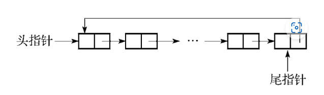
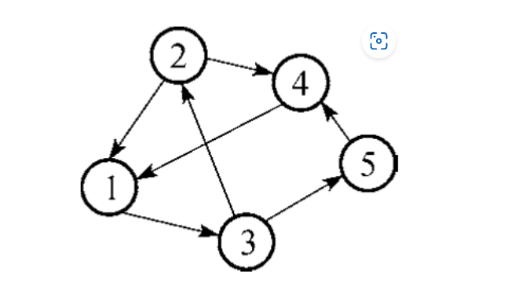
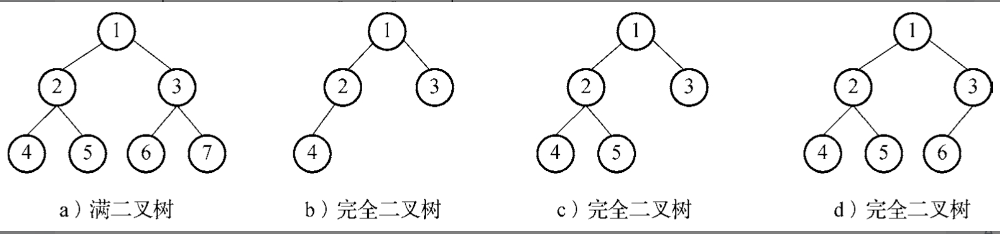

## 计算机科学基础

#### 1.【2017年上半年试题19】对于浮点数x=`m×2^i`和y=`w×2^j`，已知i＞j，那么进行x+y运算时，首先应该对阶，即`______，`使其阶码相同。

A.将尾数m左移(i-j)位

B.将尾数m右移(i-j)位

C.将尾数w左移(i-j)位

D.将尾数w右移(i-j)位


```
对阶是指将两个进行运算的浮点数的阶码(指数)对齐的操作。
对阶的目的是使两个浮点数的尾数能够进行加减运算。

对阶的原则是小阶对大阶(把小的单位换成大的单位)，采用补码表示的尾数右移时，符号位保持不变。

之所以是小阶对大阶，是因为若大阶对小阶，则尾数的数值部分的高位需移出，而小阶对大阶移出的是尾数的数值部分的低位，这样损失的精度更小。


为了让y的数值不变，当它的阶码从j增加到i时，尾数w必须缩小。具体来说：

阶码差是i - j，所以尾数w需要右移​（相当于除以2的(i-j)次方），这样数值才能保持不变。
例如，y原来是w×2^j，调整后变成(w右移i-j位)×2^i，数值和原来一样。
```


#### 2.【2017年上半年试题20】已知某字符的ASCII码值用十进制表示为69，若用二进制形式表示并将最高位设置为偶校验位，则为______。

A.11000101

B.01000101

C.11000110

D.01100101

```md
69(10) => 1000101(2) => 11000101(偶数校验 编码中1的个数为偶数)
```

3.【2017年上半年试题21，22】设机器字长为8，对于二进制编码10101100，如果它是某整数x的补码表示，则x的真值为(1)，若它是某无符号整数y的机器码，则y的真值为(2)。

(1)A.84

B.-84

C.172

D.-172

(2)A.52

B.84

C.172

D.204

```md
10101100(补码) => 11010100(真值-84,先减1再取反,符号位不变)
10101100(无符号机器码) => (真值172)

补码:
* 真值为正数时, 补码和原码相同
* 真值为负数时, 补码符号位用1表示,数值为原码取反,最低为加1.

对于负数:
补码 = 原码数值位取反 + 1
获取原码有两种方法:

原码 = 补码数值位先减1, 再取反;  

原码 = 补码数值位取反 + 1

为什么两种方法等价？
假设补码为 C，原码为 O：

​方法1：O = (C取反) + 1
​方法2：O = (C - 1) 取反
本质上，两种操作都是“补码的补码等于原码”。
无论先取反加1，还是先减1再取反，最终都会得到原码。
```


4.【2017年上半年试题36】采用`______`算法对序列{18,12,10,11,23,2,7}进行一趟递增排序后，其元素的排列变为`{12,10,11,18,2,7,23}`。

A.选择排序

B.快速排序

C.归并排序

D.冒泡排序

```md
* 选择排序：每趟选择最小元素放到已排序区末尾。若是最小元素 2 应被移动到首位，与结果不符。
​ 快速排序：基准元素 18 应被放置到最终位置，但结果中 18 后仍有更小的元素 2 和 7，不符合快排逻辑。
​ 归并排序：归并排序的一趟操作会将相邻子序列合并，但结果中元素顺序与归并后的局部有序性不匹配。
* 冒泡排序  每趟将最大元素“冒泡”到末尾的特点。

选择排序:
 * 特征: 选择排序每趟选择未排序部分的最小元素，放到已排序部分的末尾。
 * 排序结果: 原序列中最小元素是 ​2，与第一个元素 ​18 交换位置，结果为 {2,12,10,11,23,18,7}。
 
快速排序:
 * 特征: 以第一个元素为基准，将比它小的元素移到左侧，大的移到右侧。
 * 一趟划分后，18 被放置到最终位置，左侧 {12,10,11,2,7} 均小于 18，右侧 23 大于 18。效果为: {12,10,11,2,7,18,23}
 

归并排序
 * 第一趟将相邻的单个元素两两合并为有序子序列
 * 合并后相邻两个元素排序：{12,18}, {10,11}, {2,23}, {7} 结果为 {12,18,10,11,2,23,7}。
 
```


#### 5.【2017年上半年试题37】某二叉树的先序遍历（根、左、右）序列为EFHIGJK、中序遍历（左、根、右）序列为HFIEJKG，则该二叉树根结点的左孩子结点和右孩子结点分别是______。

A.A,I.K

B.F,I

**C.F,G**

D.I,G

```md
根据先序遍历和中序遍历的结果，我们可以确定二叉树的结构如下：

​根节点确定：先序遍历的第一个节点是根节点，即根为E。
​分割左右子树：在中序遍历中，E的位置将序列分为左子树（HFI）和右子树（JKG）。
​左子树分析：
左子树的先序序列为FHI，根为F。
中序序列HFI表明F的左子树为H，右子树为I。
因此，F是根E的左孩子，其左孩子为H，右孩子为I。
​右子树分析：
右子树的先序序列为GJK，根为G。
中序序列JKG表明G的左子树为JK（根为J，右孩子为K），右子树为空。
因此，G是根E的右孩子。
综上，根节点E的左孩子为F，右孩子为G。
```


#### 6.【2017年上半年试题38】对于一个初始为空的栈，其入栈序列为1，2，3，…，n(n＞3)，若出栈序列的第一个元素是1，则出栈序列的第n个元素______。

A.可能是2～n中的任何一个

B.一定是2

C.一定是n-l

D.一定是n

```md
对于一个初始为空的栈，入栈序列为1, 2, 3, ..., n（n > 3），若出栈序列的第一个元素是1，则出栈序列的第n个元素需要根据栈的后进先出（LIFO）特性进行分析：

​第一个元素为1的隐含操作：
1被压入后立即弹出，此时栈为空。后续操作针对剩余元素2, 3, ..., n依次入栈，出栈顺序需符合栈规则。

​剩余元素的出栈可能性：

后续元素2到n的入栈顺序固定为2, 3, ..., n，但出栈顺序可灵活变动。例如：
若所有元素按顺序入栈后依次弹出，最后一个元素为n（如序列1, 2, 3, ..., n）。
若部分元素提前弹出，最后一个元素可能是中间值（如序列1, 2, 4, 3，最后一个元素为3）。
若所有元素逆序弹出，最后一个元素为2（如序列1, n, n-1, ..., 2）。
​验证选项：

​选项A（可能是2～n中的任何一个）​：通过构造不同出栈序列（如1,2,3,…,n；1,n,…,2；1,2,…,k,…,n），可证明最后一个元素可以是2到n中的任意值。
​选项B（一定是2）​：存在反例（如序列1,2,3,…,n的最后一个元素为n），故错误。
​选项C（一定是n-1）​：存在反例（如序列1,2,…,n的最后一个元素为n），故错误。
​选项D（一定是n）​：存在反例（如序列1,n,…,2的最后一个元素为2），故错误。

```


#### 9**.【2017年上半年试题41】设S是一个长度为n的非空字符串，其中的字符各不相同，则其互异的非平凡子串（非空且不同于S本身）的个数为______。

A.2n-l

B.n2

C.n(n+l)/2

D.(n+2)(n-l)/2


```md
子串: 必须是原字符串中连续的一段字符。

子序列可以从原字符串中非连续地选取字符，但需保持原有顺序。子序列的总数远多于子串，为 2^n−1（非空子序列）

在计算长度为 n 且字符各不相同的字符串的非平凡子串个数时，步骤如下：
假设原字符串长度为 n, 子串的长度可以是 k=1,2,3,…,n（比如长度为1的子串是单个字符，长度为2的是连续两个字符，依此类推）。


1.总子串数：所有非空子串的数量为
```


$$
\sum_{k=1}^{n} (n - k + 1) = \frac {n(n+1)}{2}
$$


```md
假设原字符串长度为n(比如n=5, 字符串为'abcde')
子串的长度可以是 k=1,2,3,…,n
每个长度k对应的子串数量: 数量 = n - k + 1;
例如: 
	k=1时, 每个字符都是一个子串, 数量为n(即5 - 1 + 1 = 5)
	k=2时, 每两个字符是一个子串, 'ab','bc','cd','de', 数量为4, (即5 - 2 + 1 = 4)

所以, 公式X(n-k+1) = n + (n-1) + (n-2) + ... + 1
也就是1到n的等差数列和: n(n+1) / 2
```


22.【2017年下半年试题39】对关键码序列(12，24，15，56，20，87，69，9)采用散列法进行存储和查找，并设散列函数为H(Key)=Key%11（%表示整除取余运算）​。采用线性探查法（顺序地探查可用存储单元）解决冲突所构造的散列表为`______。`

![[Pasted image 20250516215542.png]]

```md
散列函数与冲突解决：
使用 H(Key)=Key%11 计算初始位置，冲突时采用线性探查法​（顺序查找下一个空位）。

​关键码插入过程：

​12：12%11=1 → 地址1。
​24：24%11=2 → 地址2。
​15：15%11=4 → 地址4。
​56：56%11=1（冲突）→ 探查地址2（被占）→ 地址3（空）→ 地址3。
​20：20%11=9 → 地址9。
​87：87%11=10 → 地址10。
​69：69%11=3（冲突）→ 探查地址4（被占）→ 地址5（空）→ 地址5。


```


24.【2017年下半年试题41、42】对于下面的有向图，其邻接矩阵是一个(1)的矩阵，采用邻接链表存储时，顶点0的表结点个数为2，顶点3的表结点个数为0，顶点1的表结点个数为(2)。


(1)A.3×4

B.4×3

C.6×6

**D.7×7**

(2)A.0

B.1

**C.2**

D.3

```md
邻接矩阵是表示有向图顶点间邻接关系的 ​方阵，矩阵的行和列数等于图中顶点的总数。

题目明确说明有向图包含 ​7个顶点（0到6）​，因此邻接矩阵的大小为 ​7×7。


邻接链表中，每个顶点的表结点个数表示该顶点的 ​出边数量​（即从该顶点指向其他顶点的边数）。

​分析顶点1的出边：
根据题目描述和用户补充信息，顶点1的出边指向 ​顶点0 和 ​顶点5，共 ​2条出边。
因此在邻接链表中，顶点1的表结点个数为 ​2。
```


#### 25.【2017年下半年试题43】对n个关键码构成的序列采用直接插入排序法进行升序排序的过程是：在插入第i个关键码Ki时，其前面的i-1个关键码已排好序，因此令Ki与Ki-1，Ki-2，…依次比较，最多到K1为止，找到插入位置并移动相关元素后将Ki插入有序子序列的适当位置，完成本趟（即第i-1趟）排序。以下关于直接插入排序的叙述中，正确的是______。

A.若原关键码序列已经升序排序，则排序过程中关键码间的比较次数最少

B.若原关键码序列已经降序排序，则排序过程中关键码间的比较次数最少

C.第1趟完成后即可确定整个序列的最小关键码

D.第1趟完成后即可确定整个序列的最大关键码

```md

选项A：若原序列已经升序排序，则每次插入仅需比较一次（与前一个元素），总比较次数为n−1次，这是最少的情况。​正确。

选项B：若原序列降序排序，每次插入需比较所有已排序元素，总比较次数为(n(n−1)) / 2次数, 属于最坏情况。​错误。

选项C：第1趟处理前两个元素，仅保证前两个有序，但后续可能存在更小元素。例如序列5,1,0，第1趟后为1,5,0，最小元素0未被确定。​错误。

选项D：同理，第1趟无法确定后续是否有更大元素。例如序列3,6,7，第1趟后前两位有序，但最大元素7未被确定。​错误。

```


#### 27.【2017年下半年试题63】设M和N为正整数，且M＞2，N＞2，MN＜2(M+N)，满足上述条件的(M,N)共有______对。

A.3

**B.5**

C.6

D.7

```md
MN＜2(M+N)等价于(M-2)(N-2)＜4，而M和N都是正整数。

M-2=1时，N-2可以是1、2、3；M-2=2时，
N-2只能是1；M-2=3时，
N-2只能是1，

所以(M,N)只有(3,3)，(3,4)，(3,5)，(4,3)，(5,3)五对。
```


#### 30.【2019年下半年试题7】若计算机字长为32，则采用补码表示的整数范围为______。


```md
长度为n的情况下，补码能够表示的范围为[-2^(n-1),2^(n-1))。
因此，当补码字长为32时，表示的范围为[-2^31,2^31）​。

```


#### 32.【2019年下半年试题21】设X、Y、Z为逻辑变量，当且仅当X和Y同时为1时Z为0，其他情况下Z为1，则对应的逻辑表达式为______。

A.Z=X·Y

B.Z=X+Y

C.Z=X⊕Y

D.Z=X+Y(头上有横杠)


#### 35.【2019年下半年试题37】单向循环链表如下图所示，以下关于单向循环链表的叙述中，正确的是______。



A.仅设头指针时，遍历单向循环链表的时间复杂度是O(1)

B.仅设尾指针时，遍历单向循环链表的时间复杂度是O(1)

C.仅设头指针时，在表尾插入一个新元素的时间复杂度是O(n)

D.仅设尾指针时，在表头插入一个新元素的时间复杂度是O(n)

```md

选项A：仅设头指针时，遍历时间复杂度是O(1)。

​错误。遍历需要从头指针开始，依次访问所有节点，直到回到头指针。时间复杂度为 ​O(n)。


​选项B：仅设尾指针时，遍历时间复杂度是O(1)。

​错误。尾指针仅能快速定位链表的尾部，但遍历仍需从头节点开始（通过 尾指针->next），时间复杂度仍为 ​O(n)。


​选项C：仅设头指针时，在表尾插入元素的时间复杂度是O(n)。
​正确。若仅有头指针，插入表尾需先遍历整个链表找到尾节点（即某个节点的 next 指向头节点），时间复杂度为 ​O(n)。

​选项D：仅设尾指针时，在表头插入元素的时间复杂度是O(1)。

​存在争议。理论上，通过尾指针可直接访问头节点（尾指针->next），插入表头只需修改指针，时间复杂度为 ​O(1)。但根据题目答案标注，此选项未被选为正确，可能原题存在排版或选项描述问题。


```


38.【2019年下半年试题40】以下关于下图所示**有向图G**的说法中，正确的是______。



A.G的邻接矩阵是对称矩阵

B.G的邻接矩阵是三角矩阵

C.G是强连通图

D.G是完全图

```md
选项A（对称矩阵）​：
有向图的邻接矩阵对称，当且仅当所有边都是双向的（即若有边 i→j，必有边 j→i）。图中未显示所有边双向存在，因此 ​A错误。

​选项B（三角矩阵）​：
邻接矩阵是三角矩阵的条件是：节点按拓扑顺序排列，且图中无反向边（即所有边从低位节点指向高位节点）。若图中存在环路或反向边（如 4→2），则邻接矩阵不可能是三角矩阵。根据图中结构，​B错误。

​选项C（强连通图）​：
强连通图要求任意两节点间存在双向路径。

​验证路径存在性：
从节点1出发，可到达2、3、4、5（通过路径如 1→3→5 或 1→2→4）。
其他节点间也存在连通路径（如 2→4→5→1，3→5→1→2 等）。
​结论：图中所有节点互相可达，因此 ​C正确。


​选项D（完全图）​：
完全图要求任意两节点间均存在直接的双向边。显然图中未包含所有可能的边（如 1→4 缺失），因此 ​D错误。
```


#### 41.【2019年下半年试题43】对n个关键码构成的序列采用简单选择排序法进行排序的过程是：第一趟经过n-1次关键码之间的比较，确定出最小关键码在序列中的位置后，再将其与序列的第一个关键码交换，第二趟则在其余的n-1个关键码中进行n-2次比较，确定出最小关键码的位置后，再将其与序列的第二个关键码进行交换……直到序列的关键码从小到大排列。在简单选择排序过程中，关键码之间的总比较次数为______。

A.n(n-1)/2

B.n/2

C.n(n+1)/2

D.nlogn


>根据题目描述，简单选择排序第一趟经过n-1次关键码之间的比较，第二趟经过n-2次关键码之间的比较，第三趟经过n-3次关键码之间的比较……第n-1趟经过1次关键码之间的比较，总的比较次数为n-1+n-2+…+1=n(n-1)/2。

#### 42.【2019年下半年试题55】软件从一个计算机系统或环境转移到另一个计算机系统或环境的难易程度是指软件的______。

A.兼容性

**B.可移植性**

C.可用性

D.可扩展性


#### 43.【2019年下半年试题56】在软件质量因素中，与能够得到正确或相符的结果或效果有关的软件属性为______。

A.可靠性

**B.准确性**

C.可用性

D.健壮性

```md
正确性（准确性）: 正确实现算法功能，最重要的指标是能否得到正确或者相符的结果或效果的软件。

可用性：是在某个考察时间，系统能够正常运行的概率或时间占有率期望值。系统的可用性取决于MTTF（平均无故障时间，表示系统的可靠性）及MTTR（平均修复故障时间，表示系统的可维护性）

可靠性：元件、产品、系统在一定时间内和一定条件下无故障地执行指定功能的能力或可能性。

友好性：具有良好的使用性。

可读性：可读的、可以理解的，方便分析、修改和移植。

健壮性：能对不合理的数据或非法的操作进行检查、纠正。

效率：对计算机资源的消耗，包括计算机内存和运行时间的消耗。
```


#### 46.【2019年下半年试题65】某工厂要分配A、B、C、D、E五个工人做编号为1、2、3、4、5的五项工作，每个人只能做一项工作，每项工作只能由一人做。下表说明了每个工人会做哪些工作（用“√”表示）、不会做哪些工作（用“×”表示）。根据此表，可知共有______种分配方案。


A.3

**B.4**

C.5

D.6


#### 48.【2020年下半年试题20】设码长为8，原码10000000所表示的十进制整数的值为______。

A.-128

B.-0

C.1

D.128

```md
原码、反码和补码是数值数据的三种基本编码方法，对于正数，三种编码是相同的，而对于负数，这三种编码是不同的。

码长为8即用8位二进制形式来表示数值，最左边的位是符号位，0表示是正数，1表示是负数，剩余的7位表示数值部分，原码表示的规则是直接表示出数值的绝对值。本题中10000000的最高位为1，表示是负数。数值部分为0，即绝对值为0的数值。在原码表示中，0由于符号部分不同占用00000000和10000000两个编码。
```


#### 49.【2020年下半年试题21】设有两个浮点数，其阶码分别为E1和E2，当这两个浮点数相乘时，运算结果的阶码E为______。

A.E1、E2中的较小者

B.E1、E2中的较大者

**C.E1+E2的值**

D.E1×E2的值

```md

在机器中表示一个浮点数时，一是要给出尾数，用定点小数形式表示，尾数部分给出有效数字的位数，因而决定了浮点数的精度；二是要给出指数，用整数形式表示，常称为阶码，阶码指明小数点在数据中的位置，因而决定了浮点数的表示范围。例

如，浮点数X=1101.0101，Y=10.0111，按照浮点格式（忽略标准格式要求）表示为X=0.11010101×2^4，Y=0.100111×2^2。

若进行加减运算，需要先对阶，也就是在阶码一致的情况下对尾数部分进行加减运算；

若进行乘除运算，则不要求阶码一致。
相乘时阶码部分为两个浮点数的阶码相加，尾数部分直接相乘，之后再按照规格化等要求进行处理。
```


#### 54.【2020年下半年试题39】将一个三对角矩阵A`[1..100,1..100]`进行压缩存储，方法是按行优先方式，将三对角中的元素存入一维数组B`[1..298]`中。在这种存储方式下，设元素A`[56,55]`存储在B`[k]`，则k为______。

A.164

B.165

C.166

D.167


```md

三对角矩阵是一种特殊矩阵，矩阵中的非零元素都分布在主对角线及邻近主对角线的次对角线上，三对角矩阵如下图所示。


按行排列，元素A[56,55]之前有164个元素((56-1)×3-1+(55-56+1))，因此该元素对应着B[165]​。

```


55.【2020年下半年试题40】对于一棵结点数为n(n＞1)的完全二叉树，从根结点这一层开始，按照从上往下、从左到右的顺序，把结点依次存储在数组A`[1..n]`中。设某结点在数组A中的位置为i，且它有右孩子，则该右孩子结点在A中的位置是`______。\`
A.2i-1

B.2i

C.2i+1

D.log(i+1)




```md
在一棵高度为h的完全二叉树中，除了第h层（即最底下一层）​，其余各层都是满的。第h层上的结点必须从左到右依次放置，不能留空，例如，高度为3的完全二叉树有如下图所示的4种，其中图a是完全二叉树也是满二叉树。
```


## 二.计算机系统基础


#### 128.【2020年下半年试题70】下面的网络地址中，不能作为目标地址的是______。

**A.0.0.0.0**

B.127.0.0.1

C.10.255.255.255

D.192.168.0.1


答案：A. 0.0.0.0

------

**解析：**
 • 0.0.0.0 是“未指定地址”，通常用于表示默认路由或绑定服务到所有接口，但不能作为目标地址发送数据包。

• 127.0.0.1 是回环地址，用于本机通信，可合法作为目标地址。

• 10.255.255.255 是私有网络（10.0.0.0/8）的广播地址，可合法作为目标地址发送广播。

• 192.168.0.1 是私有地址（C类），通常用于本地网络设备（如路由器），可合法作为目标地址。

------

**地址对比表：**

| 选项 | 地址           | 类型                    | 是否可作为目标地址 | 说明                                       |
| ---- | -------------- | ----------------------- | ------------------ | ------------------------------------------ |
| A    | 0.0.0.0        | 未指定地址              | 否                 | 用于默认路由或绑定所有接口，无实际目标。   |
| B    | 127.0.0.1      | 回环地址                | 是                 | 本机通信，测试本地服务。                   |
| C    | 10.255.255.255 | 广播地址（A类私有网络） | 是                 | 向10.0.0.0/8网络内所有主机广播。           |
| D    | 192.168.0.1    | 私有地址（C类）         | 是                 | 本地网络设备（如路由器或主机）的有效地址。 |

------

**关键总结：**
 • 0.0.0.0 因无实际目标主机或接口，不能作为目标地址。

• 其他地址（广播、回环、私有地址）均可在特定场景下作为目标地址。


#### 127.【2020年下半年试题69】在TCP/IP网络中，RARP的作用是______。

**A.根据MAC地址查找对应的IP地址**

B.根据IP地址查找对应的MAC地址

C.报告IP数据报传输中的差错

D.控制以太帧数据的正确传送

> RARP协议是反向地址转换协议，作用是将局域网中某个主机的物理地址（MAC地址）转换为IP地址。


#### 126.【2020年下半年试题68】在电子邮件系统中，客户端代理______。

A.通常都使用SMTP协议发送邮件和接收邮件

**B.发送邮件通常使用SMTP协议，而接收邮件通常使用POP3协议**

C.发送邮件通常使用POP3协议，而接收邮件通常使用SMTP协议

D.通常都使用POP3协议发送邮件和接收邮件


#### 123.【2020年下半年试题62】假设系统中有运行的事务，此时若要转储全部数据库，那么应采用______方式。

A.静态全局转储

**B.动态全局转储**

C.静态增量转储

D.动态增量转储

> 数据的转储分为静态转储和动态转储、海量转储和增量转储。
>
> ①静态转储和动态转储：静态转储是指在转储期间不允许对数据库进行任何存取、修改操作；动态转储是在转储期间允许对数据库进行存取、修改操作，故转储和用户事务可并发执行。
>
> ②海量转储和增量转储：海量转储是指每次转储全部数据；增量转储是指每次只转储上次转储后更新过的数据。
>
> 综上所述，假设系统中有运行的事务，若要转储全部数据库，那么应采用动态全局转储方式。


#### 121.【2020年下半年试题58，59】假设关系R1、R2和R3如下表所示，关系代数表达式R3=(1)，R1=(2)。


(1)

A.R1×R2

B.R1∩R2

**C.R1∪R2**

D.R1÷R2

(2)

A.R3×R2

B.R3∩R2

C.R3∪R2

**D.R3-R2**


#### 120.【2020年下半年试题57】数据库中常见的check（约束机制）是为了保证数据的_______，防止合法用户使用数据库时向数据库加入不符合语义的数据。

**A.完整性**

B.安全性

C.可靠性

D.并发控制

> 数据库的完整性是指数据库的正确性和相容性，是防止合法用户使用数据库时向数据库加入不符合语义的数据，保证数据库中数据是正确的，避免非法的更新。
>
> 数据库完整性重点需要掌握的内容有：完整性约束条件的分类、完整性控制应具备的功能。
>
> 
>
> 完整性约束条件作用的对象有关系、元组、列三种。
>
> 在数据库系统中常见的check（约束机制）就是为了保证数据的完整性，check约束可以应用于1个或多个列。例如：学生关系S（学号，课程号，成绩），若要求该关系中的“成绩”不能为负值，则可用“check（成绩＞=0）”进行约束。


#### 115.【2020年下半年试题32】在某C程序中有下面的类型和变量定义（设字符型数据占1字节，整型数据占4字节），则运行时系统为变量rec分配的空间大小为_______。

```c
union {
  char ch;
  int num;
}rec;
```

A.1字节

**B.4字节**

C.5字节

D.8字节

> 共用体变量的大小取决于其所需存储空间最大的成员，最大的成员为整型，故而占4字节。


#### 113.【2020年下半年试题30】关于下图所示的有限自动机M（A是初态、C是终态）的叙述中，正确的是_______。


**A.M是确定的有限自动机，可识别1001**

B.M是确定的有限自动机，可识别1010

C.M是不确定的有限自动机，可识别1010

D.M是不确定的有限自动机，可识别1001

> 【解析】考查程序设计语言翻译有限自动机的基础知识。
>
> 首先关于其是否是确定的有限自动机和不确定的有限自动机的判断，就是看关于该结点的路径中相同数字是否到达不同的结点，如果相同数字不同结点就是不确定的有限自动机。
>
> 很明显图示未存在这样的情况，属于确定的有限自动机。
>
> 能够识别的字符串必须要达到终点，故1001是能够被识别的，而1010不能够被识别，综合答案选择A选项。


> 解题思路：
> 确定有限自动机（DFA）的判断
> 每个状态对输入符号（0/1）有且仅有唯一转移路径，因此M是确定的有限自动机（DFA），排除选项C和D。
> 验证字符串是否被接受
> 字符串1001：
> 路径：A → (输入1) → A → (输入0) → B → (输入0) → B → (输入1) → C（终态）
> 可识别，选项A正确。
> 字符串1010：
> 路径：A → (输入1) → A → (输入0) → B → (输入1) → C → (输入0) → B（非终态）
> 不可识别，选项B错误。
> 关键结论：
> M是DFA，且能识别1001，但无法识别1010。
> 最终答案：A。


> 确定的有限自动机(DFA)要求每个状态对每个输入符号最多有一个转移
>
> 不确定的有限自动机(NFA)允许一个状态对同一个输入符号有多个转移，或者有ε转移


#### 110.【2020年下半年试题27】假设分页存储管理系统中，地址用32个二进制位表示，其中页号占12位，页内地址占20位。若系统以字节编址，则该系统_______。

A.页面大小为2MB，共有4096个页面

B.页面大小为2MB，共有1024个页面

**C.页面大小为1MB，共有4096个页面**

D.页面大小为1MB，共有1024个页面


#### 109.【2020年下半年试题25，26】假设有6个进程共享一个互斥段N，如果最多允许3个进程同时访问互斥段N，那么利用PV操作时，所用信号量S的变化范围为(1)；若信号量S的当前值为-1，则表示系统有(2)个正在等待该资源的进程。

(1)

A.0～6

B.-1～5

C.-2～4

**D.-3～3**

(2)

A.0

**B.1**

C.2

D.3

> 根据PV操作定义，当信号量的值小于0时，其绝对值表示等待资源的进程数，所以试题中信号量S的当前值为-1，表示系统中有1个进程请求资源得不到满足。


#### 100.【2020年下半年试题8】将操作数包含在指令中的寻址方式称为_______。

A.直接寻址

B.相对寻址

C.间接寻址

**D.立即寻址**


#### 99.【2020年下半年试题7】CPU主要由运算器、控制器组成，下列不属于运算器的部件是_______。

A.算术逻辑运算单元

**B.程序计数器**

C.累加器

D.状态寄存器

> CPU主要由运算器、控制器、寄存器组和内部总线组成。
>
> 
>
> 运算器主要完成算术运算和逻辑运算，实现对数据的加工与处理，包括算术逻辑运算单元(ALU)、累加器(AC)、状态字寄存器(PSW)、寄存器组及多路转换器等逻辑部件。
>
> 
>
> 控制器的主要功能是从内存中取出指令，并指出下一条指令在内存中的位置，将取出的指令送入指令寄存器，启动指令译码器对指令进行分析，最后发出相应的控制信号和定时信息，控制和协调计算机的各个部件有条不紊地工作，以完成指令所规定的操作。
>
> 
>
> 控制器主要由**程序计数器(PC)、指令寄存器(IR)、指令译码器、状态字寄存器(PSW)、时序产生器和微操作信号发生器等**组成。

#### 88.【2019年下半年试题61，62】给出关系R(A,B,C)和S(A,B,C)，R和S的函数依赖集F={A→B，B→C}。若R和S进行自然连接运算，则结果集有(1)个属性。关系R和S(2)。

(1)
**A.3**
B.4
C.5
D.6
(2)
A.不存在传递依赖
B.存在传递依赖A→B
**C.存在传递依赖A→C**
D.存在传递依赖B→C
> 当R和S进行自然连接运算时，结果集会去掉所有重复属性列，所以结果集有3个属性。根据题干“R和S的函数依赖集F={A→B，B→C}”以及Armstrong公理系统的传递律规则（传递律：若X→Y和Y→Z在R上成立，则X→Z在R上成立）​。可知，函数依赖“A→C”为F所蕴涵。


#### 77.【2019年下半年试题30】某个不确定有限自动机（s0为初态，s3为终态）如下图所示，`_______`是该自动机可识别的字符串（即从初态到终态的路径中，所有边上标记的字符构成的序列）​。
![[Pasted image 20250514225056.png]]
**A.baabb**
B.bbaab
C.aabab
D.ababa


#### 74.【2019年下半年试题27】若系统中有4个互斥资源R，当系统中有2个进程竞争R，且每个进程都需要i(i≤3)个R时，该系统可能会发生死锁的最小i值是`_______。`
A.1
B.2
**C.3**
D.4


#### 72.【2019年下半年试题24，25】某计算机系统页面大小为4K，进程P的页面变换表如下表所示。若P中某数据的逻辑地址为十六进制2C18H，则该地址的页号和页内地址分别为(1)；经过地址变换后，地址应为十六进制(2)。

![[Pasted image 20250514225151.png]]


(1)
A.2和518H
**B.2和C18H**
C.5和518H
D.5和C18H

(2)
A.2C18H
B.4C18H
**C.5C18H**
D.8C18H

> 根据题意，计算机的系统页面大小为4K，即2^12，表示需要用12位二进制（3位十六进制）来表示页面大小，所以在逻辑地址（4位十六进制表示下）中，后3位为页内地址，前1位为页号。因此，逻辑地址为十六进制2C18H，其页号为2，页内地址为C18H。
> 
> 查页表后可知，页号为2的页会存储到物理块号为5的页内，所以该地址经过变换后，其物理地址应为物理块号5加上页内地址C18H，即十六进制5C18H。

70.【2019年下半年试题20】计算机启动时CPU从`_______`读取硬件配置的重要参数。
A.SRAM
**B.CMOS**
C.DRAM
D.CD-ROM

> SRAM（Static Random Access Memory，静态随机存取存储器）
> 
> DRAM（Dynamic Random Access Memory，动态随机存取存储器）
> 
> 注意：SRAM和DRAM都属于RAM，其中存储的内容在断电之后会消失，每次开机后内容随机，不固定。
> 
> CMOS（Complementary Metal Oxide Semiconductor，互补金属氧化物半导体）是指制造大规模集成电路芯片用的一种技术或用这种技术制造出来的芯片，是计算机主板上的一块可读写的RAM芯片，用来保存BIOS设置的计算机硬件参数。


#### 64.【2019年下半年试题9】以下关于CPU与I/O设备交换数据所用控制方式的叙述中，正确的是_______。

A.中断方式下，CPU与外设是串行工作的

B.中断方式下，CPU需要主动查询和等待外设

**C.DMA方式下，CPU与外设可并行工作**

D.DMA方式下，CPU需要执行程序来传送数据

> CPU与I/O设备交换数据时常见的控制方式有**程序查询方式、中断方式、DMA方式和通道方式等**。
> 
> 在程序查询方式下，CPU执行指令查询外设的状态，在外设准备好的情况下才输入或输出数据。
> 
> 在中断方式下，外设准备好接收或发送数据时发出中断请求，CPU无须主动查询外设的状态。
> 
> 在DMA方式下，数据传送过程是直接在内存和外设间进行的，不需要CPU执行程序来进行数据传送。
> 
> DMA方式简化了CPU对数据传送的控制，提高了主机与外设并行工作的程度，实现了外设和主存之间成批数据的快速传送，使系统的效率明显提高。


#### 56.【2017年下半年试题70】邮箱客户端软件使用`_______`协议从电子邮件服务器上获取电子邮件。
A.SMTP
**B.POP3**
C.TCP
D.UDP

> 客户端代理是提供给用户的界面，在电子邮件系统中，发送邮件通常使用SMTP协议，而接收邮件通常使用POP3协议。


#### 43.【2017年下半年试题30】若程序中定义了三个函数f1、f2和f3，并且函数f1执行时会调用f2、函数f2执行时会调用f3，那么正常情况下，_______。

A.f3执行结束后返回f2继续执行，f2结束后返回f1继续执行

B.f3执行结束后返回f1继续执行，f1结束后返回f2继续执行

C.f2执行结束后返回f3继续执行，f3结束后返回f1继续执行

D.f2执行结束后返回f1继续执行，f1结束后返回f3继续执行

> 当程序设计语言允许嵌套调用函数时，应遵循先入后出的规则。即函数f1调用f2、f2调用f3，返回时应先从f3返回f2，然后从f2返回f1。


#### 38.【2017年下半年试题25】当一个双处理器的计算机系统中同时存在3个并发进程时，同一时刻允许占用处理器的进程数`_______。`
A.至少为2个
**B.最多为2个**
C.至少为3个
D.最多为3个

#### 28.【2017年下半年试题6】CPU中设置了多个寄存器，其中`_______`用于保存待执行指令的地址。
A.通用寄存器
**B.程序计数器**
C.指令寄存器
D.地址寄存器

> CPU主要部件有运算单元、控制单元和寄存器组。
> 
> 寄存器是CPU中的一个重要组成部分，它是CPU内部的临时存储单元。
> 
> 寄存器既可以用来存放数据和地址，也可以存放控制信息或CPU工作时的状态。
> 
> 累加器在运算过程中暂时存放操作数和中间运算结果，不能用于长时间保存数据。
> 
> 标志寄存器也称为状态字寄存器，用于记录运算中产生的标志信息。
> 
> 指令寄存器用于存放正在执行的指令，指令从内存取出后送入指令寄存器。
> 
> 数据寄存器用来暂时存放由内存储器读出的一条指令或一个数据字；反之，当向内存写入一个数据字时，也暂时将它们存放在数据缓冲寄存器中。
> 
> 程序计数器的作用是存储待执行指令的地址，实现程序执行时指令执行的顺序控制。
> 
> 地址寄存器通常用来暂存访问（数据）内存单元的地址。


#### 24.【2017年上半年试题70】下面地址中可以作为源地址但是不能作为目的地址的是`_______。`

A.0.0.0.0

B.127.0.0.1

C.202.225.21.1/24

D.202.225.21.255/24

> 每一个字节都为0的地址(0.0.0.0)对应于当前主机，即源地址，不能作为目的地址。
> 
> 127.0.0.1是本地回送地址，既可作源地址也可作目的地址。
> 
> 202.225.21.1/24是主机单播地址，既可作源地址也可作目的地址。
> 
> 202.225.21.255/4是网络广播地址，只能作为目的地址，不能作为源地址。


#### 22.【2017年上半年试题68】PING发出的是`_______`类型的报文，封装在IP数据中传送。

A.TCP请求

B.TCP响应

**C.ICMP请求与响应**

D.ICMP源点抑制


#### 16.【2017年上半年试题27】在页式存储管理方案中，如果地址长度为32位，并且地址结构的划分如下图所示，则系统中页面总数与页面大小分别为`_______。`
![[Pasted image 20250514233430.png]]
A.4K,1024K

B.1M,4K

C.1K,1024K

D.1M,1K


#### 15.【2017年上半年试题1】操作系统中进程的三态模型如下图所示，图中a、b和c处应分别填写`_______。`

![[Pasted image 20250514233538.png]]

A.阻塞、就绪、运行

B.运行、阻塞、就绪

**C.就绪、阻塞、运行**

D.就绪、运行、阻塞

> 进程具有运行态、就绪态和阻塞态三种基本状态。
> 
> 当CPU空闲时，系统将选择处于就绪态的一个进程进入运行态；
> 
> 当CPU的一个时间片用完时，当前处于运行态的进程就进入了就绪态；
> 
> 进程从运行到阻塞状态通常是进程释放CPU，然后等待系统分配资源或等待某些事件的发生。


#### 7.【2017年上半年试题8】总线的带宽是指`_______。`
A.用来传送数据、地址和控制信号的信号线总数
B.总线能同时传送的二进制位数
**C.单位时间内通过总线传输的数据总量**
D.总线中信号线的种类

> 总线的带宽也就是数据传输率，即单位时间内通过总线传输的数据量，以B/s（字节/秒）为单位。


## 3系统开发和运行

