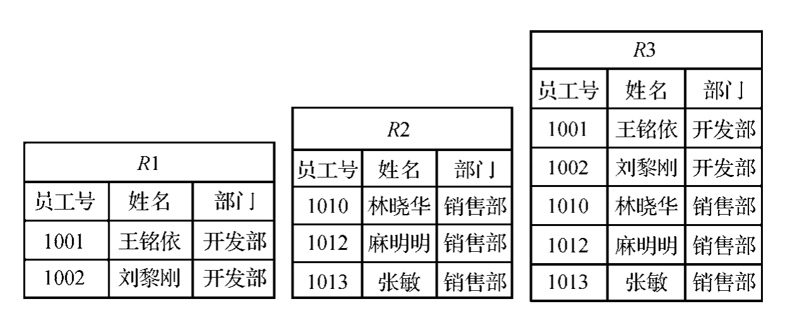

## 二.计算机系统基础


#### 128.【2020年下半年试题70】下面的网络地址中，不能作为目标地址的是______。

**A.0.0.0.0**

B.127.0.0.1

C.10.255.255.255

D.192.168.0.1


答案：A. 0.0.0.0

------

**解析：**
 • 0.0.0.0 是“未指定地址”，通常用于表示默认路由或绑定服务到所有接口，但不能作为目标地址发送数据包。

• 127.0.0.1 是回环地址，用于本机通信，可合法作为目标地址。

• 10.255.255.255 是私有网络（10.0.0.0/8）的广播地址，可合法作为目标地址发送广播。

• 192.168.0.1 是私有地址（C类），通常用于本地网络设备（如路由器），可合法作为目标地址。

------

**地址对比表：**

| 选项 | 地址           | 类型                    | 是否可作为目标地址 | 说明                                       |
| ---- | -------------- | ----------------------- | ------------------ | ------------------------------------------ |
| A    | 0.0.0.0        | 未指定地址              | 否                 | 用于默认路由或绑定所有接口，无实际目标。   |
| B    | 127.0.0.1      | 回环地址                | 是                 | 本机通信，测试本地服务。                   |
| C    | 10.255.255.255 | 广播地址（A类私有网络） | 是                 | 向10.0.0.0/8网络内所有主机广播。           |
| D    | 192.168.0.1    | 私有地址（C类）         | 是                 | 本地网络设备（如路由器或主机）的有效地址。 |

------

**关键总结：**
 • 0.0.0.0 因无实际目标主机或接口，不能作为目标地址。

• 其他地址（广播、回环、私有地址）均可在特定场景下作为目标地址。


#### 127.【2020年下半年试题69】在TCP/IP网络中，RARP的作用是______。

**A.根据MAC地址查找对应的IP地址**

B.根据IP地址查找对应的MAC地址

C.报告IP数据报传输中的差错

D.控制以太帧数据的正确传送

> RARP协议是反向地址转换协议，作用是将局域网中某个主机的物理地址（MAC地址）转换为IP地址。


#### 126.【2020年下半年试题68】在电子邮件系统中，客户端代理______。

A.通常都使用SMTP协议发送邮件和接收邮件

**B.发送邮件通常使用SMTP协议，而接收邮件通常使用POP3协议**

C.发送邮件通常使用POP3协议，而接收邮件通常使用SMTP协议

D.通常都使用POP3协议发送邮件和接收邮件


#### 123.【2020年下半年试题62】假设系统中有运行的事务，此时若要转储全部数据库，那么应采用______方式。

A.静态全局转储

**B.动态全局转储**

C.静态增量转储

D.动态增量转储

> 数据的转储分为静态转储和动态转储、海量转储和增量转储。
>
> ①静态转储和动态转储：静态转储是指在转储期间不允许对数据库进行任何存取、修改操作；动态转储是在转储期间允许对数据库进行存取、修改操作，故转储和用户事务可并发执行。
>
> ②海量转储和增量转储：海量转储是指每次转储全部数据；增量转储是指每次只转储上次转储后更新过的数据。
>
> 综上所述，假设系统中有运行的事务，若要转储全部数据库，那么应采用动态全局转储方式。


#### 121.【2020年下半年试题58，59】假设关系R1、R2和R3如下表所示，关系代数表达式R3=(1)，R1=(2)。



(1)

A.R1×R2

B.R1∩R2

**C.R1∪R2**

D.R1÷R2

(2)

A.R3×R2

B.R3∩R2

C.R3∪R2

**D.R3-R2**


#### 120.【2020年下半年试题57】数据库中常见的check（约束机制）是为了保证数据的_______，防止合法用户使用数据库时向数据库加入不符合语义的数据。

**A.完整性**

B.安全性

C.可靠性

D.并发控制

> 数据库的完整性是指数据库的正确性和相容性，是防止合法用户使用数据库时向数据库加入不符合语义的数据，保证数据库中数据是正确的，避免非法的更新。
>
> 数据库完整性重点需要掌握的内容有：完整性约束条件的分类、完整性控制应具备的功能。
>
> 
>
> 完整性约束条件作用的对象有关系、元组、列三种。
>
> 在数据库系统中常见的check（约束机制）就是为了保证数据的完整性，check约束可以应用于1个或多个列。例如：学生关系S（学号，课程号，成绩），若要求该关系中的“成绩”不能为负值，则可用“check（成绩＞=0）”进行约束。


#### 115.【2020年下半年试题32】在某C程序中有下面的类型和变量定义（设字符型数据占1字节，整型数据占4字节），则运行时系统为变量rec分配的空间大小为_______。

```c
union {
  char ch;
  int num;
}rec;
```

A.1字节

**B.4字节**

C.5字节

D.8字节

> 共用体变量的大小取决于其所需存储空间最大的成员，最大的成员为整型，故而占4字节。


#### 113.【2020年下半年试题30】关于下图所示的有限自动机M（A是初态、C是终态）的叙述中，正确的是_______。


**A.M是确定的有限自动机，可识别1001**

B.M是确定的有限自动机，可识别1010

C.M是不确定的有限自动机，可识别1010

D.M是不确定的有限自动机，可识别1001

> 【解析】考查程序设计语言翻译有限自动机的基础知识。
>
> 首先关于其是否是确定的有限自动机和不确定的有限自动机的判断，就是看关于该结点的路径中相同数字是否到达不同的结点，如果相同数字不同结点就是不确定的有限自动机。
>
> 很明显图示未存在这样的情况，属于确定的有限自动机。
>
> 能够识别的字符串必须要达到终点，故1001是能够被识别的，而1010不能够被识别，综合答案选择A选项。


> 解题思路：
> 确定有限自动机（DFA）的判断
> 每个状态对输入符号（0/1）有且仅有唯一转移路径，因此M是确定的有限自动机（DFA），排除选项C和D。
> 验证字符串是否被接受
> 字符串1001：
> 路径：A → (输入1) → A → (输入0) → B → (输入0) → B → (输入1) → C（终态）
> 可识别，选项A正确。
> 字符串1010：
> 路径：A → (输入1) → A → (输入0) → B → (输入1) → C → (输入0) → B（非终态）
> 不可识别，选项B错误。
> 关键结论：
> M是DFA，且能识别1001，但无法识别1010。
> 最终答案：A。


> 确定的有限自动机(DFA)要求每个状态对每个输入符号最多有一个转移
>
> 不确定的有限自动机(NFA)允许一个状态对同一个输入符号有多个转移，或者有ε转移


#### 110.【2020年下半年试题27】假设分页存储管理系统中，地址用32个二进制位表示，其中页号占12位，页内地址占20位。若系统以字节编址，则该系统_______。

A.页面大小为2MB，共有4096个页面

B.页面大小为2MB，共有1024个页面

**C.页面大小为1MB，共有4096个页面**

D.页面大小为1MB，共有1024个页面


#### 109.【2020年下半年试题25，26】假设有6个进程共享一个互斥段N，如果最多允许3个进程同时访问互斥段N，那么利用PV操作时，所用信号量S的变化范围为(1)；若信号量S的当前值为-1，则表示系统有(2)个正在等待该资源的进程。

(1)

A.0～6

B.-1～5

C.-2～4

**D.-3～3**

(2)

A.0

**B.1**

C.2

D.3

> 根据PV操作定义，当信号量的值小于0时，其绝对值表示等待资源的进程数，所以试题中信号量S的当前值为-1，表示系统中有1个进程请求资源得不到满足。


#### 100.【2020年下半年试题8】将操作数包含在指令中的寻址方式称为_______。

A.直接寻址

B.相对寻址

C.间接寻址

**D.立即寻址**


#### 99.【2020年下半年试题7】CPU主要由运算器、控制器组成，下列不属于运算器的部件是_______。

A.算术逻辑运算单元

**B.程序计数器**

C.累加器

D.状态寄存器

> CPU主要由运算器、控制器、寄存器组和内部总线组成。
>
> 
>
> 运算器主要完成算术运算和逻辑运算，实现对数据的加工与处理，包括算术逻辑运算单元(ALU)、累加器(AC)、状态字寄存器(PSW)、寄存器组及多路转换器等逻辑部件。
>
> 
>
> 控制器的主要功能是从内存中取出指令，并指出下一条指令在内存中的位置，将取出的指令送入指令寄存器，启动指令译码器对指令进行分析，最后发出相应的控制信号和定时信息，控制和协调计算机的各个部件有条不紊地工作，以完成指令所规定的操作。
>
> 
>
> 控制器主要由**程序计数器(PC)、指令寄存器(IR)、指令译码器、状态字寄存器(PSW)、时序产生器和微操作信号发生器等**组成。

#### 88.【2019年下半年试题61，62】给出关系R(A,B,C)和S(A,B,C)，R和S的函数依赖集F={A→B，B→C}。若R和S进行自然连接运算，则结果集有(1)个属性。关系R和S(2)。

(1)
**A.3**
B.4
C.5
D.6
(2)
A.不存在传递依赖
B.存在传递依赖A→B
**C.存在传递依赖A→C**
D.存在传递依赖B→C
> 当R和S进行自然连接运算时，结果集会去掉所有重复属性列，所以结果集有3个属性。根据题干“R和S的函数依赖集F={A→B，B→C}”以及Armstrong公理系统的传递律规则（传递律：若X→Y和Y→Z在R上成立，则X→Z在R上成立）​。可知，函数依赖“A→C”为F所蕴涵。


#### 77.【2019年下半年试题30】某个不确定有限自动机（s0为初态，s3为终态）如下图所示，`_______`是该自动机可识别的字符串（即从初态到终态的路径中，所有边上标记的字符构成的序列）​。
![[Pasted image 20250514225056.png]]
A.baabb
B.bbaab
C.aabab
D.ababa


#### 74.【2019年下半年试题27】若系统中有4个互斥资源R，当系统中有2个进程竞争R，且每个进程都需要i(i≤3)个R时，该系统可能会发生死锁的最小i值是`_______。`
A.1
B.2
**C.3**
D.4


#### 72.【2019年下半年试题24，25】某计算机系统页面大小为4K，进程P的页面变换表如下表所示。若P中某数据的逻辑地址为十六进制2C18H，则该地址的页号和页内地址分别为(1)；经过地址变换后，地址应为十六进制(2)。

![[Pasted image 20250514225151.png]]


(1)
A.2和518H
B.2和C18H
C.5和518H
D.5和C18H

(2)
A.2C18H
B.4C18H
C.5C18H
D.8C18H

> 根据题意，计算机的系统页面大小为4K，即212，表示需要用12位二进制（3位十六进制）来表示页面大小，所以在逻辑地址（4位十六进制表示下）中，后3位为页内地址，前1位为页号。因此，逻辑地址为十六进制2C18H，其页号为2，页内地址为C18H。
> 
> 查页表后可知，页号为2的页会存储到物理块号为5的页内，所以该地址经过变换后，其物理地址应为物理块号5加上页内地址C18H，即十六进制5C18H。

70.【2019年下半年试题20】计算机启动时CPU从`_______`读取硬件配置的重要参数。
A.SRAM
**B.CMOS**
C.DRAM
D.CD-ROM

> SRAM（Static Random Access Memory，静态随机存取存储器）
> 
> DRAM（Dynamic Random Access Memory，动态随机存取存储器）
> 
> 注意：SRAM和DRAM都属于RAM，其中存储的内容在断电之后会消失，每次开机后内容随机，不固定。
> 
> CMOS（Complementary Metal Oxide Semiconductor，互补金属氧化物半导体）是指制造大规模集成电路芯片用的一种技术或用这种技术制造出来的芯片，是计算机主板上的一块可读写的RAM芯片，用来保存BIOS设置的计算机硬件参数。


#### 64.【2019年下半年试题9】以下关于CPU与I/O设备交换数据所用控制方式的叙述中，正确的是_______。

A.中断方式下，CPU与外设是串行工作的

B.中断方式下，CPU需要主动查询和等待外设

**C.DMA方式下，CPU与外设可并行工作**

D.DMA方式下，CPU需要执行程序来传送数据

> CPU与I/O设备交换数据时常见的控制方式有**程序查询方式、中断方式、DMA方式和通道方式等**。
> 
> 在程序查询方式下，CPU执行指令查询外设的状态，在外设准备好的情况下才输入或输出数据。
> 
> 在中断方式下，外设准备好接收或发送数据时发出中断请求，CPU无须主动查询外设的状态。
> 
> 在DMA方式下，数据传送过程是直接在内存和外设间进行的，不需要CPU执行程序来进行数据传送。
> 
> DMA方式简化了CPU对数据传送的控制，提高了主机与外设并行工作的程度，实现了外设和主存之间成批数据的快速传送，使系统的效率明显提高。


#### 56.【2017年下半年试题70】邮箱客户端软件使用`_______`协议从电子邮件服务器上获取电子邮件。
A.SMTP
**B.POP3**
C.TCP
D.UDP

> 客户端代理是提供给用户的界面，在电子邮件系统中，发送邮件通常使用SMTP协议，而接收邮件通常使用POP3协议。


#### 43.【2017年下半年试题30】若程序中定义了三个函数f1、f2和f3，并且函数f1执行时会调用f2、函数f2执行时会调用f3，那么正常情况下，_______。

A.f3执行结束后返回f2继续执行，f2结束后返回f1继续执行

B.f3执行结束后返回f1继续执行，f1结束后返回f2继续执行

C.f2执行结束后返回f3继续执行，f3结束后返回f1继续执行

D.f2执行结束后返回f1继续执行，f1结束后返回f3继续执行

> 当程序设计语言允许嵌套调用函数时，应遵循先入后出的规则。即函数f1调用f2、f2调用f3，返回时应先从f3返回f2，然后从f2返回f1。


#### 38.【2017年下半年试题25】当一个双处理器的计算机系统中同时存在3个并发进程时，同一时刻允许占用处理器的进程数`_______。`
A.至少为2个
**B.最多为2个**
C.至少为3个
D.最多为3个

#### 28.【2017年下半年试题6】CPU中设置了多个寄存器，其中`_______`用于保存待执行指令的地址。
A.通用寄存器
**B.程序计数器**
C.指令寄存器
D.地址寄存器

> CPU主要部件有运算单元、控制单元和寄存器组。
> 
> 寄存器是CPU中的一个重要组成部分，它是CPU内部的临时存储单元。
> 
> 寄存器既可以用来存放数据和地址，也可以存放控制信息或CPU工作时的状态。
> 
> 累加器在运算过程中暂时存放操作数和中间运算结果，不能用于长时间保存数据。
> 
> 标志寄存器也称为状态字寄存器，用于记录运算中产生的标志信息。
> 
> 指令寄存器用于存放正在执行的指令，指令从内存取出后送入指令寄存器。
> 
> 数据寄存器用来暂时存放由内存储器读出的一条指令或一个数据字；反之，当向内存写入一个数据字时，也暂时将它们存放在数据缓冲寄存器中。
> 
> 程序计数器的作用是存储待执行指令的地址，实现程序执行时指令执行的顺序控制。
> 
> 地址寄存器通常用来暂存访问（数据）内存单元的地址。


#### 24.【2017年上半年试题70】下面地址中可以作为源地址但是不能作为目的地址的是`_______。`

A.0.0.0.0

B.127.0.0.1

C.202.225.21.1/24

D.202.225.21.255/24

> 每一个字节都为0的地址(0.0.0.0)对应于当前主机，即源地址，不能作为目的地址。
> 
> 127.0.0.1是本地回送地址，既可作源地址也可作目的地址。
> 
> 202.225.21.1/24是主机单播地址，既可作源地址也可作目的地址。
> 
> 202.225.21.255/4是网络广播地址，只能作为目的地址，不能作为源地址。


#### 22.【2017年上半年试题68】PING发出的是`_______`类型的报文，封装在IP数据中传送。

A.TCP请求

B.TCP响应

**C.ICMP请求与响应**

D.ICMP源点抑制


#### 16.【2017年上半年试题27】在页式存储管理方案中，如果地址长度为32位，并且地址结构的划分如下图所示，则系统中页面总数与页面大小分别为`_______。`
![[Pasted image 20250514233430.png]]
A.4K,1024K

B.1M,4K

C.1K,1024K

D.1M,1K


#### 15.【2017年上半年试题1】操作系统中进程的三态模型如下图所示，图中a、b和c处应分别填写`_______。`

![[Pasted image 20250514233538.png]]

A.阻塞、就绪、运行

B.运行、阻塞、就绪

**C.就绪、阻塞、运行**

D.就绪、运行、阻塞

> 进程具有运行态、就绪态和阻塞态三种基本状态。
> 
> 当CPU空闲时，系统将选择处于就绪态的一个进程进入运行态；
> 
> 当CPU的一个时间片用完时，当前处于运行态的进程就进入了就绪态；
> 
> 进程从运行到阻塞状态通常是进程释放CPU，然后等待系统分配资源或等待某些事件的发生。


#### 7.【2017年上半年试题8】总线的带宽是指`_______。`
A.用来传送数据、地址和控制信号的信号线总数
B.总线能同时传送的二进制位数
**C.单位时间内通过总线传输的数据总量**
D.总线中信号线的种类

> 总线的带宽也就是数据传输率，即单位时间内通过总线传输的数据量，以B/s（字节/秒）为单位。


## 3系统开发和运行

