d## 计算机科学基础


### 真题

#### 1

1.【2017年上半年试题19】对于浮点数x=`m×2^i`和y=`w×2^j`，已知i＞j，那么进行x+y运算时，首先应该对阶，即______，使其阶码相同。

A.将尾数m左移(i-j)位

B.将尾数m右移(i-j)位

C.将尾数w左移(i-j)位

D.将尾数w右移(i-j)位


```md
对阶是指将两个进行运算的浮点数的阶码(指数)对齐的操作。
对阶的目的是使两个浮点数的尾数能够进行加减运算。

对阶的原则是小阶对大阶(把小的单位换成大的单位)，采用补码表示的尾数右移时，符号位保持不变。

之所以是小阶对大阶，是因为若大阶对小阶，则尾数的数值部分的高位需移出，而小阶对大阶移出的是尾数的数值部分的低位，这样损失的精度更小。


为了让y的数值不变，当它的阶码从j增加到i时，尾数w必须缩小。具体来说：

阶码差是i - j，所以尾数w需要右移​（相当于除以2的(i-j)次方），这样数值才能保持不变。
例如，y原来是w×2^j，调整后变成(w右移i-j位)×2^i，数值和原来一样。
```


#### 2

2.【2017年上半年试题20】已知某字符的ASCII码值用十进制表示为69，若用二进制形式表示并将最高位设置为偶校验位，则为______。

A.11000101

B.01000101

C.11000110

D.01100101


```md
69(10) => 1000101(2) => 11000101(偶数校验 编码中1的个数为偶数)
```

#### 3

3.【2017年上半年试题21，22】设机器字长为8，对于二进制编码10101100，如果它是某整数x的补码表示，则x的真值为(1)，若它是某无符号整数y的机器码，则y的真值为(2)。

(1)A.84

B.-84

C.172

D.-172

(2)A.52

B.84

C.172

D.204

```md
10101100(补码) => 11010100(真值-84,先减1再取反,符号位不变)
10101100(无符号机器码) => (真值172)

补码:
* 真值为正数时, 补码和原码相同
* 真值为负数时, 补码符号位用1表示,数值为原码取反,最低为加1.

对于负数:
补码 = 原码数值位取反 + 1
获取原码有两种方法:

原码 = 补码数值位先减1, 再取反;  

原码 = 补码数值位取反 + 1

为什么两种方法等价？
假设补码为 C，原码为 O：

​方法1：O = (C取反) + 1
​方法2：O = (C - 1) 取反
本质上，两种操作都是“补码的补码等于原码”。
无论先取反加1，还是先减1再取反，最终都会得到原码。
```


```md
//证明两种方法等价
设二进制数的“取反”操作（即按位取反）等价于：

O = 取反(C) + 1
O = 取反(C - 1)

要证明:
取反(C) + 1 = 取反(C - 1)

步骤1: 定义取反操作
二进制数的“取反”操作（即按位取反）等价于： 取反(C) = (2^n - 1) - C
//举例: 1010 => 取反0101 => 2^4-1 - 5 = 10

步骤2: 方法1的表达式展开
取反(C) + 1 = (2^n - 1) -C + 1 = 2^n - C

步骤3: 方法2的表达式展开
取反(C - 1) = (2^n - 1) - (C - 1) = 2^n - C

步骤4: 比较
两者的结果都是2^n - C
```


#### 4

4.【2017年上半年试题36】采用______算法对序列{18,12,10,11,23,2,7}进行一趟递增排序后，其元素的排列变为{12,10,11,18,2,7,23}。

A.选择排序

B.快速排序

C.归并排序

D.冒泡排序


```md
* 选择排序：每趟选择最小元素放到已排序区末尾。若是最小元素 2 应被移动到首位，与结果不符。
​ 快速排序：基准元素 18 应被放置到最终位置，但结果中 18 后仍有更小的元素 2 和 7，不符合快排逻辑。
​ 归并排序：归并排序的一趟操作会将相邻子序列合并，但结果中元素顺序与归并后的局部有序性不匹配。
* 冒泡排序  每趟将最大元素“冒泡”到末尾的特点。

选择排序:
 * 特征: 选择排序每趟选择未排序部分的最小元素，放到已排序部分的末尾。
 * 排序结果: 原序列中最小元素是 ​2，与第一个元素 ​18 交换位置，结果为 {2,12,10,11,23,18,7}。
 
快速排序:
 * 特征: 以第一个元素为基准，将比它小的元素移到左侧，大的移到右侧。
 * 一趟划分后，18 被放置到最终位置，左侧 {12,10,11,2,7} 均小于 18，右侧 23 大于 18。效果为: {12,10,11,2,7,18,23}
 

归并排序
 * 第一趟将相邻的单个元素两两合并为有序子序列
 * 合并后相邻两个元素排序：{12,18}, {10,11}, {2,23}, {7} 结果为 {12,18,10,11,2,23,7}。
 
```


#### 5

5.【2017年上半年试题37】某二叉树的先序遍历（根、左、右）序列为EFHIGJK、中序遍历（左、根、右）序列为HFIEJKG，则该二叉树根结点的左孩子结点和右孩子结点分别是______。

A.A,I.K

B.F,I

C.F,G

D.I,G


```md
根据先序遍历和中序遍历的结果，我们可以确定二叉树的结构如下：

​根节点确定：先序遍历的第一个节点是根节点，即根为E。
​分割左右子树：在中序遍历中，E的位置将序列分为左子树（HFI）和右子树（JKG）。
​左子树分析：
左子树的先序序列为FHI，根为F。
中序序列HFI表明F的左子树为H，右子树为I。
因此，F是根E的左孩子，其左孩子为H，右孩子为I。
​右子树分析：
右子树的先序序列为GJK，根为G。
中序序列JKG表明G的左子树为JK（根为J，右孩子为K），右子树为空。
因此，G是根E的右孩子。
综上，根节点E的左孩子为F，右孩子为G。
```

#### 6

6.【2017年上半年试题38】对于一个初始为空的栈，其入栈序列为1，2，3，…，n(n＞3)，若出栈序列的第一个元素是1，则出栈序列的第n个元素______。

A.可能是2～n中的任何一个

B.一定是2

C.一定是n-l

D.一定是n

```md
对于一个初始为空的栈，入栈序列为1, 2, 3, ..., n（n > 3），若出栈序列的第一个元素是1，则出栈序列的第n个元素需要根据栈的后进先出（LIFO）特性进行分析：

​第一个元素为1的隐含操作：
1被压入后立即弹出，此时栈为空。后续操作针对剩余元素2, 3, ..., n依次入栈，出栈顺序需符合栈规则。

​剩余元素的出栈可能性：

后续元素2到n的入栈顺序固定为2, 3, ..., n，但出栈顺序可灵活变动。例如：
若所有元素按顺序入栈后依次弹出，最后一个元素为n（如序列1, 2, 3, ..., n）。
若部分元素提前弹出，最后一个元素可能是中间值（如序列1, 2, 4, 3，最后一个元素为3）。
若所有元素逆序弹出，最后一个元素为2（如序列1, n, n-1, ..., 2）。
​验证选项：

​选项A（可能是2～n中的任何一个）​：通过构造不同出栈序列（如1,2,3,…,n；1,n,…,2；1,2,…,k,…,n），可证明最后一个元素可以是2到n中的任意值。
​选项B（一定是2）​：存在反例（如序列1,2,3,…,n的最后一个元素为n），故错误。
​选项C（一定是n-1）​：存在反例（如序列1,2,…,n的最后一个元素为n），故错误。
​选项D（一定是n）​：存在反例（如序列1,n,…,2的最后一个元素为2），故错误。

```


#### 7

7.【2017年上半年试题39】为支持函数调用及返回，常采用称为“______”的数据结构。

A.队列

B.栈

C.多维数组

D.顺序表

```md
在函数调用过程中，每次调用新函数时，需要保存当前函数的执行状态（如返回地址、局部变量等），并在函数返回时恢复这些状态。这一过程遵循后进先出（LIFO）​原则，即最后调用的函数最先返回，与栈的特性完全一致。
```

#### 8

8.【2017年上半年试题40】在C程序中有一个二维数组`A[7][8]`，每个数组元素用相邻的8字节存储，那么存储该数组需要的字节数为______。

A.56

B.120

C.448

D.512

```md
在C语言中，二维数组的存储空间计算方式为：
总字节数 = 行数 × 列数 × 每个元素的字节数。

题目中数组定义为A[7][8]，即：

行数为7，列数为8，总元素个数为 ​7 × 8 = 56。
每个元素占8字节，因此总字节数为 ​56 × 8 = 448。
选项C（448）为正确答案。
```

#### 9

<span style="color: red;">**9**.</span>【2017年上半年试题41】设S是一个长度为n的非空字符串，其中的字符各不相同，则其互异的非平凡子串（非空且不同于S本身）的个数为______。

A.2n-l

B.n2

C.n(n+l)/2

D.(n+2)(n-l)/2


```md
子串: 必须是原字符串中连续的一段字符。

子序列可以从原字符串中非连续地选取字符，但需保持原有顺序。子序列的总数远多于子串，为 2^n−1（非空子序列）

在计算长度为 n 且字符各不相同的字符串的非平凡子串个数时，步骤如下：
假设原字符串长度为 n, 子串的长度可以是 k=1,2,3,…,n（比如长度为1的子串是单个字符，长度为2的是连续两个字符，依此类推）。


1.总子串数：所有非空子串的数量为
```


$$
\sum_{k=1}^{n} (n - k + 1) = \frac {n(n+1)}{2}
$$


```md
假设原字符串长度为n(比如n=5, 字符串为'abcde')
子串的长度可以是 k=1,2,3,…,n
每个长度k对应的子串数量: 数量 = n - k + 1;
例如: 
	k=1时, 每个字符都是一个子串, 数量为n(即5 - 1 + 1 = 5)
	k=2时, 每两个字符是一个子串, 'ab','bc','cd','de', 数量为4, (即5 - 2 + 1 = 4)

所以, 公式X(n-k+1) = n + (n-1) + (n-2) + ... + 1
也就是1到n的等差数列和: n(n+1) / 2
```


#### 10

**10.**【2017年上半年试题42】折半（二分）查找法适用的线性表应该满足______的要求。

A.链接方式存储、元素有序

B.链接方式存储、元素无序

**C.顺序方式存储、元素有序**

D.顺序方式存储、元素无序

```md
二分查找也称折半查找(Binary Search)，它是一种效率较高的查找方法。

但是，折半查找要求线性表必须采用顺序存储结构，而且表中元素按关键码有序排列。

二分查找的基本思想是将n个元素分成大致相等的两部分，取a[n/2]与x进行比较，
	如果x=a[n/2]​，则找到x时算法中止；
	如果x＜a[n/2]​，则只需在数组a的左半部分继续搜索x；
	如果x＞a[n/2]​，则只需在数组a的右半部分搜索x。
	
二分查找法要求：①必须采用顺序存储结构；②必须按关键码大小有序排列。
```


#### 11

**11.**【2017年上半年试题43】对于连通无向图G，以下叙述中错误的是______。

A.G中任意两个顶点之间存在路径

**B.G中任意两个顶点之间都有边**

C.从G中任意顶点出发可遍历图中所有顶点

D.G的邻接矩阵是对称的

```md
```


#### 12

12.【2017年上半年试题63】某项目计划20天完成，花费4万元。在项目开始后的前10天内遇到了偶发事件，到第10天进行中期检查时，发现已花费2万元，但只完成了40%的工作量。如果此后不发生偶发事件，则该项目将______。A.推迟2天完工，不需要增加费用

**B.推迟2天完工，需要增加费用4000元**

C.推迟5天完工，不需要增加费用

D.推迟5天完工，需要增加费用1万元


#### 13

13.【2017年上半年试题64】在平面坐标系中，同时满足五个条件x≥0，y≥0，x+y≤6，2x+y≤7，x+2y≤8的点集组成一个多边形区域。______是该区域的一个顶点。

A.(1，5)

B.(2，2)

**C.(2，3)**

D.(3，1)


```md
```


#### 14??

14.【2017年上半年试题65】某大型整数矩阵用二维整数数组G[1:2M,l:2N]表示，其中M和N是较大的整数，而且每行从左到右都已是递增排序，每列从上到下也都已是递增排序。元素G[M,N]将该矩阵划分为四个子矩阵

A[1:M,1:N]，B[1:M,(N+1):2N]，C[(M+1):2M,1:N]，D[(M+1):2M,(N+1):2N]。

如果某个整数E大于A[M,N]，则E______。

A.只可能在子矩阵A中

B.只可能在子矩阵B或C中

C.只可能在子矩阵B、C或D中

D.只可能在子矩阵D中


```md


```


#### 15

15.【2017年下半年试题19】将二进制序列1011011表示为十六进制，为______。

A.B3

**B.5B**

C.BB

D.3B


#### 16

16.【2017年下半年试题20】若机器字长为8位，则可表示出十进制整数-128的编码是______。

A.原码 B.反码 **C.补码** D.ASCII码


#### 17

17.【2017年下半年试题21】采用模2除法进行校验码计算的是______。

**A.CRC码**

B.ASCII码

C.BCD码

D.海明码

```md
ASCII码（选项B）​和BCD码（选项C）​均为字符编码或数值编码方式，与校验码无关，直接排除。
​海明码（选项D）​通过插入多个校验位并利用异或运算检测和纠正错误，其核心是异或操作，而非模2除法。
​CRC码（选项A）​的校验过程基于多项式除法，具体采用模2除法​（每一位运算等价于异或，无进位/借位），将数据比特流与生成多项式相除，余数作为校验码。
```


#### 18

18.【2017年下半年试题22】以下关于海明码的叙述中，正确的是______。

A.校验位随机分布在数据位中

B.所有数据位之后紧跟所有校验位

C.所有校验位之后紧跟所有数据位

**D.每个数据位由确定位置关系的校验位来校验**

```md
校验位位置规律性：
海明码的校验位严格位于2的幂次方位​（如第1、2、4、8位等），而非随机分布（排除选项A）。

​数据与校验位的混合排列：
数据位填充非2幂次方的位置，校验位穿插其中，​并非全部集中在数据位前或后​（排除选项B和C）。

​数据位与校验位的确定关系：
每个数据位的二进制位置编码决定了其被哪些校验位覆盖。例如：

位置3（二进制11）由P1（位置1）和P2（位置2）校验。
位置5（二进制101）由P1（位置1）和P4（位置4）校验。
这种设计确保每个数据位由确定位置的校验位校验​（选项D正确）。
```


#### 19

19.【2017年下半年试题35】递归函数执行时，需要______来提供支持。

**A.栈**

B.队列

C.有向图

D.二叉树

```md
其他选项的排除理由：

​队列（B）​：采用先进先出（FIFO）机制，无法满足递归的逐层返回需求。
​有向图（C）​：用于表示函数间的调用关系，而非直接支持递归执行。
​二叉树（D）​：递归可用于遍历二叉树，但问题的核心是递归本身依赖的底层结构。
```


#### 20

20.【2017年下半年试题37】对于初始为空的栈S，入栈序列为a、b、c、d，且每个元素进栈、出栈各1次。若出栈的第一个元素为d，则合法的出栈序列为______。

A.dcba

B.dabc

**C.dcab**

D.dbca


#### 21?

21.【2017年下半年试题38】对关键码序列(9，12，15，20，24，29，56，69，87)进行二分查找（折半查找），若要查找关键码15，则需依次与______进行比较。

A.87、29、15

B.9、12、15

C.24、12、15

D.24、20、15

```md
二分查找的前提是数据已经排序，并且通常是升序排列。这里给出的序列确实是升序排列的，所以没问题。查找的时候，每次取中间位置的元素，与目标值比较，如果相等就找到；

如果目标值小于中间元素，则在左半部分继续查找；否则在右半部分继续查找，直到找到或确定不存在为止。


初始序列：索引0到8，中间位置4，元素24。比较15和24，左边部分0-3（元素9，12，15，20）。

第二次中间位置0-3的中间是(0+3)/2=1.5，取下界1，对应元素12。比较15和12，右边部分2-3（元素15，20）。

第三次中间位置2-3的中间是(2+3)/2=2.5，取下界2，对应元素15。找到目标，结束。
```


#### 22

22.【2017年下半年试题39】对关键码序列(12，24，15，56，20，87，69，9)采用散列法进行存储和查找，并设散列函数为H(Key)=Key%11（%表示整除取余运算）。采用线性探查法（顺序地探查可用存储单元）解决冲突所构造的散列表为______。

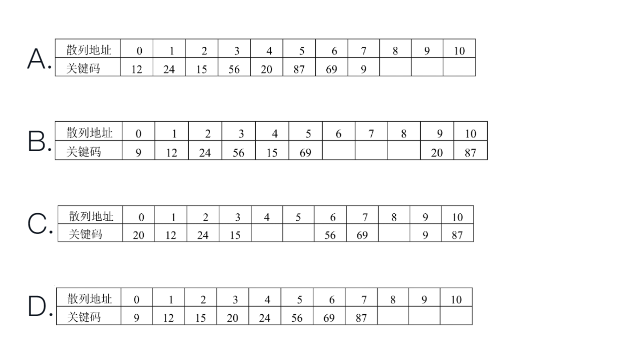


```md
散列函数与冲突解决：
使用 H(Key)=Key%11 计算初始位置，冲突时采用线性探查法​（顺序查找下一个空位）。

​关键码插入过程：

​12：12%11=1 → 地址1。
​24：24%11=2 → 地址2。
​15：15%11=4 → 地址4。
​56：56%11=1（冲突）→ 探查地址2（被占）→ 地址3（空）→ 地址3。
​20：20%11=9 → 地址9。
​87：87%11=10 → 地址10。
​69：69%11=3（冲突）→ 探查地址4（被占）→ 地址5（空）→ 地址5。


```


#### 23

23.【2017年下半年试题40】对下图所示的二叉树进行中序遍历（左子树，根结点，右子树）的结果是______。

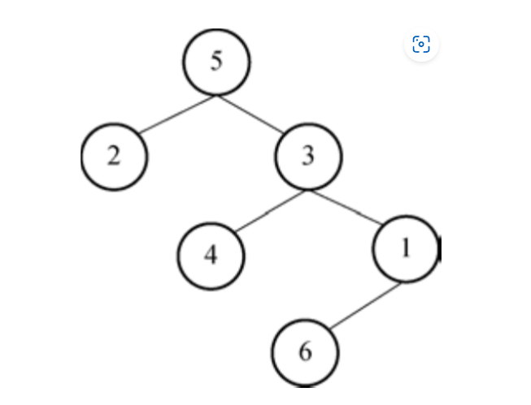


A.5 2 3 4 6 1

**B.2 5 3 4 1 6**

C.2 4 6 5 3 1

D.2 5 4 3 6 1


```md
中序遍历:
0.若二叉树为空, 则进行空操作. 否则:
1.中序遍历根的左子树
2.访问根节点
中序遍历根的右字数
```


#### 24??

24.【2017年下半年试题41、42】对于下面的有向图，其邻接矩阵是一个(1)的矩阵，采用邻接链表存储时，顶点0的表结点个数为2，顶点3的表结点个数为0，顶点1的表结点个数为(2)。

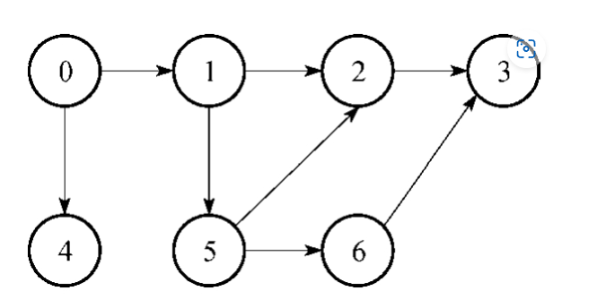

(1)A.3×4

B.4×3

C.6×6

**D.7×7**

(2)A.0

B.1

**C.2**

D.3

```md
邻接矩阵是表示有向图顶点间邻接关系的 ​方阵，矩阵的行和列数等于图中顶点的总数。

题目明确说明有向图包含 ​7个顶点（0到6）​，因此邻接矩阵的大小为 ​7×7。


邻接链表中，每个顶点的表结点个数表示该顶点的 ​出边数量​（即从该顶点指向其他顶点的边数）。

​分析顶点1的出边：
根据题目描述和用户补充信息，顶点1的出边指向 ​顶点0 和 ​顶点5，共 ​2条出边。
因此在邻接链表中，顶点1的表结点个数为 ​2。
```


#### 25

25.【2017年下半年试题43】对n个关键码构成的序列采用直接插入排序法进行升序排序的过程是：在插入第i个关键码Ki时，其前面的i-1个关键码已排好序，因此令Ki与Ki-1，Ki-2，…依次比较，最多到K1为止，找到插入位置并移动相关元素后将Ki插入有序子序列的适当位置，完成本趟（即第i-1趟）排序。以下关于直接插入排序的叙述中，正确的是______。

A.若原关键码序列已经升序排序，则排序过程中关键码间的比较次数最少

B.若原关键码序列已经降序排序，则排序过程中关键码间的比较次数最少

C.第1趟完成后即可确定整个序列的最小关键码

D.第1趟完成后即可确定整个序列的最大关键码

```md

选项A：若原序列已经升序排序，则每次插入仅需比较一次（与前一个元素），总比较次数为n−1次，这是最少的情况。​正确。

选项B：若原序列降序排序，每次插入需比较所有已排序元素，总比较次数为(n(n−1)) / 2次数, 属于最坏情况。​错误。

选项C：第1趟处理前两个元素，仅保证前两个有序，但后续可能存在更小元素。例如序列5,1,0，第1趟后为1,5,0，最小元素0未被确定。​错误。

选项D：同理，第1趟无法确定后续是否有更大元素。例如序列3,6,7，第1趟后前两位有序，但最大元素7未被确定。​错误。

```


#### 26

26.【2017年下半年试题58】在关系代数运算中，______运算结果的结构与原关系模式的结构相同。

**A.并**

B.投影

C.笛卡儿积

D.自然连接

```md
在关系代数中，
​“并”运算是一个二元运算，要求参与运算的两个关系结构必须相同，运算结果的结构与原关系模式的结构相同。

而笛卡儿积和自然连接尽管也是二元运算，但参与运算的两个关系结构不必相同。

投影运算是向关系的垂直方向运算，运算的结果是去除某些属性列，所以运算的结果与原关系模式不同。也就是说：若关系R与S具有相同的关系模式，即关系R与S的结构相同，则关系R与S可以进行并、交、差运算。

```


#### 27

27.【2017年下半年试题63】设M和N为正整数，且M＞2，N＞2，MN＜2(M+N)，满足上述条件的(M,N)共有______对。

A.3

**B.5**

C.6

D.7

```md
MN＜2(M+N)等价于(M-2)(N-2)＜4，而M和N都是正整数。

M-2=1时，N-2可以是1、2、3；M-2=2时，
N-2只能是1；M-2=3时，
N-2只能是1，

所以(M,N)只有(3,3)，(3,4)，(3,5)，(4,3)，(5,3)五对。
```


#### 28

28.【2017年下半年试题64】下表有4×7个单元格，可以将其中多个邻接的单元格拼成矩形块。该表中共有______个四角上都为1的矩形块。

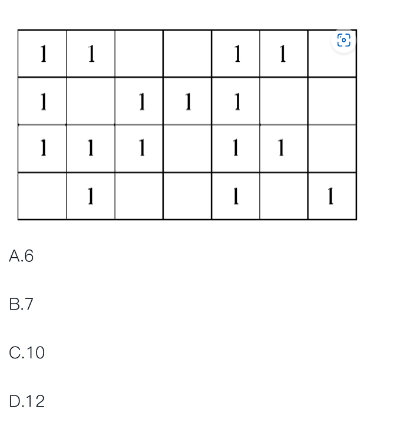


```md
D
```


#### 29


29.【2017年下半年试题65】某乡镇有7个村A～G，各村间的道路和距离（单位：km）如下图，乡政府决定在其中两村设立诊所，使这7村群众看病最方便（即最远的村去诊所的距离a最短）。经过计算，a=______km。

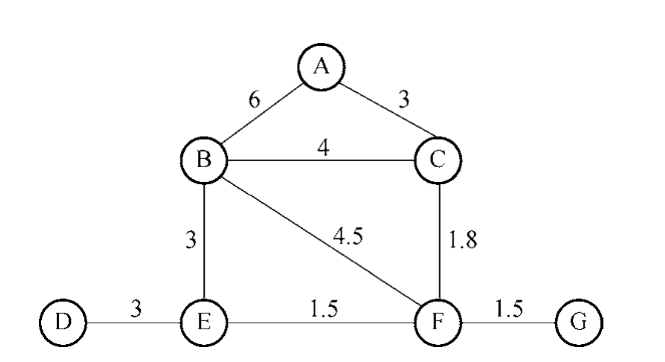

**A.3**

B.3.3

C.4

D.4.5

#### 30

30.【2019年下半年试题7】若计算机字长为32，则采用补码表示的整数范围为______。


```md
长度为n的情况下，补码能够表示的范围为[-2^(n-1),2^(n-1))。
因此，当补码字长为32时，表示的范围为[-2^31,2^31）​。

```


#### 31

31.【2019年下半年试题19】将二进制序列0011011表示为八进制形式，为______。

**A.033**

B.27

C.66

D.154


#### 32(逻辑表达式)

32.【2019年下半年试题21】设X、Y、Z为逻辑变量，当且仅当X和Y同时为1时Z为0，其他情况下Z为1，则对应的逻辑表达式为______。

A.Z=X·Y

B.Z=X+Y

C.Z=X⊕Y

D.Z=X+Y(头上有横杠)

```md
```


33.【2019年下半年试题22】以下关于海明码的叙述中，正确的是______。

A.校验位与数据信息位混淆且随机分布

**B.数据信息位与校验位需要满足一定的位置关系**

C.需将所有校验位设置在所有数据信息位之后

D.校验位的长度必须与数据信息位的长度相同

```md
A. 校验位与数据信息位混淆且随机分布
错误。海明码的校验位位置是严格确定的（2的幂次方位置），而非随机分布。

​B. 数据信息位与校验位需要满足一定的位置关系
正确。校验位和数据位的位置通过规则严格关联，例如校验位覆盖特定数据位的组合以实现纠错。

​C. 需将所有校验位设置在所有数据信息位之后
错误。校验位与数据位是交错排列的（如第1位是校验位，第3位是数据位），而非全部放在数据位之后。

​D. 校验位的长度必须与数据信息位的长度相同
错误。校验位数量由公式 2 
r
 ≥m+r+1 确定，通常少于数据位长度。例如，4位数据需要3位校验，长度不同。
```


#### 34

34.【2019年下半年试题36】数据结构中的______常用来对函数调用和返回处理的控制进行支持。

**A.栈**

B.队列

C.有序树

D.有向图


#### 35??

35.【2019年下半年试题37】单向循环链表如下图所示，以下关于单向循环链表的叙述中，正确的是______。

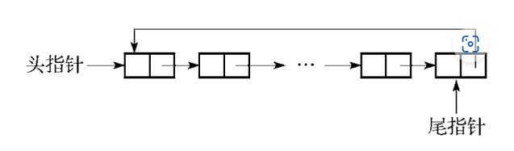

A.仅设头指针时，遍历单向循环链表的时间复杂度是O(1)

B.仅设尾指针时，遍历单向循环链表的时间复杂度是O(1)

C.仅设头指针时，在表尾插入一个新元素的时间复杂度是O(n)

D.仅设尾指针时，在表头插入一个新元素的时间复杂度是O(n)

```md

选项A：仅设头指针时，遍历时间复杂度是O(1)。

​错误。遍历需要从头指针开始，依次访问所有节点，直到回到头指针。时间复杂度为 ​O(n)。


​选项B：仅设尾指针时，遍历时间复杂度是O(1)。

​错误。尾指针仅能快速定位链表的尾部，但遍历仍需从头节点开始（通过 尾指针->next），时间复杂度仍为 ​O(n)。


​选项C：仅设头指针时，在表尾插入元素的时间复杂度是O(n)。
​正确。若仅有头指针，插入表尾需先遍历整个链表找到尾节点（即某个节点的 next 指向头节点），时间复杂度为 ​O(n)。

​选项D：仅设尾指针时，在表头插入元素的时间复杂度是O(1)。

​存在争议。理论上，通过尾指针可直接访问头节点（尾指针->next），插入表头只需修改指针，时间复杂度为 ​O(1)。但根据题目答案标注，此选项未被选为正确，可能原题存在排版或选项描述问题。


```


#### 36

36.【2019年下半年试题38】对关键码序列{12，15，18，23，29，34，56，71，82}进行二分查找（折半查找），若要查找关键码71，则______。

**A.需依次与29、56、71进行比较**

B.仅需与71进行比较

C.需依次与29、34、71进行比较

D.仅需与29进行比较

```md
详细步骤解析：
对有序序列 {12,15,18,23,29,34,56,71,82} 进行二分查找关键码 71 的过程如下：

​第一次比较​（范围 [0,8]）：

中间索引：(0+8)//2 = 4，对应元素 ​29。
由于 71 > 29，搜索范围缩小到右半部分 [5,8]（元素 {34,56,71,82}）。
​第二次比较​（范围 [5,8]）：

中间索引：(5+8)//2 = 6，对应元素 ​56。
由于 71 > 56，搜索范围缩小到右半部分 [7,8]（元素 {71,82}）。
​第三次比较​（范围 [7,8]）：

中间索引：(7+8)//2 = 7，对应元素 ​71，匹配成功。
关键点澄清：

在第二次比较时，范围是 {34,56,71,82}（4个元素），​中间位置按整数除法规则取左中位数​（索引6，元素56），而非直接取中间两个数的任意一个。
```


#### 37

37.【2019年下半年试题39】在______中，要按照确定的计算关系来找到给定关键码的存储位置。

A.顺序表

B.哈希表

C.单向链表

D.双向链表

```md
“确定的计算关系”指的是通过某种算法（如哈希函数）将关键码直接映射到存储位置。

​哈希表的核心机制是使用哈希函数，根据关键码计算出其在表中的存储位置（如索引），从而实现快速插入和查询。例如，给定关键码k，通过哈希函数 h(k) 直接得到存储位置。
其他选项（顺序表、链表）的存储位置与关键码之间没有确定的计算关系，而是通过顺序或链式结构遍历查找。
```


#### 38?

38.【2019年下半年试题40】以下关于下图所示**有向图G**的说法中，正确的是______。

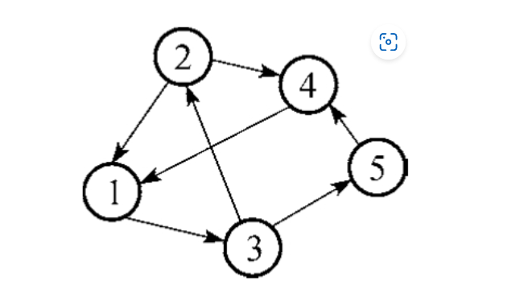

A.G的邻接矩阵是对称矩阵

B.G的邻接矩阵是三角矩阵

C.G是强连通图

D.G是完全图

```md
选项A（对称矩阵）​：
有向图的邻接矩阵对称，当且仅当所有边都是双向的（即若有边 i→j，必有边 j→i）。图中未显示所有边双向存在，因此 ​A错误。

​选项B（三角矩阵）​：
邻接矩阵是三角矩阵的条件是：节点按拓扑顺序排列，且图中无反向边（即所有边从低位节点指向高位节点）。若图中存在环路或反向边（如 4→2），则邻接矩阵不可能是三角矩阵。根据图中结构，​B错误。

​选项C（强连通图）​：
强连通图要求任意两节点间存在双向路径。

​验证路径存在性：
从节点1出发，可到达2、3、4、5（通过路径如 1→3→5 或 1→2→4）。
其他节点间也存在连通路径（如 2→4→5→1，3→5→1→2 等）。
​结论：图中所有节点互相可达，因此 ​C正确。


​选项D（完全图）​：
完全图要求任意两节点间均存在直接的双向边。显然图中未包含所有可能的边（如 1→4 缺失），因此 ​D错误。
```


#### 39

39.【2019年下半年试题41】若某二叉树的先序遍历序列是ABDCE，中序遍历序列是BDACE，则该二叉树为______。

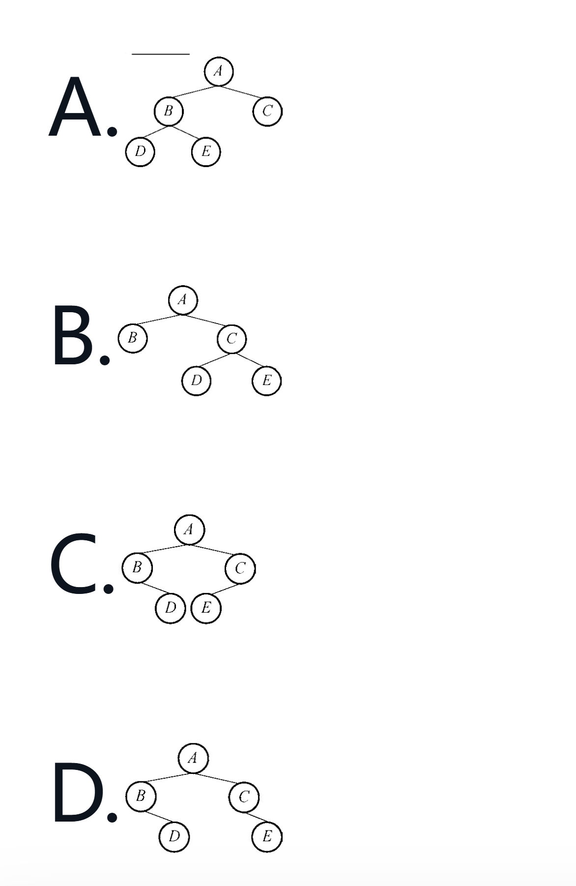

```md
先序遍历

中序遍历
```


#### 40??

40.【2019年下半年试题42】对于n个元素的关键码序列{k1,k2,…,kn}，当且仅当满足关系ki≤k2i且ki≤k2i+1(i=1,2,…,[插图]n/2[插图])时称为小根堆。对于关键码序列{10，20，12，32，14，56，25，51}，将______互换后该序列就成为小根堆。

A.14、12

B.14、20

C.12、32

D.12、25


```md
原始序列构建完全二叉树：
     10
    /  \
   20   12
  / \  / \
 32 14 56 25
/
51

2. ​**检查小根堆条件**：  
- ​**节点20（索引2）​**：其右子节点为 ​**14**，违反 `20 ≤ 14`，需调整。  
- ​**其他节点**均满足 `父节点 ≤ 子节点`。  
```


#### 41?

41.【2019年下半年试题43】对n个关键码构成的序列采用简单选择排序法进行排序的过程是：第一趟经过n-1次关键码之间的比较，确定出最小关键码在序列中的位置后，再将其与序列的第一个关键码交换，第二趟则在其余的n-1个关键码中进行n-2次比较，确定出最小关键码的位置后，再将其与序列的第二个关键码进行交换……直到序列的关键码从小到大排列。在简单选择排序过程中，关键码之间的总比较次数为______。

A.n(n-1)/2

B.n/2

C.n(n+1)/2

D.nlogn

```md
A
```


42.【2019年下半年试题55】软件从一个计算机系统或环境转移到另一个计算机系统或环境的难易程度是指软件的______。

A.兼容性

**B.可移植性**

C.可用性

D.可扩展性


43.【2019年下半年试题56】在软件质量因素中，与能够得到正确或相符的结果或效果有关的软件属性为______。

A.可靠性

**B.准确性**

C.可用性

D.健壮性

```md
正确性（准确性）: 正确实现算法功能，最重要的指标是能否得到正确或者相符的结果或效果的软件。

可用性：是在某个考察时间，系统能够正常运行的概率或时间占有率期望值。系统的可用性取决于MTTF（平均无故障时间，表示系统的可靠性）及MTTR（平均修复故障时间，表示系统的可维护性）

可靠性：元件、产品、系统在一定时间内和一定条件下无故障地执行指定功能的能力或可能性。

友好性：具有良好的使用性。

可读性：可读的、可以理解的，方便分析、修改和移植。

健壮性：能对不合理的数据或非法的操作进行检查、纠正。

效率：对计算机资源的消耗，包括计算机内存和运行时间的消耗。
```


#### 44?

44.【2019年下半年试题63】设r是在(0，1)内均匀分布的随机数，则随机变量______在(3，5)内均匀分布。

A.2+3r

B.2+5r

C.3+2r

D.3+5r

```md

因为0＜r＜1，则0＜2r＜2，同时加3后，则有3＜3+2r＜5。线性的3+2r仍能保证在区间(3，5)内均匀分布。
```


45.【2019年下半年试题64】某系统的可用性达到99.99%，这意味着其每年的停机时间不能超过______。

A.5.3分钟

**B.53分钟**

C.8.8小时

D.4天


```md
365*24*60*0.01% = 
```


46.【2019年下半年试题65】某工厂要分配A、B、C、D、E五个工人做编号为1、2、3、4、5的五项工作，每个人只能做一项工作，每项工作只能由一人做。下表说明了每个工人会做哪些工作（用“√”表示）、不会做哪些工作（用“×”表示）。根据此表，可知共有______种分配方案。

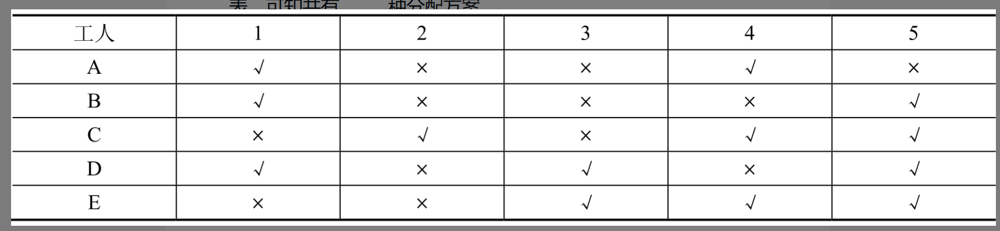

A.3

**B.4**

C.5

D.6


47.【2020年下半年试题19】二进制序列1011011可用十六进制形式表示为______。

**A.5B**

B.3B

C.B6

D.BB


48.【2020年下半年试题20】设码长为8，原码10000000所表示的十进制整数的值为______。

A.-128

B.-0

C.1

D.128

```md
原码、反码和补码是数值数据的三种基本编码方法，对于正数，三种编码是相同的，而对于负数，这三种编码是不同的。

码长为8即用8位二进制形式来表示数值，最左边的位是符号位，0表示是正数，1表示是负数，剩余的7位表示数值部分，原码表示的规则是直接表示出数值的绝对值。本题中10000000的最高位为1，表示是负数。数值部分为0，即绝对值为0的数值。在原码表示中，0由于符号部分不同占用00000000和10000000两个编码。
```


#### 49?

49.【2020年下半年试题21】设有两个浮点数，其阶码分别为E1和E2，当这两个浮点数相乘时，运算结果的阶码E为______。

A.E1、E2中的较小者

B.E1、E2中的较大者

**C.E1+E2的值**

D.E1×E2的值

```md

在机器中表示一个浮点数时，一是要给出尾数，用定点小数形式表示，尾数部分给出有效数字的位数，因而决定了浮点数的精度；二是要给出指数，用整数形式表示，常称为阶码，阶码指明小数点在数据中的位置，因而决定了浮点数的表示范围。例

如，浮点数X=1101.0101，Y=10.0111，按照浮点格式（忽略标准格式要求）表示为X=0.11010101×2^4，Y=0.100111×2^2。

若进行加减运算，需要先对阶，也就是在阶码一致的情况下对尾数部分进行加减运算；

若进行乘除运算，则不要求阶码一致。
相乘时阶码部分为两个浮点数的阶码相加，尾数部分直接相乘，之后再按照规格化等要求进行处理。
```


50.【2020年下半年试题22】在定点二进制运算中，减法运算是通过______来实现的。

A.原码表示的二进制加法

**B.补码表示的二进制加法**

C.原码表示的二进制减法

D.补码表示的二进制减法


51.【2020年下半年试题36】栈是后进先出的线性数据结构，其基本操作不包括______。

**A.从栈底删除元素**

B.从栈顶弹出元素

C.判断是否为空栈

D.在栈顶加入元素


#### 52?

52.【2020年下半年试题37】对于采用头指针作为唯一标识的单链表，其优点是______。

A.可以随机访问表中的任一元素

**B.可以快速在表头插入元素**

C.可以快速在表尾插入元素

D.可从任意位置出发遍历链表

```md
对单向链表中的结点只能进行顺序访问，不能随机访问。

在表尾插入元素时，必须从表头遍历至表尾，时间复杂度为O(n)，而在表头插入元素时，可以直接定位至插入位置，时间复杂度为O(1)。
```


53.【2020年下半年试题38】下图所示为一棵二叉排序树（二叉查找树），其先序遍历序列为______。

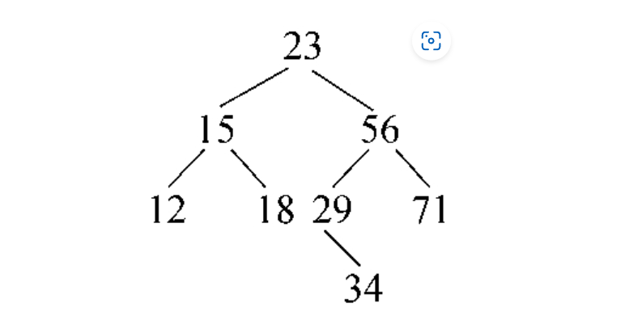


A.12, 15, 18, 23, 29, 34, 56, 71

B.12, 18, 15, 34, 29, 71, 56, 23

C.23, 15, 56, 12, 18, 29, 71, 34

**D.23, 15, 12, 18, 56, 29, 34, 71**


#### 54??

54.【2020年下半年试题39】将一个三对角矩阵A[1..100,1..100]进行压缩存储，方法是按行优先方式，将三对角中的元素存入一维数组B[1..298]中。在这种存储方式下，设元素A[56,55]存储在B[k]，则k为______。

A.164

B.165

C.166

D.167


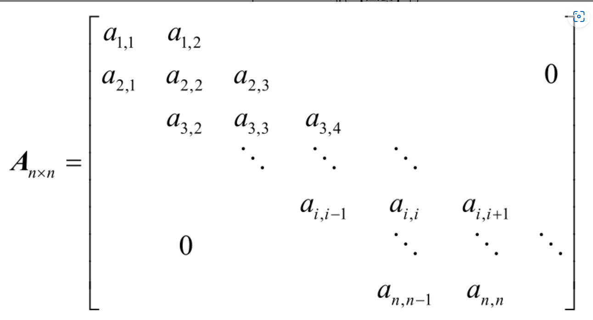

```md

三对角矩阵是一种特殊矩阵，矩阵中的非零元素都分布在主对角线及邻近主对角线的次对角线上，三对角矩阵如下图所示。


按行排列，元素A[56,55]之前有164个元素((56-1)×3-1+(55-56+1))，因此该元素对应着B[165]​。

```


#### 55??

55.【2020年下半年试题40】对于一棵结点数为n(n＞1)的完全二叉树，从根结点这一层开始，按照从上往下、从左到右的顺序，把结点依次存储在数组A[1..n]中。设某结点在数组A中的位置为i，且它有右孩子，则该右孩子结点在A中的位置是______。

A.2i-1

B.2i

C.2i+1

D.log(i+1)


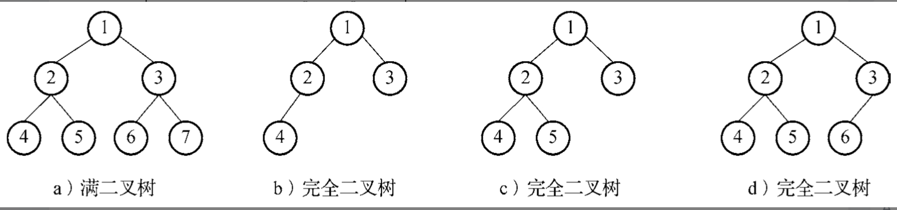

```md
在一棵高度为h的完全二叉树中，除了第h层（即最底下一层）​，其余各层都是满的。第h层上的结点必须从左到右依次放置，不能留空，例如，高度为3的完全二叉树有如下图所示的4种，其中图a是完全二叉树也是满二叉树。
```


#### 56?

56.【2020年下半年试题41】以下关于字符串的叙述中，正确的是______。

A.字符串是长度受限的线性表

B.字符串不能采用链表存储

C.字符串是一种非线性数据结构

D.空字符串的长度为0

```md
字符串是一种线性表，它的特殊性在于表中的每个元素为字符，同时具有特别的基本运算，如字符串比较、求子串、字符串连接等。

选项A是错误的，字符串的长度不受限制。

选项B是错误的，字符串可采用链表存储，只是这种存储方式在大多数情况下不利于支持字符串的基本运算。

选项C是错误的，字符串属于线性数据结构。
```


#### 57??

57.【2020年下半年试题42】对于含有n个元素的关键码序列{k1,k2,…,kn}，当且仅当满足关系ki≤k2i且ki≤k2i+1(i=1,2,…,[插图]n/2[插图])时称为小根堆。下面关键码序列中，______是小根堆。

A.131, 158, 288, 325, 763, 522, 451, 617

B.131, 325, 451, 617, 522, 288, 158, 763

C.763, 617, 325, 522, 451, 288, 131, 158

D.763, 451, 522, 617, 131, 288, 325, 158


```md
1.小根堆定义：每个父节点 ​ki 需满足 ​ki ≤ k2i 且 ​ki ≤ k2i+1​（i从1开始，非叶子节点范围为 ​i=1,2,…,n/2）。

2选项A的完全二叉树结构：


			131
    /    \
   158   288
  / \    / \
325 763 522 451
/
617


4. ​**其他选项排除**：
- ​**选项B**：i=3（451）的子节点为288和158，违反 ​**451 ≤ 288**​（×）。
- ​**选项C**：根节点763大于子节点617和325（×）。
- ​**选项D**：根节点763大于子节点451和522（×）。
```


#### 58?

58.【2020年下半年试题43】以下关于图的存储结构的叙述中，正确的是______。

A.有向图应采用邻接矩阵存储，无向图应采用邻接表存储

B.无向图应采用邻接矩阵存储，有向图应采用邻接表存储

C.稠密图适合采用邻接矩阵存储，稀疏图适合采用邻接表存储

D.稀疏图适合采用邻接矩阵存储，稠密图适合采用邻接表存储

```md
A/B错误：邻接矩阵和邻接表均适用于有向图和无向图，选择依据是图的稀疏性而非是否有向。
​C正确：
​稠密图的边数接近邻接矩阵的容量，使用邻接矩阵空间效率合理。
​稀疏图的边数少，邻接表通过链表仅存储有效边，避免空间浪费。
​D错误：与C的结论相反，逻辑矛盾。
```


#### 59?

59.【2020年下半年试题63】某绿化队分派甲、乙、丙三人合作栽种一批树苗。最开始，甲、乙两人合作种了其中的1/6，后来乙、丙两人合作种了余下的2/5，最后由甲、乙、丙三人合作完成全部任务。如果合作种树时各人的工作量是平均计算的，则甲、乙、丙三人的工作量之比为______。

A.2:3:3

B.3:4:3

C.3:5:4

D.4:6:5

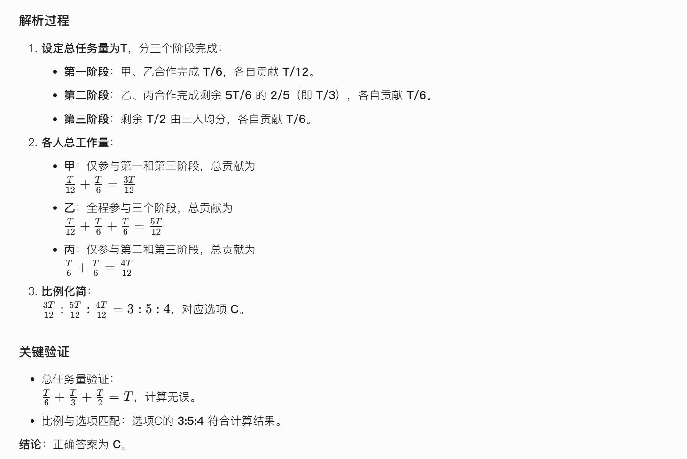


60.【2020年下半年试题64】某班数学考试平均成绩初步算得为86.7分，事后复查发现有两个错误，一个学生的成绩实为69分，却错误录入成96分，另一个学生的成绩实为98分，但错误录入成89分，纠正了这些错误后全班平均成绩为86.3分。据此可推断该班级共有______人。

A.40

B.45

C.48

D.50


61.【2020年下半年试题65】平面直角坐标系XY中，在区域S{x＞0,y＞0,x+y＜2}内，有小区域P{x＜1,y＜1,x+y＞1}，则P的面积占比为______。

A.15%

B.20%

C.25%

D.30%


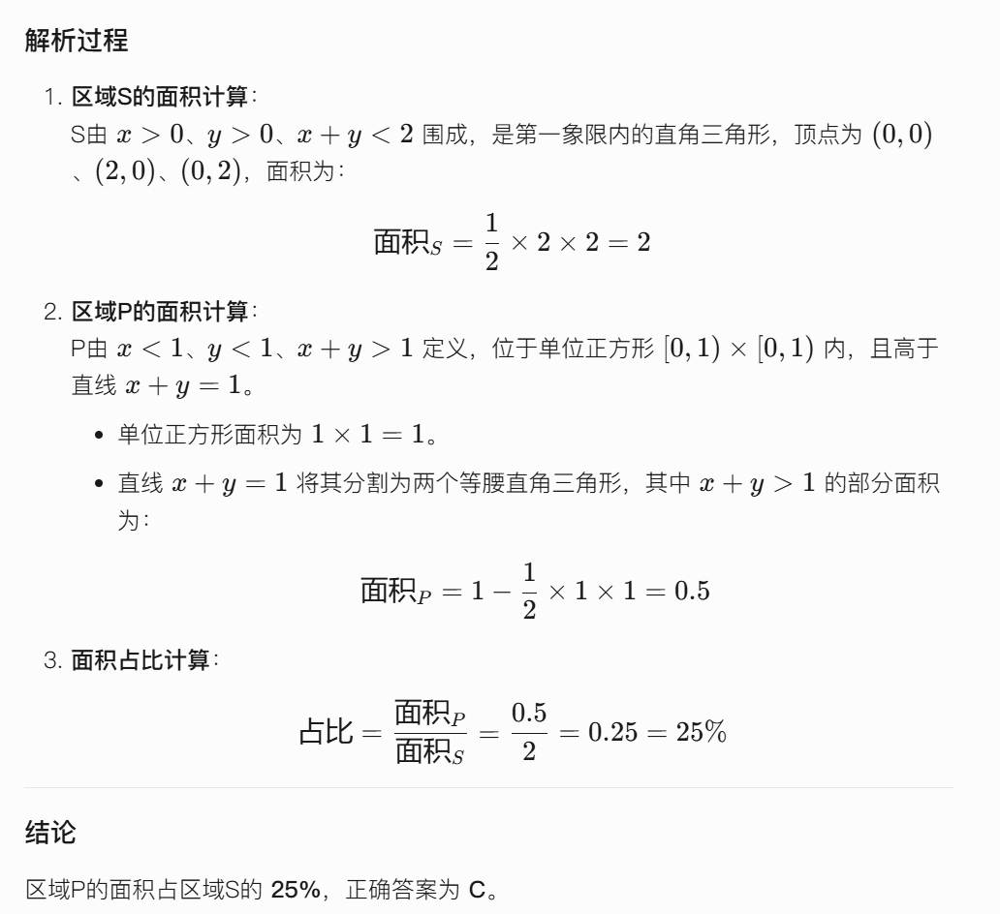


### 难点练习

#### 1.

1.二进制数11001100为原码的时候，它代表的真值为(1)；若它是补码，则它代表的真值为(2)；十进制数-1的补码用8位二进制数表示为(3)。

(1)

A.204

B.-76

C.-204

D.76

(2)

A.-52

B.-20

C.19

D.148

(3)A.0000001

B.10000001

C.1111110

**D.1111111**


#### 2

2.设X为逻辑变量，下列逻辑运算中，不正确的是______。

A.X·1=X

**B.X+1=X**

C.X·0=0

D.X+0=X

3.以下序列不是堆的是______。

A.{100，85，98，77，80，60，82，40，20，10，66}

B.{100，98，85，82，80，77，66，60，40，20，10}

C.{10，20，40，60，66，77，80，82，85，98，100}

**D.{100，85，40，77，80，60，66，98，82，10，20}**


#### 4?

4.对于关键码序列(12，13，11，18，60，15，7，20，25，100)，用筛选法建堆，必须从键值为______的关键码开始。

A.18

B.60

C.15

D.100

```md
【解析】必须从n/2开始建堆，n为10，所以要从第5个元素即60处开始建堆

完全二叉树的节点关系：

给定序列 ​**{12, 13, 11, 18, 60, 15, 7, 20, 25, 100}** 共有 ​10个元素，对应完全二叉树的节点编号为 ​1到10。
最后一个非叶子节点的位置为 ​n//2 = 10//2 = 5​（编号从1开始）。
​筛选法建堆的起点：

必须从最后一个非叶子节点（即第5个节点）开始调整，其键值为 ​60。
​原因：筛选法建堆需从底层向上逐层调整，确保每个子树满足堆的性质。最后一个非叶子节点是第一个需要调整的节点。
​验证过程：

​索引5（键值60）​：其子节点为索引10（100），需调整为大根堆（60 < 100，交换后根为100）。
依次向前调整索引4（18）、索引3（11）等，直至根节点索引1（12）。

```


5.下列逻辑不正确的是______。

**A.1+1=2**

B.1+0=1

C.0+0=0

D.1+A=1


6.堆栈和队列的相同之处是______。

A.元素的进出满足先进后出

B.元素的进出满足后进先出

**C.只允许在端点进行插入和删除操作**

D.无共同点


7.在解决计算机与打印机之间速度不匹配问题时通常设置一个打印数据缓冲区，主机将要输出的数据依次写入该缓冲区，而打印机则依次从该缓冲区取出数据打印，该缓冲区应是一个______结构。

A.线性表

B.数组

C.堆栈

**D.队列**


8.在浮点数编码表示中，______在机器数中不出现，是隐含的。

A.阶码

B.符号

C.尾数

**D.基数**


9.十进制数33用十六进制数表示为______。

A.33H

**B.21H**

C.FFH

D.12H


#### 10

10.对于卡诺图，下列说法正确的是______。

**A.卡诺图是用来化简逻辑表达式的有效手段**

B.卡诺图化简逻辑表达式时，只能合并卡诺图中的1

C.卡诺图化简逻辑表达式时，只能合并卡诺图中的0

D.卡诺图能减少逻辑错误


11.8个二进制位至多表示______个数据。

A.8

B.64

C.255

D.256


#### 12?

12.关系演算的基础是______。

A.形式逻辑中的逻辑演算

B.形式逻辑中的关系演算

**C.数理逻辑中的谓词演算**

D.数理逻辑中的形式演算


#### 13?

13.按照二叉树的定义，具有3个结点的树有______种形态（不考虑数据信息的组合情况）。

A.2

B.3

C.4

**D.5**


14.深度为h且有______个结点的二叉树称为满二叉树。

**A.2^h-1**

B.2^h

C.2h-1

D.2h


#### 15?

15.具有2000个结点的非空二叉树的最小深度为______。

A.9

B.10

**C.11**

D.12

```md
【解析】根据二叉树的性质，具有2000个结点的非空二叉树的最小深度为:
[Log2 2000] = 11
```


#### 16?

16.将数据元素2,4,6,8,10,12,14,16,18,20依次存放于一个一维数组中，然后采用折半查找方法查找数组元素12，被比较过的数组元素的下标依次为______。

A.10,16,12

B.10,12,16

C.5,8,6

D.5,6,8

```md

答案：C.5,8,6

解析过程：​

​数组下标从1开始
题目未明确说明下标起始，但根据选项和常规设定，假设数组下标从1开始。数组元素如下：

下标：1, 2, 3, 4, 5, 6, 7, 8, 9, 10
元素：2, 4, 6, 8,10,12,14,16,18,20
​折半查找步骤
目标元素为12（下标6），过程如下：

​第1次查找：
low=1，high=10，mid=(1+10)/2=5（向下取整）。
比较元素10（下标5），12>10，调整low=5+1=6。
​第2次查找：
low=6，high=10，mid=(6+10)/2=8。
比较元素16（下标8），12<16，调整high=8-1=7。
​第3次查找：
low=6，high=7，mid=(6+7)/2=6（向下取整）。
比较元素12（下标6），找到目标。
​被比较的下标顺序
依次为5→8→6，对应选项C。

结论：​
正确答案为 ​C.5,8,6。
```


#### 17?

17.对8位补码操作数(A5)16进行两位算术右移的结果是______。

A.(D2)16

B.(52)16

C.(E9)16

D.(69)16

```md
```


18.二叉树的前序遍历序列为A,B,D,C,E,F,G，中序遍历序列为D,B,C,A,F,E,G，它的后序遍历序列为______。A.D,C,F,G,E,B,A

**B.D,C,B,F,G,E,A**

C.F,G,E,D,C,B,A

D.D,C,F,G,B,E,A


```md
后序遍历：按左→右→根的顺序遍历
```


#### 19?

19.与一组权值(7,5,2,4)对应的哈夫曼树的带权路径长度为______。

A.25

B.35

C.45

D.55

```md
```


20.在AOE图中，关键路径是______。

A.从源点到汇点的最长路径

B.从源点到汇点的最短路径

C.最长的回路

D.最短的回路


21.现在6个元素按1,2,3,4,5,6的顺序进栈，序列______是不可能的出栈序列。

A.1,2,3,4,5,6

**B.3,2,1,6,4,5**

C.4,5,3,2,1,6

D.5,6,4,3,2,1


#### 22?

22.已知一个线性表(38,25,74,63,52,48)，采用的散列函数（哈希函数）为H(Key)=Key mod 7，将元素散列到表长为7的哈希表中存储。若采用线性探测的开放定址法解决冲突，则在该哈希表上进行等概率成功查找的平均查找长度为(1)；若利用拉链法解决冲突，则在该哈希表上进行等概率成功查找的平均查找长度为(2)。

(1)

A.1.5

B.1.7

C.2.0

D.2.3

(2)

A.1.0

B.7/6

C.4/3

D.3/2


23.设某二叉树有如下特点：结点的子树数目若不是2个，则为0个。这样的一棵二叉树中有m(m＞0)个子树为0的结点时，该二叉树上的结点总数为______。

A.2m+1

B.2m-1

C.2(m-1)

D.2(m+1)


24.用n个二进制位表示带符号纯整数时，已知[X]补、[Y]补，则当______时，等式[X]补+[Y]补=[X+Y]补成立。A.-2n≤(X+Y)≤2n-1

B.-2n-1≤(X+Y)＜2n-1

C.-2n-1≤(X+Y)≤2n-1

D.-2n-1≤(X+Y)＜2n


25.对于16位的数据，需要(1)个校验位才能构成海明码。在某个海明码的排列方式D9D8D7D6D5D4P4D3D2D1P3D0P2P1中，Di(0≤i≤9)表示数据位，Pj(1≤j≤4)表示校验位，数据位D8由(2)进行校验。

(1)

A.3

B.4

C.5

D.6

(2)

A.P4P2P1

B.P4P3P2

C.P4P3P1

D.P3P2P1


26.

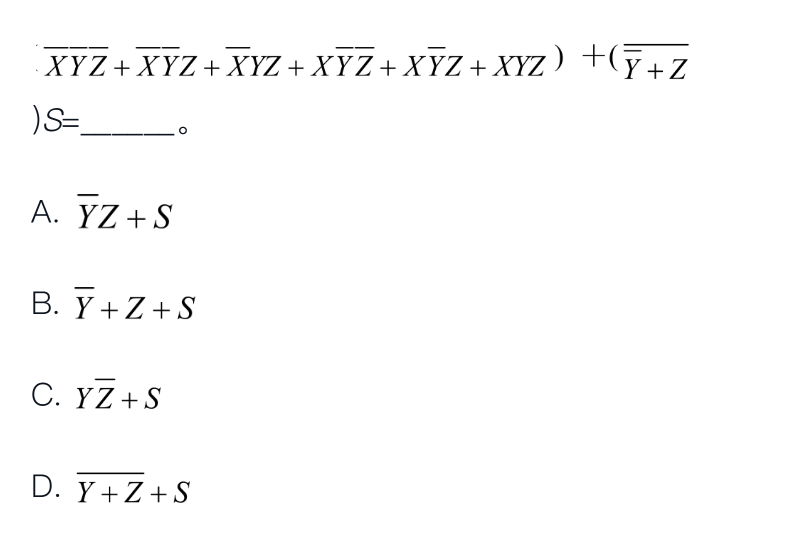


27.将一个三对角矩阵A[1..100,1..100]中的元素按行存储在一维数组B[1..298]中，矩阵A中的元素A[66,65]在数组B中的下标为______。

A.195

B.196

C.197

D.198


28.给定一个有n个元素的线性表。若采用顺序存储结构，则在等概率前提下，向其插入一个元素需要移动的元素个数平均为______。

A.n+1

B.n/2

C.(n+1)/2

D.n


29.______是线性结构的数据结构。

A.列表

B.高维数组

C.双端队列

D.二叉树


30.某线性表最常用的运算是插入和删除，插入运算是指在表尾插入一个新元素，删除运算是指删除表头第一个元素，那么采用______存储方式最节省运算时间。

A.仅有尾指针的单向循环链表

B.仅有头指针的单向循环链表

C.单向链表

D.双向链表


31.设数组A[3..16,5..20]的元素以列为主序存放，每个元素占用两个存储单元，数组空间的起始地址为a，则数组元素`A[i,j](3≤i≤16，5≤j≤20)`的地址计算公式为______。

A.a-118+2i+28j

B.a-116+2i+28j

C.a-144+2i+28j

D.a-146+2i+28j


32.与十进制数254等值的二进制数是______。

A.11111110

B.11101111

C.11111011

D.11101110


33.无符号数A减去无符号数B，结果的进位标志为1表明______。

A.A≥B

B.A＜B

C.A=B

D.A＞B


34.链表不具备的特点是______。

A.可随机访问任何一个元素

B.插入、删除操作不需要移动元素

C.不需要先估计存储空间的大小

D.所需存储空间与线性表长度成正比


35.对矩阵压缩存储的主要目的是______。

A.方便运算

B.节省存储空间

C.降低计算复杂度

D.提高运算速度


36.判断“链式队列为空”的条件是______。（front为头指针，rear为尾指针。）

A.front==NULL

B.rear==NULL

C.front==rear

D.front!=rear


37.以下关于字符串的判定语句中正确的是______。

A.字符串是一种特殊的线性表

B.字符串的长度必须大于零

C.字符串不属于线性表的一种

D.空格字符组成的字符串就是空串


38.在具有100个结点的树中，其边的数目为______。

A.101

B.100

C.99

D.98


39.在程序的执行过程中，用______结构可实现嵌套调用函数的正确返回地址。

A.队列

B.栈

C.树

D.图


40.已知有一维数组T[0…m×n-1]，其中m＞n。从数组T的第一个元素(T[0])开始，每隔n个元素取出一个元素依次存入数组B[1…m]中，即B[1]=T[0]，B[2]=T[n]，以此类推，那么放入B[k](1≤k≤m)的元素是______。

A.T[(k-1)×n]

B.T[k×n]

C.T[(k-1)×m]

D.T[k×m]


41.已知递归函数f(n)的功能是计算1+2+…+n，且n≥1，应采用的代码段是______。

A.if n＞1 then return1 else return n+f(n-1)

B.if n＞1 then return1 else return n+f(n+1)

C.if n＜1 then return0 else return n+f(n-1)

D.if n＜1 then return0 else return n+f(n+1)


42.若码值FFH是一个整数的原码表示，则该整数的真值为(1)；若码值FFH是一个整数的补码表示，

则该整数的真值为(2)。

(1)

A.127

B.0

C.-127

D.-1

(2)

A.127

B.0

C.-127

D.-1


## 第二章 计算机系统基础 


### 习题

1.二进制数11001100为原码的时候，它代表的真值为(1)；若它是补码，则它代表的真值为(2)；十进制数-1的补码用8位二进制数表示为(3)。

(1)A.204

B.-76

C.-204

D.76

(2)A.-52

B.-20

C.19

D.148

(3)A.0000001

B.10000001

C.1111110

D.1111111


**答案**

b a d


2.设X为逻辑变量，下列逻辑运算中，不正确的是______。

A.X·1=X

B.X+1=X

C.X·0=0

D.X+0=X


3.以下序列不是堆的是______。

A.{100，85，98，77，80，60，82，40，20，10，66}

B.{100，98，85，82，80，77，66，60，40，20，10}

C.{10，20，40，60，66，77，80，82，85，98，100}

D.{100，85，40，77，80，60，66，98，82，10，20}


4.对于关键码序列(12，13，11，18，60，15，7，20，25，100)，用筛选法建堆，必须从键值为______的关键码开始。

A.18

B.60

C.15

D.100


5.下列逻辑不正确的是______。

A.1+1=2

B.1+0=1

C.0+0=0

D.1+A=1

6.堆栈和队列的相同之处是______。

A.元素的进出满足先进后出

B.元素的进出满足后进先出

C.只允许在端点进行插入和删除操作

D.无共同点


7.在解决计算机与打印机之间速度不匹配问题时通常设置一个打印数据缓冲区，主机将要输出的数据依次写入该缓冲区，而打印机则依次从该缓冲区取出数据打印，该缓冲区应是一个______结构。

A.线性表

B.数组

C.堆栈

D.队列


8.在浮点数编码表示中，______在机器数中不出现，是隐含的。

A.阶码

B.符号

C.尾数

D.基数


9.十进制数33用十六进制数表示为______。

A.33H

B.21H

C.FFH

D.12H


10.对于卡诺图，下列说法正确的是______。

A.卡诺图是用来化简逻辑表达式的有效手段

B.卡诺图化简逻辑表达式时，只能合并卡诺图中的1

C.卡诺图化简逻辑表达式时，只能合并卡诺图中的0

D.卡诺图能减少逻辑错误


11.8个二进制位至多表示______个数据。

A.8

B.64

C.255

D.256


12.关系演算的基础是______。

A.形式逻辑中的逻辑演算

B.形式逻辑中的关系演算

C.数理逻辑中的谓词演算

D.数理逻辑中的形式演算


13.按照二叉树的定义，具有3个结点的树有______种形态（不考虑数据信息的组合情况）。

A.2

B.3

C.4

D.5


14.深度为h且有______个结点的二叉树称为满二叉树。

A.2h-1

B.2h

C.2h-1

D.2h

15.具有2000个结点的非空二叉树的最小深度为______。

A.9

B.10

C.11

D.12


16.将数据元素2,4,6,8,10,12,14,16,18,20依次存放于一个一维数组中，然后采用折半查找方法查找数组元素12，被比较过的数组元素的下标依次为______。

A.10,16,12

B.10,12,16

C.5,8,6

D.5,6,8


17.对8位补码操作数(A5)16进行两位算术右移的结果是______。

A.(D2)16

B.(52)16

C.(E9)16

D.(69)16


18.二叉树的前序遍历序列为A,B,D,C,E,F,G，中序遍历序列为D,B,C,A,F,E,G，它的后序遍历序列为______。A.D,C,F,G,E,B,A

B.D,C,B,F,G,E,A

C.F,G,E,D,C,B,A

D.D,C,F,G,B,E,A


19.与一组权值(7,5,2,4)对应的哈夫曼树的带权路径长度为______。

A.25

B.35

C.45

D.55


20.在AOE图中，关键路径是______。

A.从源点到汇点的最长路径

B.从源点到汇点的最短路径

C.最长的回路

D.最短的回路


21.现在6个元素按1,2,3,4,5,6的顺序进栈，序列______是不可能的出栈序列。

A.1,2,3,4,5,6

B.3,2,1,6,4,5

C.4,5,3,2,1,6

D.5,6,4,3,2,1


22.已知一个线性表(38,25,74,63,52,48)，采用的散列函数（哈希函数）为H(Key)=Key mod 7，将元素散列到表长为7的哈希表中存储。若采用线性探测的开放定址法解决冲突，则在该哈希表上进行等概率成功查找的平均查找长度为(1)；若利用拉链法解决冲突，则在该哈希表上进行等概率成功查找的平均查找长度为(2)。

(1)A.1.5

B.1.7

C.2.0

D.2.3

(2)A.1.0

B.7/6

C.4/3

D.3/2


23.设某二叉树有如下特点：结点的子树数目若不是2个，则为0个。这样的一棵二叉树中有m(m＞0)个子树为0的结点时，该二叉树上的结点总数为______。

A.2m+1

B.2m-1

C.2(m-1)

D.2(m+1)


24.用n个二进制位表示带符号纯整数时，已知[X]补、[Y]补，则当______时，等式[X]补+[Y]补=[X+Y]补成立。A.-2n≤(X+Y)≤2n-1

B.-2n-1≤(X+Y)＜2n-1

C.-2n-1≤(X+Y)≤2n-1

D.-2n-1≤(X+Y)＜2n


25.对于16位的数据，需要(1)个校验位才能构成海明码。在某个海明码的排列方式

D9D8D7D6D5D4P4D3D2D1P3D0P2P1中，Di(0≤i≤9)表示数据位，Pj(1≤j≤4)表示校验位，数据位D8由(2)进行校验。

(1)A.3

B.4

C.5

D.6

(2)A.P4P2P1

B.P4P3P2

C.P4P3P1

D.P3P2P1


26.(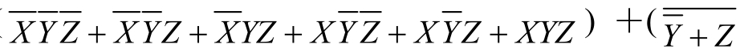)S=______。

A. ``

B.[插图]

C.[插图]

D.[插图]


27.将一个三对角矩阵A[1..100,1..100]中的元素按行存储在一维数组B[1..298]中，矩阵A中的元素A[66,65]在数组B中的下标为______。

A.195

B.196

C.197

D.198

28.给定一个有n个元素的线性表。若采用顺序存储结构，则在等概率前提下，向其插入一个元素需要移动的元素个数平均为______。

A.n+1

B.(n/2)

C.(n+1)/2

D.n


29.______是线性结构的数据结构。

A.列表

B.高维数组

C.双端队列

D.二叉树


30.某线性表最常用的运算是插入和删除，插入运算是指在表尾插入一个新元素，删除运算是指删除表头第一个元素，那么采用______存储方式最节省运算时间。

A.仅有尾指针的单向循环链表

B.仅有头指针的单向循环链表

C.单向链表

D.双向链表


31.设数组A[3..16,5..20]的元素以列为主序存放，每个元素占用两个存储单元，数组空间的起始地址为a，则数组元素`A[i,j](3≤i≤16，5≤j≤20)`的地址计算公式为______。

A.a-118+2i+28j

B.a-116+2i+28j

C.a-144+2i+28j

D.a-146+2i+28j


32.与十进制数254等值的二进制数是______。

A.11111110

B.11101111

C.11111011

D.11101110


33.无符号数A减去无符号数B，结果的进位标志为1表明______

A.A≥B

B.A＜B

C.A=B

D.A＞B


34.链表不具备的特点是______。

A.可随机访问任何一个元素

B.插入、删除操作不需要移动元素

C.不需要先估计存储空间的大小

D.所需存储空间与线性表长度成正比


35.对矩阵压缩存储的主要目的是______。

A.方便运算

B.节省存储空间

C.降低计算复杂度

D.提高运算速度


36.判断“链式队列为空”的条件是______。（front为头指针，rear为尾指针。）A.front==NULL

B.rear==NULL

C.front==rear

D.front!=rear


37.以下关于字符串的判定语句中正确的是______。

A.字符串是一种特殊的线性表

B.字符串的长度必须大于零

C.字符串不属于线性表的一种

D.空格字符组成的字符串就是空串


38.在具有100个结点的树中，其边的数目为______。

A.101

B.100

C.99

D.98


39.在程序的执行过程中，用______结构可实现嵌套调用函数的正确返回地址。

A.队列

B.栈

C.树

D.图


40.已知有一维数组`T[0…m×n-1]`，其中m＞n。从数组T的第一个元素(`T[0]`)开始，每隔n个元素取出一个元素依次存入数组`B[1…m]`中，即`B[1]=T[0]`，`B[2]=T[n]`，以此类推，那么放入`B[k](1≤k≤m)`的元素是______。

A.`T[(k-1)×n]`

B.`T[k×n]`

C.`T[(k-1)×m]`

D.`T[k×m]`


41.已知递归函数f(n)的功能是计算1+2+…+n，且n≥1，应采用的代码段是______。

A.if n＞1 then return1 else return n+f(n-1)

B.if n＞1 then return1 else return n+f(n+1)

C.if n＜1 then return0 else return n+f(n-1)

D.if n＜1 then return0 else return n+f(n+1)


42.若码值FFH是一个整数的原码表示，则该整数的真值为(1)；若码值FFH是一个整数的补码表示，则该整数的真值为(2)。

(1)A.127

B.0

C.-127

D.-1

(2)A.127

B.0

C.-127

D.-1


7.【2017年上半年试题8】总线的带宽是指_______。
A.用来传送数据、地址和控制信号的信号线总数
B.总线能同时传送的二进制位数
C.单位时间内通过总线传输的数据总量
D.总线中信号线的种类

>总线的带宽也就是数据传输率，即单位时间内通过总线传输的数据量，以B/s（字节/秒）为单位。C

15.【2017年上半年试题1】操作系统中进程的三态模型如下图所示，图中a、b和c处应分别填写_______。
![[Pasted image 20250505114745.png]]


A.阻塞、就绪、运行B.运行、阻塞、就绪C.就绪、阻塞、运行D.就绪、运行、阻塞

> 进程具有运行态、就绪态和阻塞态三种基本状态。
> 当CPU空闲时，系统将选择处于就绪态的一个进程进入运行态；
> 当CPU的一个时间片用完时，当前处于运行态的进程就进入了就绪态；
> 进程从运行到阻塞状态通常是进程释放CPU，然后等待系统分配资源或等待某些事件的发生。


16.【2017年上半年试题27】在页式存储管理方案中，如果地址长度为32位，并且地址结构的划分如下图所示，则系统中页面总数与页面大小分别为_______。
![[Pasted image 20250505115630.png]]
A.4K,1024K
B.1M,4K
C.1K,1024K
D.1M,1K

>页内地址的宽度就是页面大小，共有12位，即2的12次方，212=4096=4K。页号的宽度就是页面总数，共有20位，即2的20次方，220=1024×1024=1MB。


18.【2017年上半年试题58】在数据库系统运行维护过程中，通过重建视图能够实现_______。
A.程序的物理独立性B.数据的物理独立性C.程序的逻辑独立性D.数据的逻辑独立性


22.【2017年上半年试题68】PING发出的是`_______`类型的报文，封装在IP数据中传送。
A.TCP请求
B.TCP响应
C.ICMP请求与响应
D.ICMP源点抑制

> Ping发送一个ICMP(Internet Control Message Protocol)，即因特网控制报文协议；回声请求消息给目的地并报告是否收到所希望的ICMPecho（ICMP回声应答）​。它是用来检查网络是否通畅或者网络连接速度的命令。


23.【2017年上半年试题69】SMTP使用的传输协议是`_______`。A.TCPB.IPC.UDPD.ARP
>SMTP是一种TCP支持的提供可靠且有效电子邮件传输的应用层协议，是简单邮件传输协议。


24.【2017年上半年试题70】下面地址中可以作为源地址但是不能作为目的地址的是`_______。`
A.0.0.0.0
B.127.0.0.1
C.202.225.21.1/24
D.202.225.21.255/24

>每一个字节都为0的地址(0.0.0.0)对应于当前主机，即源地址，不能作为目的地址。
>127.0.0.1是本地回送地址，既可作源地址也可作目的地址。
>202.225.21.1/24是主机单播地址，既可作源地址也可作目的地址。
>202.225.21.255/4是网络广播地址，只能作为目的地址，不能作为源地址。


28.【2017年下半年试题6】CPU中设置了多个寄存器，其中`_______`用于保存待执行指令的地址。A.通用寄存器
==B.程序计数器==
C.指令寄存器
D.地址寄存器

> CPU主要部件有运算单元、控制单元和寄存器组。
> 
> 寄存器是CPU中的一个重要组成部分，它是CPU内部的临时存储单元。
> 
> 寄存器既可以用来存放数据和地址，也可以存放控制信息或CPU工作时的状态。
> 
> 累加器在运算过程中暂时存放操作数和中间运算结果，不能用于长时间保存数据。
> 
> 标志寄存器也称为状态字寄存器，用于记录运算中产生的标志信息。
> 
> 指令寄存器用于存放正在执行的指令，指令从内存取出后送入指令寄存器。数据寄存器用来暂时存放由内存储器读出的一条指令或一个数据字；反之，当向内存写入一个数据字时，也暂时将它们存放在数据缓冲寄存器中。
> 
> 程序计数器的作用是存储待执行指令的地址，实现程序执行时指令执行的顺序控制。
> 
> 地址寄存器通常用来暂存访问（数据）内存单元的地址。


38.【2017年下半年试题25】当一个双处理器的计算机系统中同时存在3个并发进程时，同一时刻允许占用处理器的进程数`_______。`
A.至少为2个
B.最多为2个
C.至少为3个
D.最多为3个

>一个双处理器的计算机系统中尽管同时存在3个并发进程，但同一时刻允许占用处理器的进程数最多为2个。


43.【2017年下半年试题30】若程序中定义了三个函数f1、f2和f3，并且函数f1执行时会调用f2、函数f2执行时会调用f3，那么正常情况下，`_______`。
A.f3执行结束后返回f2继续执行，f2结束后返回f1继续执行
B.f3执行结束后返回f1继续执行，f1结束后返回f2继续执行
C.f2执行结束后返回f3继续执行，f3结束后返回f1继续执行
D.f2执行结束后返回f1继续执行，f1结束后返回f3继续执行

> 当程序设计语言允许嵌套调用函数时，应遵循先入后出的规则。即函数f1调用f2、f2调用f3，返回时应先从f3返回f2，然后从f2返回f1。


44.【2017年下半年试题31】下图所示的非确定有限自动机（s0为初态，s3为终态）可识别字符串`_______。`
![[Pasted image 20250505154520.png]]

A.bbaa
B.aabb
C.abab
D.baba


64.【2019年下半年试题9】以下关于CPU与I/O设备交换数据所用控制方式的叙述中，正确的是`_______`。
A.中断方式下，CPU与外设是串行工作的
B.中断方式下，CPU需要主动查询和等待外设
C.DMA方式下，CPU与外设可并行工作
D.DMA方式下，CPU需要执行程序来传送数据

>CPU与I/O设备交换数据时常见的控制方式有程序查询方式、中断方式、DMA方式和通道方式等。
>
>在程序查询方式下，CPU执行指令查询外设的状态，在外设准备好的情况下才输入或输出数据。
>
>在中断方式下，外设准备好接收或发送数据时发出中断请求，CPU无须主动查询外设的状态。
>
>在DMA方式下，数据传送过程是直接在内存和外设间进行的，不需要CPU执行程序来进行数据传送。
>
>DMA方式简化了CPU对数据传送的控制，提高了主机与外设并行工作的程度，实现了外设和主存之间成批数据的快速传送，使系统的效率明显提高。


68.【2019年下半年试题13】声音信号的数字化过程就是在时间和幅度两个维度上的离散化过程，其中时间的离散化称为`_______`。
A.分时B.采样C.量化D.调频

> 声音的数字化过程包含采样、量化、编码三个阶段。
> 
> 采样：把时间连续的模拟信号在时间轴上离散化的过程。在某些特定的时刻获取声音信号幅值叫作采样。核心指标是采样频率（采样周期：每隔相同时间采样一次）​。
> 
> 量化：把在幅度上连续取值（模拟量）的每一个样本转换为离散值（数字量）​，即对样本的幅度值进行A/D转换（模数转换）​。核心指标是量化精度（量化分辨率）​，样本用二进制表示，位数多少反映精度。
> 
> 编码：按照一定格式进行数据编码及组织成文件，可选择数据的压缩编码来存储，以减少存储量。


72.【2019年下半年试题24，25】某计算机系统页面大小为4K，进程P的页面变换表如下表所示。若P中某数据的逻辑地址为十六进制2C18H，则该地址的页号和页内地址分别为(1)；经过地址变换后，地址应为十六进制(2)。

![[Pasted image 20250505174553.png]]

(1)A.2和518H
B.2和C18H
C.5和518H
D.5和C18H

(2)A.2C18H
B.4C18H
C.5C18H
D.8C18H

> 根据题意，计算机的系统页面大小为4K，即2^12，表示需要用12位二进制（3位十六进制）来表示页面大小，所以在逻辑地址（4位十六进制表示下）中，后3位为页内地址，前1位为页号。
> 
> 因此，逻辑地址为十六进制2C18H，其页号为2，页内地址为C18H。
> 
> 查页表后可知，页号为2的页会存储到物理块号为5的页内，所以该地址经过变换后，其物理地址应为物理块号5加上页内地址C18H，即十六进制5C18H。