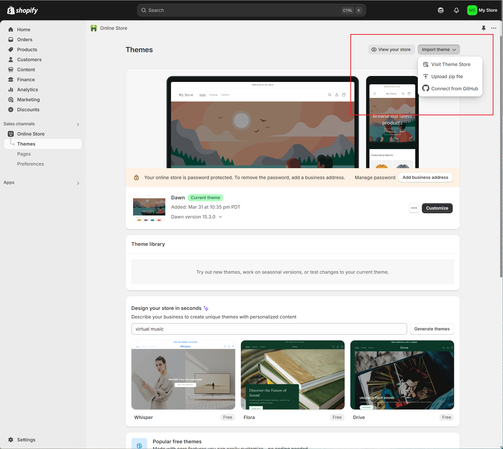

# 如何自建Shopify?

## 资料收集

* 

## 建站前提条件
#### 1.域名
##### 2.收款方账号
* 例如PayPal企业账号(企业资质)
* 或shopify payments
* 或Stripe信用卡收款
#### 3.支持外币信用卡
#### 4.网站主题
* shipify免费主题(功能有限)
* 主题购买:
	* [Themeforest](https://link.zhihu.com/?target=https%3A//www.qingsongb2c.com/goto/themforest-shopify-themes/)

#### 5.产品, 货源

## 建站步骤
### 1.注册账号
#### 1.访问[shopify官网](https://link.zhihu.com/?target=https%3A//www.qingsongb2c.com/goto/shopify-online/), 
注意: 会根据你的ip自动跳转对应语言的分站

#### 2.点击`Start Free Trail`进行注册
1) 需要选择业务类型, 可选可跳过
2) 确定店铺地区, 不同地区功能也不同. 美国地区功能最全.

### 2.试用

#### 1.认证邮箱

总共有两项需要设置:

* General – 常规设置，主要是发送验证邮件到自己邮箱，然后就可以修改其他设置了
* Security – 更改密码，双重安全登录，还有添加辅助邮箱，看自己需求设置。

采用第三方账号(谷歌)注册的话, 在`settings-general`中没有显示`Verification email send`

#### 2.设置步骤概述

后台首页，要使网站上线，最少有四个基本步骤：

1. 添加产品
2. 自定义主题
3. 设置付款方式
4. 设置物流运费

#### 3.设置主题

> 店铺需要一个主题模板，网站才能使用，你可以从首页`新手页面>customize theme`进入主题设置，也可以从`左侧菜单的online Store>Themes`进入主题设置

可能是改版了,[原文](https://zhuanlan.zhihu.com/p/379992485)中只有路径说明,并没有图片说明.所以

##### 1.查看当前主题

**Home -> Setup guide -> Design your online store in seconds**

**Online Store -> Themes**

从上图可以看到, 默认主题是`Dawn`

##### 2.选择主题

我们从页面最下方的`Visit theme store`链接文字,跳转到新页面,选择合适的主题.

共246个网站模板

免费13

付费233

购买主题，在哪里可以购买第三方主题，我提供两个地方供你大家选择，

- [Themeforest](https://themeforest.net/category/ecommerce/shopify)
- [Template Monster](https://www.templatemonster.com/shopify-themes.php)

##### 3.购买主题

1. 选择All files & Documentation下载
2. 下载后需要解压, 进入解压后的文件夹`ella-package-UnZip-Me`, 然会会有十几个文件夹, 每个文件夹相当于一款独立主题,可以根据主题预览选择自己需要的`.zip`文件

**2.templateMonster上下载主题**

如果是第一次登录, 需要邮箱和手机号. 

选择了免费主题Nitro

##### 4.上传主题/更新主题

1. 页面-import theme-Upload zip file

**Nitro主题安装**

在解压后的文件中,有步骤指导.

**nitro主题更新**

按照上图中其提供的教程更新即可

##### 5.更改主题

1.点击`Customize`进入页面自定义编辑

2.进入自定义编辑页面,

其页面左侧编辑栏有3部分组成:

* Home page
* Theme settings
* App embed

3.自定义一些功能

我们尝试在模块`Newsletter`之前添加一个`Featured blog`, 更改完成以后,点击左右角的保存按钮, 预览查看下效果

### 3.新增页面

> 主题设置好后，之后还要经历页面修改和新品上架等。如何新增页面呢?  从左侧菜单的`online Store>Pages`进入添加页面.
>
> 需要添加什么页面请看：[一个完整外贸独立站必须要有的页面](https://link.zhihu.com/?target=https%3A//www.qingsongb2c.com/necessary-pages-for-ecommerce-website/)。

#### 1.页面概览

- Blog Posts – 你可以添加博客文章
- Navgation – 就是菜单设置了，这一步在主题设置的页头设置里面也会有此项设置
- Domain – 域名
- Preferences – 店铺的基本设置包括店铺名称，二级名称，简单介绍，google分析，密码保护等

#### 2.添加产品/集合

路径: 首页>Products>Add product

### 3.更改主题

> https://www.zzbaimaozi.com/shopify%E4%BA%8C%E6%AC%A1%E5%BC%80%E5%8F%91%E5%85%A8%E9%9D%A2%E6%8C%87%E5%8D%97/

## 竞品网站

个人建站,旨在探索shopify的使用及流程,最快最完整的全流程实践,所以选择了虚拟商品销售,又在虚拟商品销售中选择了音乐这个门类.

### shopify建立的音乐站

| 网站名称                  | 网址                                                         | 类型                  | Shopify 功能应用                                             | 亮点                                                         |
| ------------------------- | ------------------------------------------------------------ | --------------------- | ------------------------------------------------------------ | ------------------------------------------------------------ |
| **Cymatics.fm**           | [https://cymatics.fm](https://cymatics.fm)                   | 电子音乐采样包/预设   | - Digital Downloads - ReCharge（订阅制） - SendOwl（大文件托管） | - 提供免费采样包引流 - 内嵌音频试听功能 - 清晰的商用版权声明 |
| **Ghostly International** | [https://ghostly.com](https://ghostly.com)                   | 独立厂牌数字音乐+实体 | - Digital Downloads - 混合销售（虚拟+实体） - SoundCloud 嵌入试听 | - 艺术家故事化页面 - 订阅制独家内容 - 黑胶与数字捆绑销售 |
| **The Drum Broker**       | [https://www.thedrumbroker.com](https://www.thedrumbroker.com) | 专业鼓点采样/Beats    | - 分层定价（非商用/商用/独家） - SendOwl（文件托管） - PDF 授权证书生成 | - 按授权类型差异化定价 - 提供法律授权模板 - 详细教程（合法使用指南） |
| **ProducerLoops**         | [https://www.producerloops.com](https://www.producerloops.com) | 音乐循环/MIDI 文件    | - 捆绑销售（主题包） - Bold Subscriptions（订阅制） - YouTube 教程嵌入 | - 免费试用包换取邮箱 - 嵌入实际应用演示视频 - 支持批量下载 |
| **FreeForm Records**      | [https://freeformrecords.com](https://freeformrecords.com)   | 独立厂牌数字专辑      | - Digital Downloads - Shopify Email（通知推送） - 实体+虚拟捆绑销售 | - 新曲目邮件营销 - 高质感视觉设计 - 限量版黑胶与数字专辑联动 |
| **Beatstars 独立店铺**    | （示例：个人 Shopify 店铺）                                  | 个人 Beats/混音服务   | - Book That App（预约服务） - 分层交付（分轨文件） - 嵌入式播放器 | - 展示代表作（Spotify 嵌入） - 按需定制混音 - 提供分轨加购选项 |

## 如何推广

## 网站注意事项

## 资料收集
* [如何自建Shopify独立站，一篇就够(完整教程) - 知乎](https://zhuanlan.zhihu.com/p/379992485)
* [独立站建站指南：创建网站的9个步骤（2025年） - Shopify 中国](https://www.shopify.com/zh/blog/build-a-website)
* 